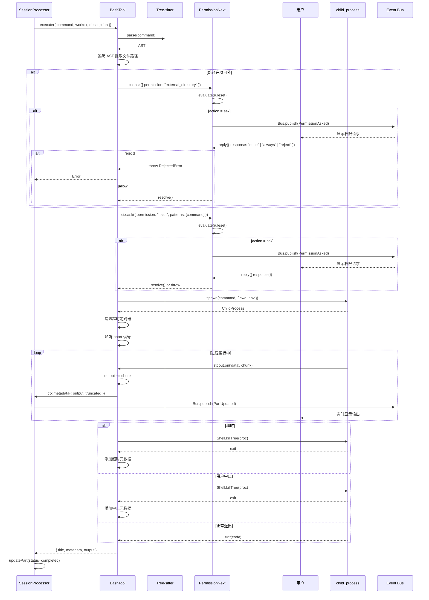
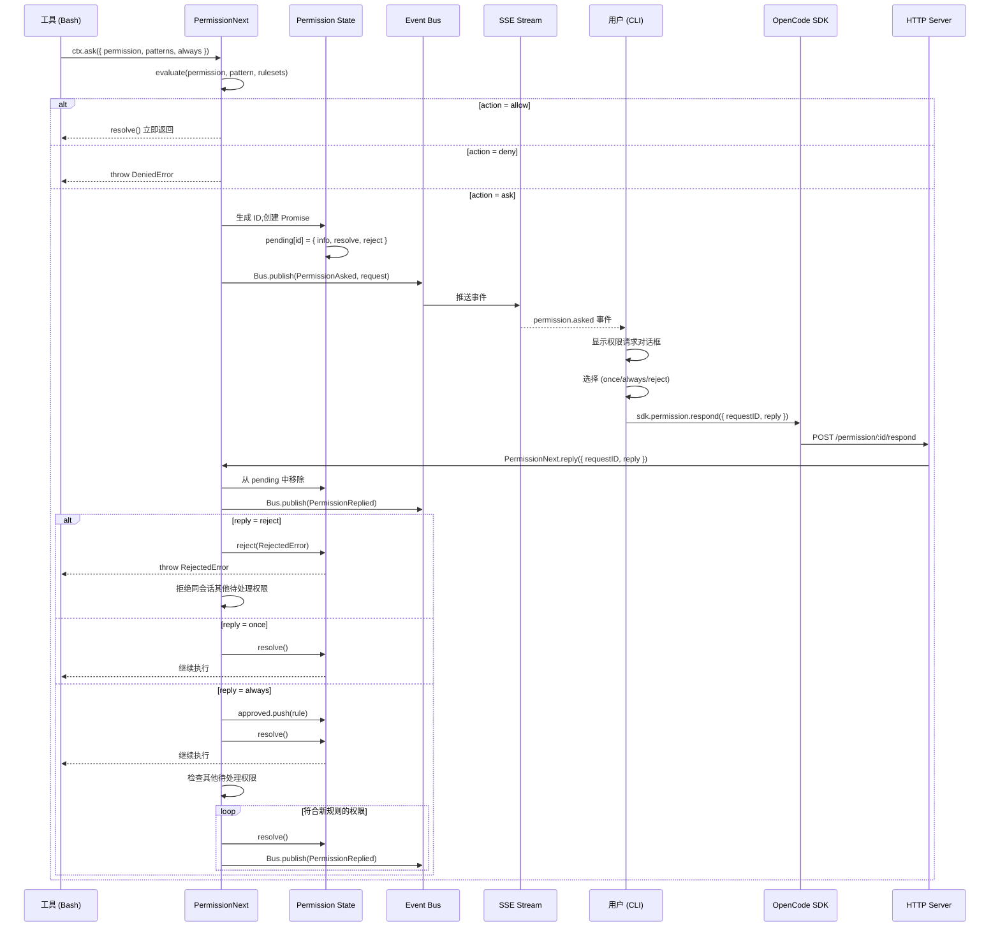
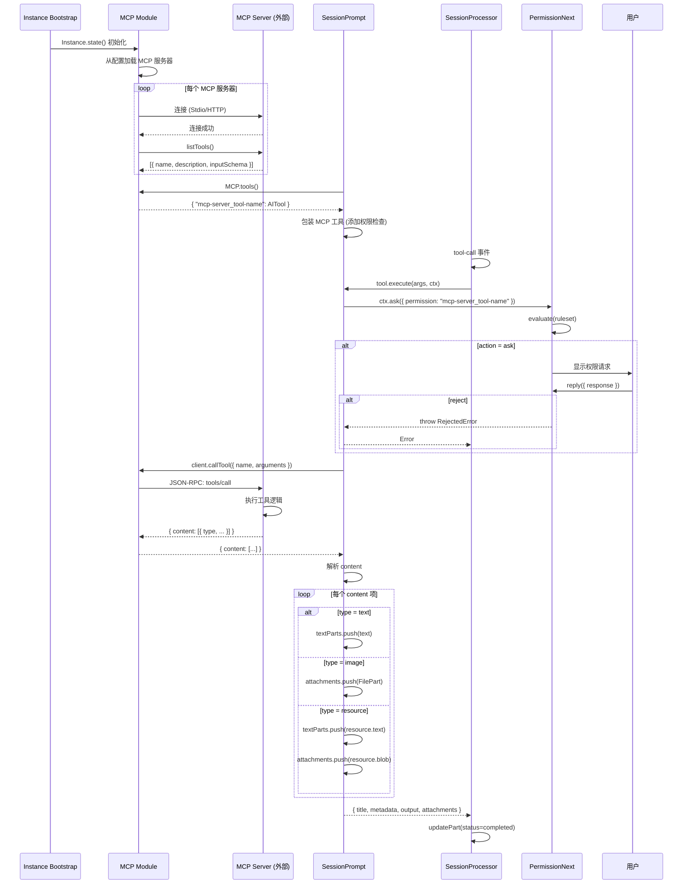

# 3. 核心流程时序

## 流程概览

本项目的核心业务流程围绕 AI 代理与用户交互、工具执行和代码修改展开：

1. **用户提示处理流程** - 用户发送消息,AI 生成响应并执行工具
2. **工具执行流程 (Bash)** - AI 调用 Bash 工具执行命令
3. **权限请求与响应流程** - 工具执行前的权限检查
4. **上下文压缩流程 (Compaction)** - 当上下文窗口溢出时自动压缩历史
5. **MCP 工具调用流程** - 集成外部 MCP 服务器的工具

---

## 流程 1: 用户提示处理流程

### 触发条件
- **用户操作**: CLI 执行 `opencode run "message"` 或 Web/Desktop 界面发送消息
- **API 调用**: `POST /session/:id/prompt`

### 涉及的模块
- CLI: `packages/opencode/src/cli/cmd/run.ts`
- HTTP Routes: `packages/opencode/src/server/routes/session.ts`
- 应用层: `packages/opencode/src/session/prompt.ts`
- 处理器: `packages/opencode/src/session/processor.ts`
- LLM: `packages/opencode/src/session/llm.ts`
- 工具注册: `packages/opencode/src/tool/registry.ts`

### 预期结果
- 创建用户消息和助手消息
- AI 生成文本响应和/或执行工具
- 通过 SSE 实时推送事件到客户端
- 会话状态更新为 `idle`

---

### 步骤分解

#### 1. **CLI 命令解析**
- **模块**: `packages/opencode/src/cli/cmd/run.ts`
- **函数**: `RunCommand.handler()`
- **作用**: 
  - 解析命令行参数 (message, model, agent, file attachments)
  - 创建 SDK 客户端 (本地或远程)
  - 订阅 SSE 事件流
- **依据**: `packages/opencode/src/cli/cmd/run.ts:95-394`

#### 2. **创建或获取会话**
- **模块**: `packages/opencode/src/cli/cmd/run.ts`
- **函数**: `sdk.session.create()` 或 `sdk.session.list()`
- **作用**:
  - 如果 `--continue` 则获取最后一个会话
  - 否则创建新会话,设置标题和权限
- **依据**: `packages/opencode/src/cli/cmd/run.ts:281-318`

#### 3. **发送提示请求**
- **模块**: `packages/opencode/src/cli/cmd/run.ts`
- **函数**: `sdk.session.prompt()`
- **作用**:
  - 发送用户消息和文件附件
  - 指定 agent 和 model
- **依据**: `packages/opencode/src/cli/cmd/run.ts:265-272`

#### 4. **HTTP 路由处理**
- **模块**: `packages/opencode/src/server/routes/session.ts`
- **函数**: `POST /session/:id/prompt`
- **作用**:
  - 验证请求参数 (Zod Schema)
  - 调用 `SessionPrompt.prompt()`
- **依据**: `packages/opencode/src/server/routes/session.ts` (推断)

#### 5. **创建用户消息**
- **模块**: `packages/opencode/src/session/prompt.ts`
- **函数**: `SessionPrompt.prompt()` → `createUserMessage()`
- **作用**:
  - 创建 `MessageV2.User` 实体
  - 处理文件附件 (file:// 协议)
  - 自动调用 Read/List 工具读取文件内容
  - 处理 MCP Resource 引用
  - 存储消息和 Parts 到 Storage
- **依据**: `packages/opencode/src/session/prompt.ts:824-1191`

#### 6. **进入处理循环**
- **模块**: `packages/opencode/src/session/prompt.ts`
- **函数**: `SessionPrompt.loop()`
- **作用**:
  - 检查是否需要 Compaction (上下文溢出)
  - 检查是否有待处理的 Subtask
  - 获取最后一条用户消息和助手消息
  - 判断是否需要继续循环
- **依据**: `packages/opencode/src/session/prompt.ts:257-634`

#### 7. **解析工具列表**
- **模块**: `packages/opencode/src/session/prompt.ts`
- **函数**: `resolveTools()`
- **作用**:
  - 从 `ToolRegistry` 获取内置工具
  - 从 `MCP` 获取外部工具
  - 包装工具执行函数,注入 Context
  - 添加 Plugin 钩子 (before/after)
- **依据**: `packages/opencode/src/session/prompt.ts:643-822`

#### 8. **创建 SessionProcessor**
- **模块**: `packages/opencode/src/session/prompt.ts`
- **函数**: `SessionProcessor.create()`
- **作用**:
  - 创建助手消息实体
  - 初始化处理器状态 (toolcalls, snapshot, blocked)
- **依据**: `packages/opencode/src/session/prompt.ts:520-548`

#### 9. **调用 LLM 流式 API**
- **模块**: `packages/opencode/src/session/processor.ts`
- **函数**: `processor.process()` → `LLM.stream()`
- **作用**:
  - 构建消息历史 (MessageV2 → AI SDK 格式)
  - 调用 Provider 的 `streamText()` API
  - 返回异步流
- **依据**: `packages/opencode/src/session/processor.ts:45-406`

#### 10. **处理流式响应**
- **模块**: `packages/opencode/src/session/processor.ts`
- **函数**: `processor.process()` 循环
- **作用**:
  - 监听流事件: `text-delta`, `tool-call`, `tool-result`, `reasoning-delta`
  - 创建和更新 MessageV2.Part (TextPart, ToolPart, ReasoningPart)
  - 发布 `Bus` 事件: `MessageV2.Event.PartUpdated`
  - 检测 Doom Loop (连续 3 次相同工具调用)
- **依据**: `packages/opencode/src/session/processor.ts:55-338`

#### 11. **执行工具调用**
- **模块**: `packages/opencode/src/session/processor.ts`
- **函数**: 工具的 `execute()` 方法
- **作用**:
  - 调用工具实现 (例如 `BashTool.execute()`)
  - 捕获错误 (PermissionNext.RejectedError)
  - 更新 ToolPart 状态: `running` → `completed` / `error`
- **依据**: `packages/opencode/src/session/processor.ts:126-221`

#### 12. **完成步骤**
- **模块**: `packages/opencode/src/session/processor.ts`
- **函数**: `finish-step` 事件处理
- **作用**:
  - 计算 Token 使用量和成本
  - 创建 Snapshot 并生成 Patch
  - 触发 SessionSummary (异步)
  - 检查是否需要 Compaction
- **依据**: `packages/opencode/src/session/processor.ts:236-277`

#### 13. **SSE 事件推送**
- **模块**: `packages/opencode/src/cli/cmd/run.ts`
- **函数**: `eventProcessor` 异步循环
- **作用**:
  - 监听 `message.part.updated` 事件
  - 格式化输出 (Markdown/JSON)
  - 处理 `session.error` 和 `session.idle`
- **依据**: `packages/opencode/src/cli/cmd/run.ts:157-229`

#### 14. **循环判断**
- **模块**: `packages/opencode/src/session/prompt.ts`
- **函数**: `loop()` while 循环
- **作用**:
  - 如果 `finish` 不是 `tool-calls`,退出循环
  - 如果达到 `maxSteps`,退出循环
  - 否则继续下一轮 (AI 可能继续调用工具)
- **依据**: `packages/opencode/src/session/prompt.ts:294-301`

---

### 时序图

```mermaid
sequenceDiagram
    participant User as 用户 (CLI)
    participant SDK as OpenCode SDK
    participant Server as HTTP Server
    participant Prompt as SessionPrompt
    participant Loop as Prompt Loop
    participant Proc as SessionProcessor
    participant LLM as LLM Module
    participant Tool as Tool (Bash)
    participant Perm as PermissionNext
    participant Bus as Event Bus
    participant Storage as Storage

    User->>SDK: opencode run "message"
    SDK->>Server: POST /session/:id/prompt
    Server->>Prompt: SessionPrompt.prompt(input)
    
    Prompt->>Storage: createUserMessage()
    Storage-->>Prompt: MessageV2.User
    
    Prompt->>Loop: loop(sessionID)
    
    loop 处理循环 (每轮可能多次工具调用)
        Loop->>Loop: 检查 Compaction 需求
        Loop->>Loop: 获取消息历史
        Loop->>Loop: resolveTools() (内置 + MCP)
        
        Loop->>Proc: SessionProcessor.create()
        Proc-->>Loop: processor
        
        Loop->>Proc: processor.process(messages, tools)
        Proc->>LLM: LLM.stream(input)
        LLM->>LLM: Provider.getLanguage(model)
        LLM-->>Proc: AsyncStream
        
        loop 流式响应
            Proc->>Proc: 监听 text-delta
            Proc->>Storage: Session.updatePart(TextPart)
            Proc->>Bus: Bus.publish(PartUpdated)
            Bus-->>SDK: SSE Event
            SDK-->>User: 显示文本
            
            Proc->>Proc: 监听 tool-call
            Proc->>Storage: Session.updatePart(ToolPart, status=running)
            Proc->>Bus: Bus.publish(PartUpdated)
            
            Proc->>Tool: tool.execute(args, ctx)
            
            alt 需要权限
                Tool->>Perm: ctx.ask({ permission, patterns })
                Perm->>Perm: evaluate(ruleset)
                
                alt 规则为 ask
                    Perm->>Bus: Bus.publish(PermissionAsked)
                    Bus-->>SDK: SSE Event
                    SDK-->>User: 显示权限请求
                    User->>SDK: 选择 (once/always/reject)
                    SDK->>Server: POST /permission/:id/respond
                    Server->>Perm: PermissionNext.reply()
                    
                    alt 用户拒绝
                        Perm-->>Tool: throw RejectedError
                        Tool-->>Proc: Error
                        Proc->>Storage: updatePart(status=error)
                    else 用户允许
                        Perm-->>Tool: resolve()
                    end
                end
            end
            
            Tool-->>Proc: { output, metadata }
            Proc->>Storage: Session.updatePart(ToolPart, status=completed)
            Proc->>Bus: Bus.publish(PartUpdated)
            Bus-->>SDK: SSE Event
            SDK-->>User: 显示工具结果
            
            Proc->>Proc: 监听 finish-step
            Proc->>Storage: Session.updatePart(StepFinishPart)
            Proc->>Storage: Snapshot.patch() → PatchPart
        end
        
        Proc-->>Loop: "continue" | "stop" | "compact"
        
        alt 结果为 continue 且 finish=tool-calls
            Loop->>Loop: 继续下一轮
        else 结果为 stop 或其他
            Loop->>Loop: 退出循环
        end
    end
    
    Loop->>Bus: Bus.publish(Session.Event.Idle)
    Bus-->>SDK: SSE Event
    SDK-->>User: 完成
```

---

### 数据流

#### 输入数据格式
```typescript
// CLI 输入
{
  message: ["Fix", "the", "bug"],
  file: ["src/app.ts"],
  agent: "build",
  model: "anthropic/claude-sonnet-4"
}

// HTTP API 输入
POST /session/:id/prompt
{
  "parts": [
    { "type": "text", "text": "Fix the bug" },
    { "type": "file", "url": "file:///path/to/src/app.ts", "mime": "text/plain" }
  ],
  "agent": "build",
  "model": { "providerID": "anthropic", "modelID": "claude-sonnet-4" }
}
```

#### 中间数据转换
```typescript
// 1. MessageV2.User 实体
{
  id: "01JKM...",
  role: "user",
  sessionID: "01JKL...",
  agent: "build",
  model: { providerID: "anthropic", modelID: "claude-sonnet-4" },
  time: { created: 1737123456789 }
}

// 2. MessageV2.Part (TextPart)
{
  id: "01JKN...",
  messageID: "01JKM...",
  sessionID: "01JKL...",
  type: "text",
  text: "Fix the bug",
  synthetic: false
}

// 3. AI SDK 消息格式
{
  role: "user",
  content: [
    { type: "text", text: "Fix the bug" },
    { type: "text", text: "Called the Read tool with input: {\"filePath\":\"/path/to/src/app.ts\"}" },
    { type: "text", text: "1|import { app } from './app'\n2|..." }
  ]
}

// 4. 流式响应事件
{
  type: "tool-call",
  toolName: "bash",
  toolCallId: "call_abc123",
  input: { command: "npm test", description: "Run tests" }
}

// 5. MessageV2.ToolPart
{
  id: "01JKP...",
  messageID: "01JKO...",
  sessionID: "01JKL...",
  type: "tool",
  tool: "bash",
  callID: "call_abc123",
  state: {
    status: "completed",
    input: { command: "npm test", description: "Run tests" },
    output: "PASS src/app.test.ts\n✓ should work (5ms)",
    metadata: { output: "...", description: "Run tests", exit: 0 },
    time: { start: 1737123460000, end: 1737123465000 }
  }
}
```

#### 输出数据格式
```typescript
// SSE 事件 (JSON 格式)
{
  "type": "message.part.updated",
  "timestamp": 1737123456789,
  "sessionID": "01JKL...",
  "properties": {
    "part": { /* MessageV2.Part */ },
    "delta": "text delta" // 仅 text-delta 事件
  }
}

// CLI 输出 (Markdown 格式)
|  Bash    Run tests
PASS src/app.test.ts
✓ should work (5ms)

The tests are passing now. The bug has been fixed.
```

---

### 同步/异步

#### 同步步骤
1. **消息创建**: `createUserMessage()` - 同步写入 Storage
2. **工具解析**: `resolveTools()` - 同步构建工具列表
3. **权限评估**: `PermissionNext.evaluate()` - 同步匹配规则

#### 异步步骤
1. **LLM 流式响应**: `LLM.stream()` - 异步流,使用 `for await`
2. **工具执行**: `tool.execute()` - 异步,可能长时间运行 (Bash)
3. **权限请求**: `PermissionNext.ask()` - 异步,等待用户响应
4. **SSE 推送**: `Bus.publish()` - 异步,非阻塞
5. **会话摘要**: `SessionSummary.summarize()` - 异步,后台执行

#### 并发处理
- **工具执行串行**: 工具按 LLM 返回顺序依次执行,不并发
- **SSE 推送并发**: 多个客户端可同时订阅事件
- **权限请求队列**: 同一会话的权限请求串行处理,避免冲突

---

### 错误处理

#### 错误点 1: 用户消息创建失败
- **可能原因**: 文件不存在、MCP Resource 读取失败
- **处理策略**: 
  - 捕获错误,创建 synthetic TextPart 说明错误
  - 继续处理,不中断流程
- **依据**: `packages/opencode/src/session/prompt.ts:900-911`

#### 错误点 2: LLM API 调用失败
- **可能原因**: 网络错误、API Key 无效、Rate Limit
- **处理策略**:
  - `SessionRetry.retryable()` 判断是否可重试
  - 如果可重试,延迟后重试 (最多 3 次)
  - 如果不可重试,设置 `assistantMessage.error`
  - 发布 `Session.Event.Error`
- **依据**: `packages/opencode/src/session/processor.ts:339-363`

#### 错误点 3: 工具执行失败
- **可能原因**: 命令执行错误、权限被拒绝、超时
- **处理策略**:
  - 捕获错误,更新 ToolPart 状态为 `error`
  - 如果是 `PermissionNext.RejectedError`,设置 `blocked = true`
  - 如果 `blocked && shouldBreak`,退出循环
  - 否则继续,让 LLM 看到错误并重试
- **依据**: `packages/opencode/src/session/processor.ts:196-221`

#### 错误点 4: 上下文溢出
- **可能原因**: Token 数超过模型上下文窗口
- **处理策略**:
  - `SessionCompaction.isOverflow()` 检测溢出
  - 自动创建 Compaction Part
  - 下一轮循环时执行压缩
  - 压缩后继续处理
- **依据**: `packages/opencode/src/session/prompt.ts:496-508`

#### 回滚/补偿机制
- **Snapshot + Patch**: 每个步骤前后创建快照,可回滚文件修改
- **Session.revert**: 用户可手动回滚到任意消息
- **Abort Signal**: 用户可随时取消执行,清理资源

---

### 调用链

```
用户操作: opencode run "Fix the bug"
  → RunCommand.handler() [packages/opencode/src/cli/cmd/run.ts:95]
  → sdk.session.create() [packages/opencode/src/cli/cmd/run.ts:295]
  → sdk.session.prompt() [packages/opencode/src/cli/cmd/run.ts:265]
  → POST /session/:id/prompt [packages/opencode/src/server/routes/session.ts]
  → SessionPrompt.prompt() [packages/opencode/src/session/prompt.ts:150]
  → createUserMessage() [packages/opencode/src/session/prompt.ts:824]
  → Session.updateMessage() [packages/opencode/src/session/index.ts:213]
  → Storage.write() [packages/opencode/src/storage/storage.ts:182]
  → SessionPrompt.loop() [packages/opencode/src/session/prompt.ts:257]
  → resolveTools() [packages/opencode/src/session/prompt.ts:643]
  → ToolRegistry.tools() [packages/opencode/src/tool/registry.ts:31]
  → SessionProcessor.create() [packages/opencode/src/session/processor.ts:26]
  → processor.process() [packages/opencode/src/session/processor.ts:45]
  → LLM.stream() [packages/opencode/src/session/llm.ts]
  → Provider.getLanguage() [packages/opencode/src/provider/provider.ts:1086]
  → sdk.streamText() [Vercel AI SDK]
  → [流式响应循环]
  → tool.execute() [packages/opencode/src/tool/bash.ts:77]
  → PermissionNext.ask() [packages/opencode/src/permission/next.ts:116]
  → Bus.publish(PermissionAsked) [packages/opencode/src/bus/index.ts]
  → [用户响应]
  → PermissionNext.reply() [packages/opencode/src/permission/next.ts:148]
  → [工具执行完成]
  → Session.updatePart() [packages/opencode/src/session/index.ts:401]
  → Bus.publish(PartUpdated) [packages/opencode/src/bus/index.ts]
  → [SSE 推送到客户端]
  → eventProcessor [packages/opencode/src/cli/cmd/run.ts:157]
  → UI.println() [packages/opencode/src/cli/ui.ts]
```

---

## 流程 2: 工具执行流程 (Bash)

### 触发条件
- **LLM 决策**: AI 决定调用 `bash` 工具
- **流式响应**: 接收到 `tool-call` 事件

### 涉及的模块
- 工具定义: `packages/opencode/src/tool/bash.ts`
- 权限检查: `packages/opencode/src/permission/next.ts`
- 进程管理: `packages/opencode/src/shell/shell.ts`

### 预期结果
- 命令在项目目录下执行
- 捕获 stdout/stderr 输出
- 更新工具状态为 `completed` 或 `error`

---

### 步骤分解

#### 1. **工具调用触发**
- **模块**: `packages/opencode/src/session/processor.ts`
- **函数**: `tool-call` 事件处理
- **作用**:
  - 创建 ToolPart (status=running)
  - 调用工具的 `execute()` 方法
- **依据**: `packages/opencode/src/session/processor.ts:126-141`

#### 2. **解析命令参数**
- **模块**: `packages/opencode/src/tool/bash.ts`
- **函数**: `BashTool.execute()`
- **作用**:
  - 验证参数: `command`, `timeout`, `workdir`, `description`
  - 使用 Tree-sitter 解析 Bash AST
- **依据**: `packages/opencode/src/tool/bash.ts:77-86`

#### 3. **提取文件路径**
- **模块**: `packages/opencode/src/tool/bash.ts`
- **函数**: AST 遍历
- **作用**:
  - 遍历 AST,找到所有 `command` 节点
  - 提取 `rm`, `cp`, `mv`, `mkdir` 等命令的文件路径
  - 使用 `realpath` 解析相对路径
- **依据**: `packages/opencode/src/tool/bash.ts:92-137`

#### 4. **权限检查: external_directory**
- **模块**: `packages/opencode/src/tool/bash.ts`
- **函数**: `ctx.ask()`
- **作用**:
  - 如果路径在项目外,请求 `external_directory` 权限
  - 等待用户响应
- **依据**: `packages/opencode/src/tool/bash.ts:139-146`

#### 5. **权限检查: bash**
- **模块**: `packages/opencode/src/tool/bash.ts`
- **函数**: `ctx.ask()`
- **作用**:
  - 请求 `bash` 权限,传递完整命令和前缀
  - 例如: `patterns: ["npm test"]`, `always: ["npm*"]`
- **依据**: `packages/opencode/src/tool/bash.ts:148-155`

#### 6. **权限评估**
- **模块**: `packages/opencode/src/permission/next.ts`
- **函数**: `PermissionNext.ask()` → `evaluate()`
- **作用**:
  - 合并 Agent 和 Session 的权限规则
  - 按优先级匹配规则 (后定义优先)
  - 返回 `allow` / `deny` / `ask`
- **依据**: `packages/opencode/src/permission/next.ts:116-146`

#### 7. **用户权限响应 (如果 action=ask)**
- **模块**: `packages/opencode/src/permission/next.ts`
- **函数**: `PermissionNext.reply()`
- **作用**:
  - 用户选择: `once` (一次), `always` (永久), `reject` (拒绝)
  - 如果 `always`,添加规则到 `approved` 列表
  - 如果 `reject`,抛出 `RejectedError`
- **依据**: `packages/opencode/src/permission/next.ts:148-218`

#### 8. **生成 Shell 进程**
- **模块**: `packages/opencode/src/tool/bash.ts`
- **函数**: `spawn()`
- **作用**:
  - 使用 `child_process.spawn()` 创建进程
  - 设置 `cwd`, `env`, `stdio`
  - 设置 `detached=true` (非 Windows)
- **依据**: `packages/opencode/src/tool/bash.ts:157-165`

#### 9. **流式捕获输出**
- **模块**: `packages/opencode/src/tool/bash.ts`
- **函数**: `proc.stdout.on('data')` / `proc.stderr.on('data')`
- **作用**:
  - 累积 stdout 和 stderr 到 `output` 变量
  - 实时更新 ToolPart 的 `metadata.output` (截断到 30KB)
  - 调用 `ctx.metadata()` 触发 UI 更新
- **依据**: `packages/opencode/src/tool/bash.ts:177-189`

#### 10. **超时和中止处理**
- **模块**: `packages/opencode/src/tool/bash.ts`
- **函数**: `setTimeout()` / `ctx.abort.addEventListener()`
- **作用**:
  - 设置超时定时器 (默认 2 分钟)
  - 监听 `abort` 信号 (用户取消)
  - 调用 `Shell.killTree()` 杀死进程树
- **依据**: `packages/opencode/src/tool/bash.ts:191-230`

#### 11. **等待进程退出**
- **模块**: `packages/opencode/src/tool/bash.ts`
- **函数**: `new Promise()` 监听 `exit` 事件
- **作用**:
  - 等待进程结束
  - 清理定时器和监听器
- **依据**: `packages/opencode/src/tool/bash.ts:214-231`

#### 12. **返回结果**
- **模块**: `packages/opencode/src/tool/bash.ts`
- **函数**: `return { title, metadata, output }`
- **作用**:
  - 返回完整输出 (可能很大)
  - 返回元数据 (截断到 30KB)
  - 如果超时或中止,添加 `<bash_metadata>` 标签
- **依据**: `packages/opencode/src/tool/bash.ts:233-256`

---

### 时序图



---

### 数据流

#### 输入
```typescript
{
  command: "npm test",
  workdir: "/path/to/project",
  description: "Run tests",
  timeout: 120000 // 可选
}
```

#### AST 解析
```bash
# 命令: rm -rf node_modules && npm install
# AST 节点:
[
  { type: "command", children: ["rm", "-rf", "node_modules"] },
  { type: "command", children: ["npm", "install"] }
]
```

#### 权限请求
```typescript
// external_directory 权限
{
  permission: "external_directory",
  patterns: ["/home/user/other-project"],
  always: ["/home/user/*"],
  metadata: {}
}

// bash 权限
{
  permission: "bash",
  patterns: ["npm test"],
  always: ["npm*"],
  metadata: {}
}
```

#### 输出
```typescript
{
  title: "Run tests",
  metadata: {
    output: "PASS src/app.test.ts\n✓ should work (5ms)\n...", // 截断到 30KB
    exit: 0,
    description: "Run tests"
  },
  output: "PASS src/app.test.ts\n✓ should work (5ms)\n..." // 完整输出
}
```

---

### 同步/异步

- **同步**: AST 解析、路径提取、权限评估
- **异步**: 权限请求 (等待用户)、进程执行、输出捕获

---

### 错误处理

#### 错误点 1: 权限被拒绝
- **处理**: 抛出 `PermissionNext.RejectedError`,更新 ToolPart 状态为 `error`
- **依据**: `packages/opencode/src/permission/next.ts:244-248`

#### 错误点 2: 命令执行失败
- **处理**: 捕获 stderr,返回非零退出码,不抛出异常
- **依据**: `packages/opencode/src/tool/bash.ts:188-189`

#### 错误点 3: 超时
- **处理**: 杀死进程,添加超时元数据到输出
- **依据**: `packages/opencode/src/tool/bash.ts:235-237`

---

### 调用链

```
LLM 决策: 调用 bash 工具
  → tool-call 事件 [AI SDK]
  → SessionProcessor.process() [packages/opencode/src/session/processor.ts:126]
  → tool.execute() [包装函数]
  → BashTool.execute() [packages/opencode/src/tool/bash.ts:77]
  → parser().parse() [web-tree-sitter]
  → ctx.ask({ permission: "external_directory" }) [packages/opencode/src/tool/bash.ts:140]
  → PermissionNext.ask() [packages/opencode/src/permission/next.ts:116]
  → evaluate() [packages/opencode/src/permission/next.ts:220]
  → Bus.publish(PermissionAsked) [packages/opencode/src/bus/index.ts]
  → [用户响应]
  → PermissionNext.reply() [packages/opencode/src/permission/next.ts:148]
  → ctx.ask({ permission: "bash" }) [packages/opencode/src/tool/bash.ts:149]
  → spawn(command) [child_process]
  → proc.stdout.on('data') [packages/opencode/src/tool/bash.ts:188]
  → ctx.metadata() [packages/opencode/src/tool/bash.ts:179]
  → Session.updatePart() [packages/opencode/src/session/index.ts:401]
  → Bus.publish(PartUpdated) [packages/opencode/src/bus/index.ts]
  → proc.on('exit') [packages/opencode/src/tool/bash.ts:220]
  → return { output, metadata } [packages/opencode/src/tool/bash.ts:247]
  → SessionProcessor [packages/opencode/src/session/processor.ts:172]
  → Session.updatePart(status=completed) [packages/opencode/src/session/processor.ts:175]
```

---

## 流程 3: 权限请求与响应流程

### 触发条件
- **工具执行**: 工具调用 `ctx.ask()` 请求权限
- **规则匹配**: 权限规则评估结果为 `ask`

### 涉及的模块
- 权限管理: `packages/opencode/src/permission/next.ts`
- 事件总线: `packages/opencode/src/bus/index.ts`
- HTTP Routes: `packages/opencode/src/server/routes/permission.ts`

### 预期结果
- 用户做出决策 (允许/拒绝)
- 权限状态更新
- 工具继续或中止执行

---

### 步骤分解

#### 1. **工具请求权限**
- **模块**: `packages/opencode/src/tool/bash.ts` (示例)
- **函数**: `ctx.ask()`
- **作用**: 调用 `PermissionNext.ask()`,传递权限类型和模式
- **依据**: `packages/opencode/src/tool/bash.ts:140-155`

#### 2. **评估权限规则**
- **模块**: `packages/opencode/src/permission/next.ts`
- **函数**: `PermissionNext.evaluate()`
- **作用**:
  - 合并多个 Ruleset (Agent + Session + Approved)
  - 按后定义优先匹配规则
  - 使用 Wildcard 匹配 permission 和 pattern
- **依据**: `packages/opencode/src/permission/next.ts:220-227`

#### 3. **创建权限请求**
- **模块**: `packages/opencode/src/permission/next.ts`
- **函数**: `PermissionNext.ask()`
- **作用**:
  - 生成唯一 ID
  - 创建 Promise,存储到 `state.pending`
  - 发布 `PermissionAsked` 事件
- **依据**: `packages/opencode/src/permission/next.ts:129-141`

#### 4. **SSE 推送到客户端**
- **模块**: `packages/opencode/src/bus/index.ts`
- **函数**: `Bus.publish()`
- **作用**: 通过 SSE 推送 `permission.asked` 事件
- **依据**: `packages/opencode/src/server/server.ts:450` (SSE 端点)

#### 5. **用户选择**
- **模块**: `packages/opencode/src/cli/cmd/run.ts` (CLI)
- **函数**: `select()` (clack prompts)
- **作用**:
  - 显示权限请求信息
  - 提供选项: `once`, `always`, `reject`
- **依据**: `packages/opencode/src/cli/cmd/run.ts:212-220`

#### 6. **发送响应**
- **模块**: `packages/opencode/src/cli/cmd/run.ts`
- **函数**: `sdk.permission.respond()`
- **作用**: 发送 `POST /permission/:id/respond`
- **依据**: `packages/opencode/src/cli/cmd/run.ts:222-226`

#### 7. **处理响应**
- **模块**: `packages/opencode/src/permission/next.ts`
- **函数**: `PermissionNext.reply()`
- **作用**:
  - 从 `pending` 中移除请求
  - 发布 `PermissionReplied` 事件
  - 根据响应类型处理:
    - `once`: resolve Promise
    - `always`: 添加规则到 `approved`,resolve Promise
    - `reject`: reject Promise,抛出 `RejectedError`
- **依据**: `packages/opencode/src/permission/next.ts:148-218`

#### 8. **级联处理**
- **模块**: `packages/opencode/src/permission/next.ts`
- **函数**: `PermissionNext.reply()` (always 分支)
- **作用**:
  - 如果选择 `always`,检查其他待处理权限
  - 自动批准符合新规则的权限
- **依据**: `packages/opencode/src/permission/next.ts:196-210`

---

### 时序图



---

### 数据流

#### 输入
```typescript
// 权限请求
{
  permission: "bash",
  patterns: ["npm test"],
  always: ["npm*"],
  metadata: {},
  sessionID: "01JKL...",
  tool: {
    messageID: "01JKO...",
    callID: "call_abc123"
  }
}
```

#### 规则评估
```typescript
// Ruleset (合并后)
[
  { permission: "bash", pattern: "npm*", action: "allow" },
  { permission: "bash", pattern: "rm*", action: "deny" },
  { permission: "*", pattern: "*", action: "ask" }
]

// 匹配结果
evaluate("bash", "npm test", ruleset)
// → { permission: "bash", pattern: "npm*", action: "allow" }
```

#### SSE 事件
```typescript
{
  type: "permission.asked",
  timestamp: 1737123456789,
  properties: {
    id: "01JKP...",
    sessionID: "01JKL...",
    permission: "bash",
    patterns: ["npm test"],
    always: ["npm*"],
    metadata: {},
    tool: { messageID: "01JKO...", callID: "call_abc123" }
  }
}
```

#### 用户响应
```typescript
// HTTP 请求
POST /permission/:id/respond
{
  "requestID": "01JKP...",
  "reply": "always"
}

// 内部处理
{
  requestID: "01JKP...",
  reply: "always",
  message: undefined // 可选,用于 reject 时提供反馈
}
```

---

### 同步/异步

- **同步**: 规则评估 (`evaluate`)
- **异步**: 权限请求 (`ask` 返回 Promise)、用户响应 (`reply`)

---

### 错误处理

#### 错误点 1: 用户拒绝
- **处理**: 抛出 `RejectedError`,工具执行中止
- **依据**: `packages/opencode/src/permission/next.ts:164-179`

#### 错误点 2: 规则拒绝
- **处理**: 抛出 `DeniedError`,工具执行中止
- **依据**: `packages/opencode/src/permission/next.ts:126-127`

#### 错误点 3: 请求不存在
- **处理**: `reply()` 静默返回,不抛出异常
- **依据**: `packages/opencode/src/permission/next.ts:156-157`

---

### 调用链

```
工具执行
  → ctx.ask() [Tool Context]
  → PermissionNext.ask() [packages/opencode/src/permission/next.ts:116]
  → evaluate() [packages/opencode/src/permission/next.ts:220]
  → state().pending[id] = { ... } [packages/opencode/src/permission/next.ts:135]
  → Bus.publish(PermissionAsked) [packages/opencode/src/bus/index.ts]
  → SSE /event [packages/opencode/src/server/server.ts:450]
  → eventProcessor [packages/opencode/src/cli/cmd/run.ts:209]
  → select() [clack/prompts]
  → sdk.permission.respond() [packages/opencode/src/cli/cmd/run.ts:222]
  → POST /permission/:id/respond [packages/opencode/src/server/routes/permission.ts]
  → PermissionNext.reply() [packages/opencode/src/permission/next.ts:148]
  → pending[id].resolve() [packages/opencode/src/permission/next.ts:182]
  → Promise 返回 [packages/opencode/src/permission/next.ts:130]
  → 工具继续执行
```

---

## 流程 4: 上下文压缩流程 (Compaction)

### 触发条件
- **自动触发**: Token 数超过模型上下文窗口
- **检测时机**: 每个 `finish-step` 后检查

### 涉及的模块
- 压缩管理: `packages/opencode/src/session/compaction.ts`
- 会话循环: `packages/opencode/src/session/prompt.ts`

### 预期结果
- 生成会话摘要
- 创建 CompactionPart
- 继续会话处理

---

### 步骤分解

#### 1. **检测上下文溢出**
- **模块**: `packages/opencode/src/session/processor.ts`
- **函数**: `SessionCompaction.isOverflow()`
- **作用**:
  - 计算总 Token 数: `input + cache.read + output`
  - 计算可用空间: `context - output_max`
  - 判断是否溢出
- **依据**: `packages/opencode/src/session/compaction.ts:30-39`

#### 2. **标记需要压缩**
- **模块**: `packages/opencode/src/session/processor.ts`
- **函数**: `finish-step` 事件处理
- **作用**: 设置 `needsCompaction = true`
- **依据**: `packages/opencode/src/session/processor.ts:274-276`

#### 3. **返回 compact 信号**
- **模块**: `packages/opencode/src/session/processor.ts`
- **函数**: `processor.process()`
- **作用**: 返回 `"compact"` 而不是 `"continue"`
- **依据**: `packages/opencode/src/session/processor.ts:397`

#### 4. **创建 Compaction Part**
- **模块**: `packages/opencode/src/session/prompt.ts`
- **函数**: `SessionCompaction.create()`
- **作用**:
  - 创建用户消息
  - 添加 CompactionPart (type=compaction, auto=true)
- **依据**: `packages/opencode/src/session/compaction.ts:195-224`

#### 5. **下一轮循环处理**
- **模块**: `packages/opencode/src/session/prompt.ts`
- **函数**: `loop()` while 循环
- **作用**:
  - 检测到 CompactionPart
  - 调用 `SessionCompaction.process()`
- **依据**: `packages/opencode/src/session/prompt.ts:482-493`

#### 6. **执行压缩**
- **模块**: `packages/opencode/src/session/compaction.ts`
- **函数**: `SessionCompaction.process()`
- **作用**:
  - 创建 Compaction Agent 消息
  - 使用 SessionProcessor 处理
  - 发送特殊提示: "提供详细的继续对话提示"
  - 不提供工具 (tools={})
- **依据**: `packages/opencode/src/session/compaction.ts:92-193`

#### 7. **生成摘要**
- **模块**: `packages/opencode/src/session/compaction.ts`
- **函数**: LLM 生成摘要文本
- **作用**:
  - AI 阅读完整历史
  - 生成摘要 (包含: 做了什么、正在做什么、接下来做什么、相关文件)
- **依据**: `packages/opencode/src/session/compaction.ts:141-143`

#### 8. **创建继续消息 (如果 auto=true)**
- **模块**: `packages/opencode/src/session/compaction.ts`
- **函数**: `process()` 返回后
- **作用**:
  - 创建用户消息: "Continue if you have next steps"
  - 让 AI 继续执行任务
- **依据**: `packages/opencode/src/session/compaction.ts:166-189`

#### 9. **Prune 旧工具输出**
- **模块**: `packages/opencode/src/session/compaction.ts`
- **函数**: `SessionCompaction.prune()`
- **作用**:
  - 从后往前扫描,保留最近 40K Token 的工具调用
  - 删除更早的工具输出 (设置 `time.compacted`)
  - 减少上下文占用
- **依据**: `packages/opencode/src/session/compaction.ts:49-90`

---

### 时序图

```mermaid
sequenceDiagram
    participant Loop as Prompt Loop
    participant Proc as SessionProcessor
    participant Comp as SessionCompaction
    participant LLM as LLM Module
    participant Storage as Storage
    participant Bus as Event Bus

    Loop->>Proc: processor.process(messages, tools)
    
    loop 流式响应
        Proc->>Proc: 处理 text/tool 事件
        Proc->>Proc: finish-step 事件
        Proc->>Comp: SessionCompaction.isOverflow({ tokens, model })
        
        alt 上下文溢出
            Comp-->>Proc: true
            Proc->>Proc: needsCompaction = true
        end
    end
    
    Proc-->>Loop: return "compact"
    
    Loop->>Comp: SessionCompaction.create({ sessionID, agent, model, auto: true })
    Comp->>Storage: Session.updateMessage(UserMessage)
    Comp->>Storage: Session.updatePart(CompactionPart)
    
    Loop->>Loop: 继续下一轮循环
    Loop->>Loop: 检测到 CompactionPart
    
    Loop->>Comp: SessionCompaction.process({ messages, sessionID, abort, auto })
    
    Comp->>Storage: Session.updateMessage(AssistantMessage, agent="compaction")
    Comp->>Proc: SessionProcessor.create()
    Comp->>Proc: processor.process({ tools: {}, messages: [...history, prompt] })
    
    Proc->>LLM: LLM.stream()
    LLM-->>Proc: AsyncStream
    
    loop 生成摘要
        Proc->>Proc: 处理 text-delta
        Proc->>Storage: Session.updatePart(TextPart)
        Proc->>Bus: Bus.publish(PartUpdated)
    end
    
    Proc-->>Comp: "continue"
    
    alt auto = true
        Comp->>Storage: Session.updateMessage(UserMessage, text="Continue if you have next steps")
    end
    
    Comp->>Bus: Bus.publish(Compacted)
    Comp-->>Loop: "continue"
    
    Loop->>Comp: SessionCompaction.prune({ sessionID })
    Comp->>Comp: 扫描历史,标记旧工具输出
    Comp->>Storage: Session.updatePart(part, time.compacted=now)
    
    Loop->>Loop: 继续正常处理
```

---

### 数据流

#### 检测溢出
```typescript
// 输入
{
  tokens: {
    input: 80000,
    output: 5000,
    reasoning: 0,
    cache: { read: 20000, write: 0 }
  },
  model: {
    limit: {
      context: 200000,
      output: 8000
    }
  }
}

// 计算
count = 80000 + 20000 + 5000 = 105000
usable = 200000 - 8000 = 192000
isOverflow = 105000 > 192000 // false

// 如果 count > usable,则触发压缩
```

#### Compaction 提示
```typescript
// 发送给 LLM 的消息
[
  ...MessageV2.toModelMessage(allMessages), // 完整历史
  {
    role: "user",
    content: [
      {
        type: "text",
        text: "Provide a detailed prompt for continuing our conversation above. Focus on information that would be helpful for continuing the conversation, including what we did, what we're doing, which files we're working on, and what we're going to do next considering new session will not have access to our conversation."
      }
    ]
  }
]
```

#### 生成的摘要 (示例)
```
We've been working on fixing a bug in the authentication system. 

What we did:
- Identified the issue in src/auth/login.ts where tokens weren't being validated properly
- Modified the validateToken() function to check expiration timestamps
- Added unit tests in tests/auth.test.ts

What we're doing:
- Currently running the test suite to verify the fix

Files we're working on:
- src/auth/login.ts (modified)
- tests/auth.test.ts (new tests added)

Next steps:
- Review test results
- Update documentation if needed
- Commit the changes
```

#### Prune 结果
```typescript
// 旧的 ToolPart
{
  type: "tool",
  tool: "bash",
  state: {
    status: "completed",
    output: "...", // 大量输出
    time: {
      start: 1737120000000,
      end: 1737120005000,
      compacted: 1737123456789 // 新增,标记已压缩
    }
  }
}

// MessageV2.toModelMessage() 会跳过 time.compacted 的工具输出
```

---

### 同步/异步

- **同步**: 溢出检测 (`isOverflow`)
- **异步**: 压缩执行 (`process`)、摘要生成 (LLM 调用)、Prune 操作

---

### 错误处理

#### 错误点 1: 摘要生成失败
- **处理**: `processor.message.error` 会被检查,返回 `"stop"`
- **依据**: `packages/opencode/src/session/compaction.ts:190`

#### 错误点 2: 配置禁用 Compaction
- **处理**: `isOverflow()` 返回 `false`,不触发压缩
- **依据**: `packages/opencode/src/session/compaction.ts:31-32`

---

### 调用链

```
finish-step 事件
  → SessionCompaction.isOverflow() [packages/opencode/src/session/compaction.ts:30]
  → needsCompaction = true [packages/opencode/src/session/processor.ts:275]
  → return "compact" [packages/opencode/src/session/processor.ts:397]
  → SessionCompaction.create() [packages/opencode/src/session/prompt.ts:615]
  → Session.updatePart(CompactionPart) [packages/opencode/src/session/compaction.ts:216]
  → loop() 下一轮 [packages/opencode/src/session/prompt.ts:270]
  → SessionCompaction.process() [packages/opencode/src/session/prompt.ts:484]
  → SessionProcessor.create() [packages/opencode/src/session/compaction.ts:129]
  → processor.process() [packages/opencode/src/session/compaction.ts:144]
  → LLM.stream() [packages/opencode/src/session/llm.ts]
  → [生成摘要]
  → Session.updateMessage(UserMessage, "Continue...") [packages/opencode/src/session/compaction.ts:167]
  → Bus.publish(Compacted) [packages/opencode/src/session/compaction.ts:191]
  → SessionCompaction.prune() [packages/opencode/src/session/prompt.ts:624]
  → Session.updatePart(time.compacted) [packages/opencode/src/session/compaction.ts:85]
```

---

## 流程 5: MCP 工具调用流程

### 触发条件
- **LLM 决策**: AI 决定调用 MCP 工具 (例如 `mcp-server-name_tool-name`)
- **前提条件**: MCP 服务器已连接并提供工具

### 涉及的模块
- MCP 客户端: `packages/opencode/src/mcp/index.ts`
- 工具注册: `packages/opencode/src/session/prompt.ts` (resolveTools)
- 会话处理: `packages/opencode/src/session/processor.ts`

### 预期结果
- 调用外部 MCP 服务器的工具
- 获取结果 (text/image/resource)
- 更新 ToolPart 状态

---

### 步骤分解

#### 1. **MCP 客户端初始化**
- **模块**: `packages/opencode/src/mcp/index.ts`
- **函数**: `Instance.state()` 初始化
- **作用**:
  - 从配置加载 MCP 服务器列表
  - 创建 Stdio 或 HTTP 传输
  - 连接到 MCP 服务器
  - 获取工具列表 (`listTools`)
- **依据**: `packages/opencode/src/mcp/index.ts:163-198`

#### 2. **获取 MCP 工具**
- **模块**: `packages/opencode/src/mcp/index.ts`
- **函数**: `MCP.tools()`
- **作用**:
  - 遍历所有已连接的 MCP 客户端
  - 获取每个客户端的工具列表
  - 转换为 AI SDK 工具格式
- **依据**: `packages/opencode/src/mcp/index.ts:631-702`

#### 3. **工具注册**
- **模块**: `packages/opencode/src/session/prompt.ts`
- **函数**: `resolveTools()`
- **作用**:
  - 合并内置工具和 MCP 工具
  - 包装 MCP 工具的 `execute()` 方法
  - 添加权限检查和 Plugin 钩子
- **依据**: `packages/opencode/src/session/prompt.ts:731-819`

#### 4. **LLM 调用工具**
- **模块**: `packages/opencode/src/session/processor.ts`
- **函数**: `tool-call` 事件处理
- **作用**: 调用 MCP 工具的包装函数
- **依据**: `packages/opencode/src/session/processor.ts:126-170`

#### 5. **权限检查**
- **模块**: `packages/opencode/src/session/prompt.ts`
- **函数**: MCP 工具包装的 `ctx.ask()`
- **作用**:
  - 请求 MCP 工具权限 (permission=工具名)
  - 等待用户响应
- **依据**: `packages/opencode/src/session/prompt.ts:751-756`

#### 6. **调用 MCP 服务器**
- **模块**: `packages/opencode/src/mcp/index.ts`
- **函数**: `client.callTool()`
- **作用**:
  - 通过 JSON-RPC 调用 MCP 服务器
  - 传递工具名称和参数
- **依据**: `packages/opencode/src/mcp/index.ts` (MCP SDK)

#### 7. **处理 MCP 响应**
- **模块**: `packages/opencode/src/session/prompt.ts`
- **函数**: MCP 工具包装的 `execute()` 返回
- **作用**:
  - 解析 MCP 响应 (content 数组)
  - 提取 text/image/resource
  - 转换为 OpenCode 格式
- **依据**: `packages/opencode/src/session/prompt.ts:770-810`

#### 8. **返回结果**
- **模块**: `packages/opencode/src/session/prompt.ts`
- **函数**: MCP 工具包装返回
- **作用**:
  - 返回 `{ title, metadata, output, attachments }`
  - `output` 包含所有 text 内容
  - `attachments` 包含 image/resource
- **依据**: `packages/opencode/src/session/prompt.ts:804-810`

---

### 时序图



---

### 数据流

#### MCP 服务器配置
```jsonc
// opencode.jsonc
{
  "mcp": {
    "filesystem": {
      "type": "local",
      "command": "npx",
      "args": ["-y", "@modelcontextprotocol/server-filesystem", "/path/to/allowed"]
    },
    "github": {
      "type": "remote",
      "url": "https://mcp.example.com/github",
      "auth": {
        "type": "oauth",
        "clientId": "...",
        "authUrl": "https://github.com/login/oauth/authorize"
      }
    }
  }
}
```

#### MCP 工具列表
```typescript
// listTools() 响应
{
  tools: [
    {
      name: "read_file",
      description: "Read a file from the filesystem",
      inputSchema: {
        type: "object",
        properties: {
          path: { type: "string" }
        },
        required: ["path"]
      }
    }
  ]
}
```

#### AI SDK 工具格式
```typescript
// 转换后
{
  "filesystem_read_file": {
    id: "filesystem_read_file",
    description: "Read a file from the filesystem",
    inputSchema: { ... },
    execute: async (args, options) => {
      // 包装逻辑
      await ctx.ask({ permission: "filesystem_read_file" })
      const result = await client.callTool({ name: "read_file", arguments: args })
      return { title: "", metadata: {}, output: result.content[0].text }
    }
  }
}
```

#### MCP 调用请求
```json
// JSON-RPC 请求
{
  "jsonrpc": "2.0",
  "id": 1,
  "method": "tools/call",
  "params": {
    "name": "read_file",
    "arguments": {
      "path": "/path/to/file.txt"
    }
  }
}
```

#### MCP 响应
```json
// JSON-RPC 响应
{
  "jsonrpc": "2.0",
  "id": 1,
  "result": {
    "content": [
      {
        "type": "text",
        "text": "File contents here..."
      }
    ],
    "isError": false
  }
}
```

#### OpenCode 工具结果
```typescript
{
  title: "",
  metadata: {},
  output: "File contents here...",
  attachments: [], // 如果有 image/resource
  content: [ // 原始 MCP content,用于 toModelOutput
    { type: "text", text: "File contents here..." }
  ]
}
```

---

### 同步/异步

- **同步**: 工具列表获取 (初始化时)、工具包装
- **异步**: MCP 服务器连接、工具调用 (`callTool`)、权限请求

---

### 错误处理

#### 错误点 1: MCP 服务器连接失败
- **处理**: 标记为 `broken`,不提供工具,记录日志
- **依据**: `packages/opencode/src/mcp/index.ts:163-198`

#### 错误点 2: 工具调用失败
- **处理**: MCP SDK 抛出异常,捕获后返回错误信息
- **依据**: `packages/opencode/src/session/prompt.ts:758` (推断)

#### 错误点 3: OAuth 认证失败
- **处理**: 返回授权 URL,等待用户完成 OAuth 流程
- **依据**: `packages/opencode/src/mcp/index.ts:703-926`

---

### 调用链

```
Instance Bootstrap
  → MCP.init() [packages/opencode/src/mcp/index.ts:163]
  → 连接 MCP 服务器 (Stdio/HTTP)
  → client.listTools() [MCP SDK]
  → MCP.tools() [packages/opencode/src/mcp/index.ts:631]
  → resolveTools() [packages/opencode/src/session/prompt.ts:731]
  → 包装 MCP 工具 [packages/opencode/src/session/prompt.ts:736]
  → tool-call 事件 [AI SDK]
  → tool.execute() [包装函数]
  → ctx.ask() [packages/opencode/src/session/prompt.ts:751]
  → PermissionNext.ask() [packages/opencode/src/permission/next.ts:116]
  → [用户响应]
  → client.callTool() [MCP SDK]
  → JSON-RPC: tools/call [MCP 协议]
  → MCP 服务器执行
  → 解析 content [packages/opencode/src/session/prompt.ts:770]
  → return { output, attachments } [packages/opencode/src/session/prompt.ts:804]
  → SessionProcessor [packages/opencode/src/session/processor.ts:172]
  → Session.updatePart(status=completed) [packages/opencode/src/session/processor.ts:175]
```

---

## 下一步

继续阅读 [4. 接口与协议规范](./4.Interfaces.md)
