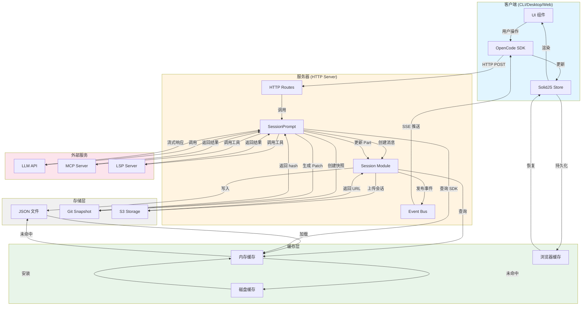
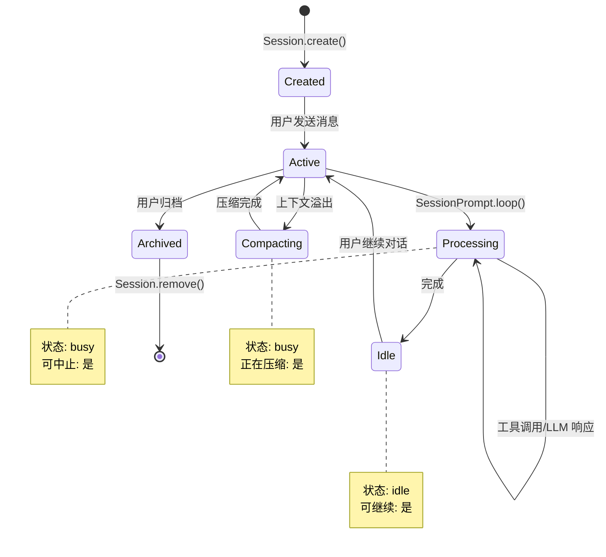
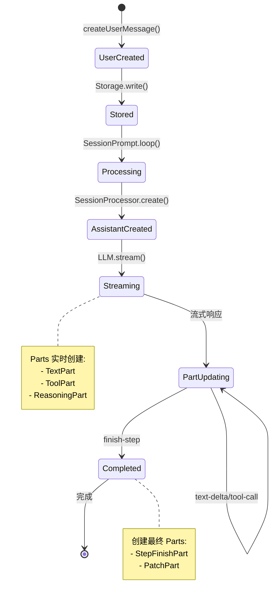
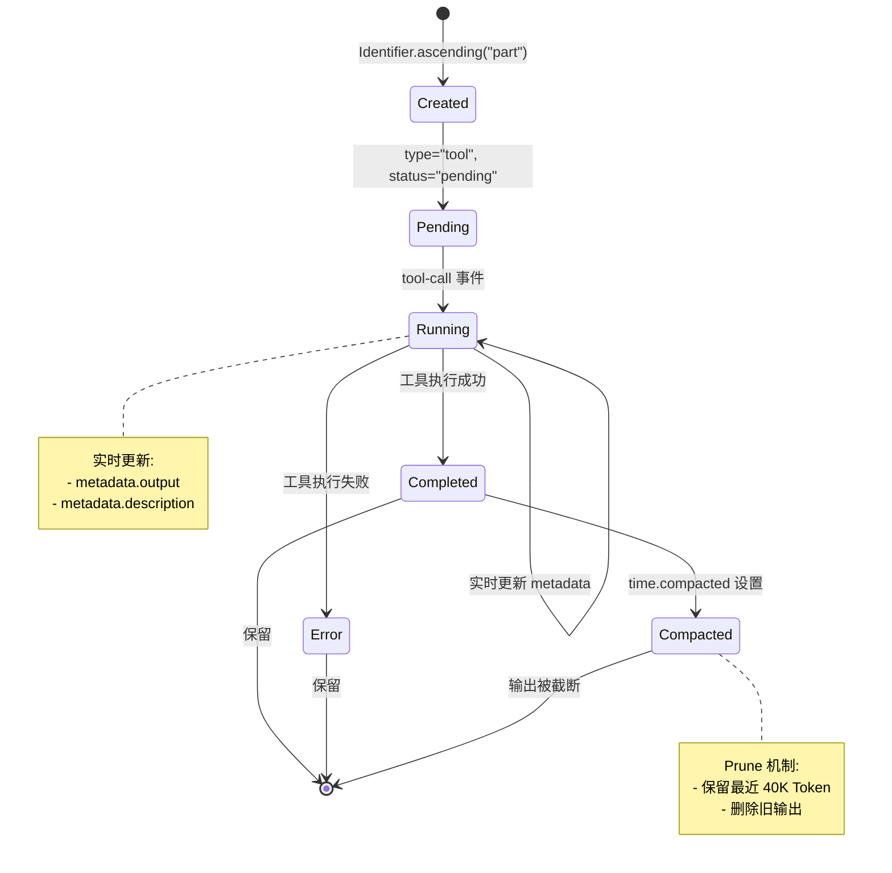

# 5. 数据模型与状态管理

## 数据模型

### 核心实体 (Entities)

#### 1. Session (会话)

**字段定义**:

```typescript
type Session = {
  // 标识符
  id: string                      // ses_... (Descending ID)
  slug: string                    // 短标识符 (用于 URL)
  projectID: string               // 所属项目 ID
  directory: string               // 项目目录路径

  // 元数据
  title: string                   // 会话标题
  version: string                 // OpenCode 版本
  parentID?: string               // 父会话 ID (fork)

  // 时间戳
  time: {
    created: number               // 创建时间 (ms)
    updated: number               // 更新时间 (ms)
    compacting?: number           // 压缩时间
    archived?: number             // 归档时间
  }

  // 聚合数据
  summary?: {
    additions: number             // 新增行数
    deletions: number             // 删除行数
    files: number                 // 修改文件数
  }

  // 分享信息
  share?: {
    url: string                   // 分享链接
  }

  // 权限配置
  permission?: PermissionNext.Ruleset

  // 回滚状态
  revert?: {
    messageID: string             // 回滚到的消息 ID
    partID?: string               // 回滚到的 Part ID
    snapshot?: string             // 快照哈希
    diff?: string                 // Diff 内容
  }
}
```

**关系**:
- 与 `Project` 的关系: 多对一 (通过 `projectID`)
- 与 `Message` 的关系: 一对多 (通过 `sessionID`)
- 与 `Session` 的关系: 一对多 (通过 `parentID`,支持 fork)

**约束**:
- `id`: 主键,必须以 `ses_` 开头,Descending ID (新的在前)
- `slug`: 唯一,用于生成分享链接
- `title`: 必填,默认 `"New session - {ISO8601}"`
- `directory`: 必填,必须是绝对路径
- `projectID`: 外键,引用 `Project.id`
- `parentID`: 外键,引用 `Session.id` (可选)

**依据**: `packages/opencode/src/session/index.ts:42-83`

---

#### 2. Message (消息)

**字段定义**:

```typescript
// 联合类型 (Discriminated Union)
type Message = UserMessage | AssistantMessage

type UserMessage = {
  // 标识符
  id: string                      // msg_... (Ascending ID)
  sessionID: string               // 所属会话 ID
  role: "user"

  // 时间戳
  time: {
    created: number               // 创建时间 (ms)
  }

  // 配置
  agent: string                   // 使用的 Agent
  model: {
    providerID: string            // 提供商 ID
    modelID: string               // 模型 ID
  }
  system?: string                 // 自定义系统提示
  tools?: Record<string, boolean> // 工具开关 (已废弃)
  variant?: string                // 模型变体

  // 摘要
  summary?: {
    title?: string                // 消息标题
    body?: string                 // 消息摘要
    diffs: FileDiff[]             // 文件变更
  }
}

type AssistantMessage = {
  // 标识符
  id: string                      // msg_... (Ascending ID)
  sessionID: string               // 所属会话 ID
  role: "assistant"
  parentID: string                // 父消息 ID (UserMessage)

  // 时间戳
  time: {
    created: number               // 创建时间 (ms)
    completed?: number            // 完成时间 (ms)
  }

  // 配置
  agent: string                   // 使用的 Agent
  mode: string                    // @deprecated 使用 agent
  modelID: string                 // 模型 ID
  providerID: string              // 提供商 ID

  // 执行路径
  path: {
    cwd: string                   // 工作目录
    root: string                  // 项目根目录
  }

  // 使用量
  cost: number                    // 总成本 (USD)
  tokens: {
    input: number                 // 输入 Token 数
    output: number                // 输出 Token 数
    reasoning: number             // 推理 Token 数
    cache: {
      read: number                // 缓存读取 Token 数
      write: number               // 缓存写入 Token 数
    }
  }

  // 完成状态
  finish?: string                 // 完成原因 (stop, tool-calls, length, etc.)
  summary?: boolean               // 是否为压缩消息
  error?: {                       // 错误信息
    name: string
    data: any
  }
}
```

**关系**:
- 与 `Session` 的关系: 多对一 (通过 `sessionID`)
- 与 `Message` 的关系: 一对一 (通过 `parentID`,User → Assistant)
- 与 `Part` 的关系: 一对多 (通过 `messageID`)

**约束**:
- `id`: 主键,必须以 `msg_` 开头,Ascending ID (旧的在前)
- `sessionID`: 外键,引用 `Session.id`
- `parentID`: 外键,引用 `Message.id` (仅 Assistant)
- `role`: 必填,只能是 `"user"` 或 `"assistant"`
- `agent`: 必填,引用 `Agent.name`

**依据**: `packages/opencode/src/session/message-v2.ts:304-396`

---

#### 3. Part (消息片段)

**字段定义**:

```typescript
// 联合类型 (Discriminated Union by type)
type Part = 
  | TextPart 
  | ToolPart 
  | ReasoningPart 
  | FilePart 
  | StepStartPart 
  | StepFinishPart 
  | PatchPart 
  | AgentPart 
  | SubtaskPart 
  | CompactionPart 
  | RetryPart 
  | SnapshotPart

// 文本片段
type TextPart = {
  id: string                      // prt_...
  messageID: string
  sessionID: string
  type: "text"
  text: string                    // 文本内容
  synthetic?: boolean             // 是否为系统生成
  ignored?: boolean               // 是否被忽略
  time?: {
    start: number
    end?: number
  }
  metadata?: Record<string, any>
}

// 工具调用片段
type ToolPart = {
  id: string
  messageID: string
  sessionID: string
  type: "tool"
  tool: string                    // 工具名称
  callID: string                  // 工具调用 ID
  state: 
    | { status: "pending"; input: any; raw: string }
    | { status: "running"; input: any; title?: string; metadata?: any; time: { start: number } }
    | { status: "completed"; input: any; output: string; title: string; metadata: any; time: { start: number; end: number; compacted?: number }; attachments?: FilePart[] }
    | { status: "error"; input: any; error: string; metadata?: any; time: { start: number; end: number } }
  metadata?: Record<string, any>
}

// 推理片段
type ReasoningPart = {
  id: string
  messageID: string
  sessionID: string
  type: "reasoning"
  text: string                    // 推理内容
  time: {
    start: number
    end?: number
  }
  metadata?: Record<string, any>
}

// 文件附件片段
type FilePart = {
  id: string
  messageID: string
  sessionID: string
  type: "file"
  url: string                     // file:// 或 data:
  mime: string                    // MIME 类型
  filename?: string               // 文件名
  source?: FilePartSource         // 来源信息
}

// 步骤开始片段
type StepStartPart = {
  id: string
  messageID: string
  sessionID: string
  type: "step-start"
  snapshot?: string               // 快照哈希
}

// 步骤完成片段
type StepFinishPart = {
  id: string
  messageID: string
  sessionID: string
  type: "step-finish"
  reason: string                  // 完成原因
  snapshot?: string               // 快照哈希
  cost: number                    // 成本
  tokens: {
    input: number
    output: number
    reasoning: number
    cache: { read: number; write: number }
  }
}

// 补丁片段
type PatchPart = {
  id: string
  messageID: string
  sessionID: string
  type: "patch"
  hash: string                    // 快照哈希
  files: string[]                 // 修改的文件列表
}
```

**关系**:
- 与 `Message` 的关系: 多对一 (通过 `messageID`)
- 与 `Session` 的关系: 多对一 (通过 `sessionID`)

**约束**:
- `id`: 主键,必须以 `prt_` 开头,Ascending ID
- `messageID`: 外键,引用 `Message.id`
- `sessionID`: 外键,引用 `Session.id`
- `type`: 必填,用于 Discriminated Union

**依据**: `packages/opencode/src/session/message-v2.ts:38-347`

---

#### 4. Agent (代理)

**字段定义**:

```typescript
type Agent = {
  // 标识符
  name: string                    // 唯一名称 (build, plan, general, explore)

  // 元数据
  description?: string            // 描述
  mode: "subagent" | "primary" | "all"  // 模式
  native?: boolean                // 是否为内置 Agent
  hidden?: boolean                // 是否在列表中隐藏
  color?: string                  // UI 颜色

  // 配置
  model?: {
    providerID: string
    modelID: string
  }
  prompt?: string                 // 自定义系统提示
  temperature?: number            // 温度参数
  topP?: number                   // Top-P 参数
  steps?: number                  // 最大步骤数
  options: Record<string, any>    // 其他选项

  // 权限
  permission: PermissionNext.Ruleset
}
```

**关系**:
- 与 `Message` 的关系: 一对多 (通过 `agent` 字段)
- 与 `Provider.Model` 的关系: 多对一 (通过 `model`)

**约束**:
- `name`: 主键,必须唯一
- `mode`: 必填,只能是 `"subagent"`, `"primary"`, `"all"`
- `permission`: 必填,至少包含默认规则
- `steps`: 可选,必须为正整数

**依据**: `packages/opencode/src/agent/agent.ts:22-46`

---

#### 5. Provider (提供商)

**字段定义**:

```typescript
type Provider = {
  // 标识符
  id: string                      // 提供商 ID (anthropic, openai, etc.)
  name: string                    // 显示名称

  // 来源
  source: "env" | "config" | "custom" | "api"

  // 认证
  env: string[]                   // 环境变量名称列表
  key?: string                    // API Key (如果来源为 env/api)

  // 配置
  options: Record<string, any>    // 提供商选项

  // 模型列表
  models: Record<string, Model>   // modelID → Model
}

type Model = {
  // 标识符
  id: string                      // 模型 ID
  providerID: string              // 所属提供商 ID
  name: string                    // 显示名称
  family?: string                 // 模型系列

  // API 配置
  api: {
    id: string                    // API 中的模型 ID
    url: string                   // API 端点
    npm: string                   // NPM 包名
  }

  // 能力
  capabilities: {
    temperature: boolean          // 是否支持温度参数
    reasoning: boolean            // 是否支持推理
    attachment: boolean           // 是否支持附件
    toolcall: boolean             // 是否支持工具调用
    input: {
      text: boolean
      audio: boolean
      image: boolean
      video: boolean
      pdf: boolean
    }
    output: {
      text: boolean
      audio: boolean
      image: boolean
      video: boolean
      pdf: boolean
    }
    interleaved: boolean | { field: string }
  }

  // 成本
  cost: {
    input: number                 // 输入成本 (USD per 1M tokens)
    output: number                // 输出成本
    cache: {
      read: number                // 缓存读取成本
      write: number               // 缓存写入成本
    }
    experimentalOver200K?: {      // 超过 200K 上下文的成本
      input: number
      output: number
      cache: { read: number; write: number }
    }
  }

  // 限制
  limit: {
    context: number               // 上下文窗口大小
    input?: number                // 最大输入 Token 数
    output: number                // 最大输出 Token 数
  }

  // 其他
  status: "alpha" | "beta" | "deprecated" | "active"
  options: Record<string, any>    // 模型选项
  headers: Record<string, string> // 自定义 HTTP Headers
  release_date: string            // 发布日期
  variants?: Record<string, any>  // 模型变体
}
```

**关系**:
- 与 `Model` 的关系: 一对多 (通过 `providerID`)
- 与 `Message` 的关系: 多对多 (通过 `model` 字段)

**约束**:
- `Provider.id`: 主键,必须唯一
- `Model.id`: 在 Provider 内唯一
- `Model.providerID`: 外键,引用 `Provider.id`
- `cost.*`: 必须 >= 0
- `limit.context`: 必须 > 0

**依据**: `packages/opencode/src/provider/provider.ts:509-593`

---

#### 6. Project (项目)

**字段定义**:

```typescript
type Project = {
  // 标识符
  id: string                      // Git root commit hash 或 "global"
  worktree: string                // Git worktree 路径

  // 元数据
  name?: string                   // 项目名称 (用户自定义)
  vcs?: "git"                     // 版本控制系统
  icon?: {
    url?: string                  // 图标 URL (data: 或 http:)
    override?: string             // 用户覆盖的图标
    color?: string                // 图标颜色
  }

  // 时间戳
  time: {
    created: number               // 创建时间 (ms)
    updated: number               // 更新时间 (ms)
    initialized?: number          // 初始化时间 (运行 init 命令)
  }

  // 沙箱
  sandboxes: string[]             // 沙箱目录列表 (worktree 的子目录)
}
```

**关系**:
- 与 `Session` 的关系: 一对多 (通过 `projectID`)

**约束**:
- `id`: 主键,Git 项目为 root commit hash,非 Git 项目为 `"global"`
- `worktree`: 必填,必须是绝对路径
- `vcs`: 可选,当前仅支持 `"git"`
- `sandboxes`: 必填,可为空数组

**依据**: `packages/opencode/src/project/project.ts:19-42`

---

### 值对象 (Value Objects)

#### 1. PermissionRule (权限规则)

```typescript
type PermissionRule = {
  permission: string              // 权限名称 (bash, edit, read)
  pattern: string                 // 匹配模式 (支持 wildcard)
  action: "allow" | "deny" | "ask"
}

type PermissionRuleset = PermissionRule[]
```

**不可变性**: 规则创建后不可修改,只能添加新规则

**依据**: `packages/opencode/src/permission/next.ts:20-34`

---

#### 2. FileDiff (文件变更)

```typescript
type FileDiff = {
  file: string                    // 文件路径 (相对于 worktree)
  before: string                  // 变更前的快照哈希
  after: string                   // 变更后的快照哈希
  additions: number               // 新增行数
  deletions: number               // 删除行数
}
```

**不可变性**: Diff 计算后不可修改

**依据**: `packages/opencode/src/snapshot/index.ts:184-195`

---

#### 3. Identifier (标识符)

```typescript
type Identifier = string  // {prefix}_{timestamp_hex}{random}

// 前缀
type Prefix = 
  | "ses_"   // Session
  | "msg_"   // Message
  | "prt_"   // Part
  | "per_"   // Permission
  | "que_"   // Question
  | "pty_"   // PTY
  | "usr_"   // User
  | "tool_"  // Tool
```

**生成规则**:
- **Ascending**: 时间戳正序,越新 ID 越大 (用于 Message, Part)
- **Descending**: 时间戳倒序,越新 ID 越小 (用于 Session)
- **单调性**: 同一毫秒内生成的 ID 保证递增 (使用 counter)

**依据**: `packages/opencode/src/id/id.ts:4-83`

---

### 聚合根 (Aggregate Roots)

#### Session 聚合

**聚合边界**:
- **根实体**: `Session`
- **子实体**: `Message`, `Part`
- **值对象**: `PermissionRule`, `FileDiff`

**不变量**:
1. 所有 Message 必须属于同一个 Session
2. 所有 Part 必须属于同一个 Message
3. AssistantMessage 必须有 parentID 指向 UserMessage
4. Session 删除时级联删除所有 Message 和 Part

**操作**:
- `Session.create()` - 创建聚合
- `Session.remove()` - 删除聚合 (级联)
- `Session.fork()` - 复制聚合
- `Session.updateMessage()` - 更新子实体
- `Session.updatePart()` - 更新子实体

**依据**: `packages/opencode/src/session/index.ts:26-488`

---

### DTO (Data Transfer Objects)

#### 1. PromptInput (提示输入)

```typescript
type PromptInput = {
  sessionID: string
  messageID?: string
  model?: {
    providerID: string
    modelID: string
  }
  agent?: string
  noReply?: boolean
  system?: string
  variant?: string
  parts: Array<
    | { type: "text"; text: string }
    | { type: "file"; url: string; filename?: string; mime: string }
    | { type: "agent"; name: string }
    | { type: "subtask"; prompt: string; agent: string; description: string }
  >
}
```

**用途**: HTTP API 请求体,SDK 方法参数

**依据**: `packages/opencode/src/session/prompt.ts:84-148`

---

#### 2. PermissionRequest (权限请求)

```typescript
type PermissionRequest = {
  id: string                      // per_...
  sessionID: string
  permission: string              // 权限名称
  patterns: string[]              // 要匹配的模式
  metadata: Record<string, any>   // 元数据
  always: string[]                // "always allow" 时添加的模式
  tool?: {
    messageID: string
    callID: string
  }
}
```

**用途**: SSE 事件 Payload,权限对话框数据

**依据**: `packages/opencode/src/permission/next.ts:56-75`

---

## 状态管理

### 后端状态管理

#### 1. Instance.state() - 项目级状态

**状态管理库**: 自定义 State Factory Pattern

**状态结构**:
```typescript
// State Factory
const state = Instance.state(
  async () => {
    // 初始化逻辑
    return {
      data: [],
      cache: new Map()
    }
  },
  async (state) => {
    // 清理逻辑
    await cleanup(state)
  }
)

// 使用
const s = await state()
```

**特点**:
- **项目隔离**: 每个项目有独立的状态实例
- **延迟初始化**: 首次访问时才初始化
- **自动清理**: Instance 销毁时自动调用 dispose
- **缓存**: 同一项目多次访问返回同一实例

**应用场景**:
- `Provider` 状态: SDK 实例缓存,模型列表
- `LSP` 状态: LSP 客户端池
- `MCP` 状态: MCP 客户端池
- `Permission` 状态: 待处理权限请求

**依据**: `packages/opencode/src/project/instance.ts:62-64`

---

#### 2. State.create() - 通用状态工厂

**实现**:
```typescript
export namespace State {
  const recordsByKey = new Map<string, Map<any, Entry>>()

  export function create<S>(
    root: () => string,
    init: () => S,
    dispose?: (state: Awaited<S>) => Promise<void>
  ) {
    return () => {
      const key = root()
      let entries = recordsByKey.get(key)
      if (!entries) {
        entries = new Map()
        recordsByKey.set(key, entries)
      }
      const exists = entries.get(init)
      if (exists) return exists.state as S
      const state = init()
      entries.set(init, { state, dispose })
      return state
    }
  }

  export async function dispose(key: string) {
    const entries = recordsByKey.get(key)
    if (!entries) return
    for (const entry of entries.values()) {
      if (entry.dispose) {
        await entry.dispose(await entry.state)
      }
    }
    entries.clear()
    recordsByKey.delete(key)
  }
}
```

**特点**:
- **Key-Value 缓存**: 使用 Map 存储状态
- **多实例支持**: 同一 key 可有多个状态实例 (通过 init 函数区分)
- **生命周期管理**: 自动调用 dispose
- **并发安全**: 使用 Promise 确保初始化完成

**依据**: `packages/opencode/src/project/state.ts:3-66`

---

#### 3. Storage - 持久化状态

**状态存储位置**:
- **路径**: `~/.opencode/data/storage/`
- **格式**: JSON 文件
- **结构**:
  ```
  storage/
    session/
      {projectID}/
        {sessionID}.json
    message/
      {sessionID}/
        {messageID}.json
    part/
      {messageID}/
        {partID}.json
    project/
      {projectID}.json
    permission/
      {projectID}.json
    share/
      {sessionID}.json
  ```

**状态更新方式**:
```typescript
// 写入
await Storage.write(["session", projectID, sessionID], session)

// 读取
const session = await Storage.read<Session.Info>(["session", projectID, sessionID])

// 更新 (使用 Immer)
await Storage.update<Session.Info>(["session", projectID, sessionID], (draft) => {
  draft.title = "New title"
  draft.time.updated = Date.now()
})

// 删除
await Storage.remove(["session", projectID, sessionID])

// 列出
for (const key of await Storage.list(["session", projectID])) {
  const session = await Storage.read<Session.Info>(key)
}
```

**依据**: `packages/opencode/src/storage/storage.ts:12-227`

---

### 前端状态管理

#### 1. SolidJS Store - 全局状态

**状态管理库**: `solid-js/store`

**状态结构**:
```typescript
// 全局状态
type GlobalState = {
  ready: boolean
  error?: Error
  path: Path
  project: Project[]
  provider: ProviderListResponse
  provider_auth: ProviderAuthResponse
}

// 项目级状态
type ProjectState = {
  status: "loading" | "partial" | "complete"
  project: string                 // Project ID
  provider: ProviderListResponse
  config: Config
  path: Path
  agent: Agent[]
  command: Command[]
  session: Session[]              // 会话列表
  sessionTotal: number            // 总会话数
  session_status: {               // 会话状态
    [sessionID: string]: SessionStatus
  }
  session_diff: {                 // 会话 Diff
    [sessionID: string]: FileDiff[]
  }
  todo: {                         // TODO 列表
    [sessionID: string]: Todo[]
  }
  permission: {                   // 权限请求
    [sessionID: string]: PermissionRequest[]
  }
  question: {                     // 问题请求
    [sessionID: string]: QuestionRequest[]
  }
  mcp: {                          // MCP 状态
    [name: string]: McpStatus
  }
  lsp: LspStatus[]                // LSP 状态
  vcs: VcsInfo | undefined        // VCS 信息
  limit: number                   // 会话加载限制
  message: {                      // 消息列表
    [sessionID: string]: Message[]
  }
  part: {                         // Part 列表
    [messageID: string]: Part[]
  }
}
```

**依据**: `packages/app/src/context/global-sync.tsx:46-83`

---

#### 2. 状态更新方式

**创建 Store**:
```typescript
const [store, setStore] = createStore<State>({
  session: [],
  message: {},
  part: {}
})
```

**更新状态 (Immutable)**:
```typescript
// 使用 reconcile (智能 diff)
setStore("session", reconcile(newSessions, { key: "id" }))

// 使用 produce (Immer 风格)
setStore(
  "session",
  produce((draft) => {
    draft.push(newSession)
  })
)

// 直接赋值
setStore("status", "complete")

// 嵌套更新
setStore("session", index, "title", "New title")

// 批量更新
batch(() => {
  setStore("session", reconcile(sessions))
  setStore("message", sessionID, reconcile(messages))
})
```

**依据**: `packages/app/src/context/global-sync.tsx:354-477`

---

#### 3. 状态订阅机制

**SSE 事件订阅**:
```typescript
const unsub = globalSDK.event.listen((e) => {
  const directory = e.name
  const event = e.details

  switch (event.type) {
    case "session.created": {
      const result = Binary.search(store.session, event.properties.info.id, (s) => s.id)
      if (result.found) {
        setStore("session", result.index, reconcile(event.properties.info))
      } else {
        setStore("session", produce((draft) => {
          draft.splice(result.index, 0, event.properties.info)
        }))
      }
      break
    }

    case "message.part.updated": {
      const part = event.properties.part
      const parts = store.part[part.messageID]
      if (!parts) {
        setStore("part", part.messageID, [part])
      } else {
        const result = Binary.search(parts, part.id, (p) => p.id)
        if (result.found) {
          setStore("part", part.messageID, result.index, reconcile(part))
        } else {
          setStore("part", part.messageID, produce((draft) => {
            draft.splice(result.index, 0, part)
          }))
        }
      }
      break
    }
  }
})

onCleanup(unsub)
```

**特点**:
- **实时更新**: SSE 推送事件,立即更新 Store
- **二分查找**: 使用 `Binary.search()` 快速定位
- **智能合并**: 使用 `reconcile()` 最小化 DOM 更新
- **批量更新**: 使用 `batch()` 减少渲染次数

**依据**: `packages/app/src/context/global-sync.tsx:320-572`

---

#### 4. 组件状态 (Local State)

**useState 模式**:
```typescript
import { createSignal } from "solid-js"

function Component() {
  const [count, setCount] = createSignal(0)
  const [text, setText] = createSignal("")

  return (
    <div>
      <input value={text()} onInput={(e) => setText(e.target.value)} />
      <button onClick={() => setCount(count() + 1)}>
        Count: {count()}
      </button>
    </div>
  )
}
```

**createMemo 模式** (派生状态):
```typescript
import { createMemo } from "solid-js"

const filteredSessions = createMemo(() => {
  return store.session.filter(s => !s.time.archived)
})
```

**依据**: SolidJS 标准模式

---

#### 5. Context Provider Pattern

**定义 Context**:
```typescript
import { createContext, useContext } from "solid-js"

const SyncContext = createContext<SyncState>()

export function SyncProvider(props: ParentProps) {
  const value = createSync()
  return (
    <SyncContext.Provider value={value}>
      {props.children}
    </SyncContext.Provider>
  )
}

export function useSync() {
  const context = useContext(SyncContext)
  if (!context) throw new Error("useSync must be used within SyncProvider")
  return context
}
```

**嵌套 Providers**:
```typescript
<GlobalSyncProvider>
  <ServerProvider>
    <PermissionProvider>
      <LayoutProvider>
        {children}
      </LayoutProvider>
    </PermissionProvider>
  </ServerProvider>
</GlobalSyncProvider>
```

**依据**: `packages/app/src/context/global-sync.tsx:648-668`

---

## 数据持久化

### 持久化方式

#### 1. JSON 文件存储 (CLI/Desktop)

**存储位置**:
- **路径**: `~/.opencode/data/storage/`
- **格式**: JSON (每个实体一个文件)

**文件结构**:
```
~/.opencode/data/
  storage/
    session/
      {projectID}/
        ses_01JKL....json
        ses_01JKM....json
    message/
      {sessionID}/
        msg_01JKN....json
        msg_01JKO....json
    part/
      {messageID}/
        prt_01JKP....json
        prt_01JKQ....json
    project/
      {projectID}.json
    permission/
      {projectID}.json
    share/
      {sessionID}.json
    session_diff/
      {sessionID}.json
  logs/
    opencode.log
  plans/
    {timestamp}-{slug}.md
```

**依据**: `packages/opencode/src/storage/storage.ts:144-227`

---

#### 2. 数据库存储 (Console)

**数据库**: PlanetScale (MySQL)

**ORM**: Drizzle ORM

**表结构** (推断):
```sql
-- sessions
CREATE TABLE sessions (
  id VARCHAR(50) PRIMARY KEY,
  project_id VARCHAR(50) NOT NULL,
  title TEXT NOT NULL,
  created_at BIGINT NOT NULL,
  updated_at BIGINT NOT NULL,
  data JSON NOT NULL
);

-- messages
CREATE TABLE messages (
  id VARCHAR(50) PRIMARY KEY,
  session_id VARCHAR(50) NOT NULL,
  role ENUM('user', 'assistant') NOT NULL,
  created_at BIGINT NOT NULL,
  data JSON NOT NULL,
  FOREIGN KEY (session_id) REFERENCES sessions(id) ON DELETE CASCADE
);
```

**依据**: `sst.config.ts:14` (PlanetScale 集成)

---

#### 3. S3 存储 (Session Sharing)

**用途**: 分享会话数据

**存储格式**: JSON (压缩)

**访问方式**: 通过分享链接 (https://opencode.ai/share/{slug})

**依据**: `packages/opencode/src/share/share-next.ts` (推断)

---

### 数据序列化

#### JSON 序列化

**写入**:
```typescript
await Storage.write(["session", projectID, sessionID], session)

// 内部实现
const target = path.join(dir, ...key) + ".json"
await Bun.file(target).write(JSON.stringify(data))
```

**读取**:
```typescript
const session = await Storage.read<Session.Info>(["session", projectID, sessionID])

// 内部实现
const target = path.join(dir, ...key) + ".json"
const result = await Bun.file(target).json()
return result as T
```

**特点**:
- **类型安全**: 使用 Zod 验证
- **文件锁**: 使用 `Lock.read()` / `Lock.write()` 保证并发安全
- **错误处理**: 文件不存在时抛出 `Storage.NotFoundError`

**依据**: `packages/opencode/src/storage/storage.ts:169-227`

---

### 数据迁移策略

#### 迁移机制

**迁移文件**:
```typescript
const MIGRATIONS: Migration[] = [
  // Migration 0: 项目结构迁移
  async (dir) => {
    // 从 project/{directory}/ 迁移到 session/{projectID}/
    // 从 Git root commit 生成 projectID
  },

  // Migration 1: Session.summary 迁移
  async (dir) => {
    // 从 session.summary.diffs 提取到 session_diff/{sessionID}.json
    // 简化 session.summary 为 { additions, deletions, files }
  }
]
```

**执行逻辑**:
```typescript
const migration = await Bun.file(path.join(dir, "migration"))
  .json()
  .then((x) => parseInt(x))
  .catch(() => 0)

for (let index = migration; index < MIGRATIONS.length; index++) {
  await MIGRATIONS[index](dir)
  await Bun.file(path.join(dir, "migration")).write(JSON.stringify(index + 1))
}
```

**特点**:
- **顺序执行**: 按索引顺序执行迁移
- **幂等性**: 记录已执行的迁移索引,避免重复
- **自动触发**: 应用启动时自动检查并执行

**依据**: `packages/opencode/src/storage/storage.ts:24-142`

---

#### 迁移示例

**v0.0.1 → v0.0.2**: 项目结构迁移
```typescript
// 旧结构
storage/
  project/
    {directory-hash}/
      storage/
        session/
          info/
            {sessionID}.json
          message/
            {sessionID}/
              {messageID}.json

// 新结构
storage/
  project/
    {git-root-commit}.json
  session/
    {projectID}/
      {sessionID}.json
  message/
    {sessionID}/
      {messageID}.json
```

**v0.0.2 → v0.0.3**: Summary 字段拆分
```typescript
// 旧格式
{
  "summary": {
    "diffs": [
      { "file": "src/app.ts", "additions": 10, "deletions": 5 }
    ]
  }
}

// 新格式
// session/{projectID}/{sessionID}.json
{
  "summary": {
    "additions": 10,
    "deletions": 5,
    "files": 1
  }
}

// session_diff/{sessionID}.json
[
  {
    "file": "src/app.ts",
    "before": "hash1",
    "after": "hash2",
    "additions": 10,
    "deletions": 5
  }
]
```

**依据**: `packages/opencode/src/storage/storage.ts:121-141`

---

### 备份恢复机制

#### Snapshot (快照)

**快照机制**:
```typescript
// 创建快照
const hash = await Snapshot.track()
// → 使用 git write-tree 创建快照
// → 返回 tree hash

// 生成 Patch
const patch = await Snapshot.patch(hash)
// → 使用 git diff 对比快照
// → 返回修改的文件列表

// 回滚快照
await Snapshot.restore(hash)
// → 使用 git read-tree + checkout-index 恢复文件
```

**存储位置**:
- **路径**: `~/.opencode/data/snapshot/{projectID}/`
- **格式**: Git objects (tree, blob)

**清理策略**:
- **定时任务**: 每小时执行一次
- **保留时间**: 7 天
- **命令**: `git gc --prune=7.days`

**依据**: `packages/opencode/src/snapshot/index.ts:11-182`

---

#### Session Revert (会话回滚)

**回滚流程**:
```typescript
// 1. 设置回滚标记
await SessionRevert.revert({
  sessionID: "ses_01JKL...",
  messageID: "msg_01JKM..."
})

// 2. 更新 Session.revert
session.revert = {
  messageID: "msg_01JKM...",
  snapshot: "abc123...",
  diff: "diff content..."
}

// 3. 恢复文件
await Snapshot.revert(patches)
// → 使用 git checkout 恢复文件

// 4. 清理回滚状态
await SessionRevert.cleanup(session)
```

**依据**: `packages/opencode/src/session/revert.ts` (推断)

---

## 缓存策略

### 缓存层级

#### 1. 内存缓存 (Provider SDK)

**缓存内容**: AI SDK 实例

**缓存键**: `xxHash32(JSON.stringify({ npm, options }))`

**缓存策略**:
```typescript
const state = Instance.state(async () => {
  return {
    models: new Map<string, LanguageModelV2>(),  // 模型实例缓存
    sdk: new Map<number, SDK>()                  // SDK 实例缓存
  }
})

async function getSDK(model: Model) {
  const s = await state()
  const key = Bun.hash.xxHash32(JSON.stringify({ npm: model.api.npm, options }))
  const existing = s.sdk.get(key)
  if (existing) return existing

  // 创建新实例
  const loaded = createSDK(options)
  s.sdk.set(key, loaded)
  return loaded
}
```

**特点**:
- **项目隔离**: 每个项目有独立的缓存
- **永久缓存**: 实例创建后不失效
- **自动清理**: Instance 销毁时清理

**依据**: `packages/opencode/src/provider/provider.ts:676-1060`

---

#### 2. 内存缓存 (LSP/MCP Clients)

**缓存内容**: LSP/MCP 客户端连接

**缓存策略**:
```typescript
const state = Instance.state(
  async () => {
    return {
      clients: [],                // LSP 客户端列表
      broken: new Set<string>(),  // 失败的服务器
      connected: new Set<string>()// 已连接的服务器
    }
  },
  async (state) => {
    // 清理: 关闭所有客户端
    await Promise.all(state.clients.map(client => client.shutdown()))
  }
)
```

**特点**:
- **连接池**: 复用已建立的连接
- **故障隔离**: 失败的服务器不再重试
- **自动清理**: Instance 销毁时关闭连接

**依据**: `packages/opencode/src/lsp/index.ts:79-143`

---

#### 3. 磁盘缓存 (Bun Install)

**缓存内容**: NPM 包安装

**缓存位置**: `~/.bun/install/cache/`

**缓存策略**:
```typescript
export async function install(pkg: string, version = "latest") {
  const key = `${pkg}@${version}`
  const cached = state().installed.get(key)
  if (cached) return cached

  const result = await $`bun install --global ${pkg}@${version}`.quiet().nothrow()
  const installed = await resolvePackagePath(pkg)
  state().installed.set(key, installed)
  return installed
}
```

**特点**:
- **全局缓存**: 所有项目共享
- **版本管理**: 支持多版本共存
- **延迟加载**: 首次使用时安装

**依据**: `packages/opencode/src/bun/index.ts` (推断)

---

#### 4. 浏览器缓存 (LocalStorage)

**缓存内容**: VCS 信息

**缓存键**: `opencode:workspace:{directory}:vcs:v1`

**缓存策略**:
```typescript
const cache = persisted(
  Persist.workspace(directory, "vcs", ["vcs.v1"]),
  createStore({ value: undefined as VcsInfo | undefined })
)

// 读取缓存
createEffect(() => {
  if (!cache.ready()) return
  const cached = cache.store.value
  if (cached?.branch) {
    setStore("vcs", (value) => value ?? cached)
  }
})

// 更新缓存
sdk.vcs.get().then((x) => {
  const next = x.data
  setStore("vcs", next)
  if (next?.branch) cache.setStore("value", next)
})
```

**特点**:
- **持久化**: 刷新页面后保留
- **延迟加载**: 先显示缓存,后台更新
- **版本控制**: 使用版本号 `vcs.v1`

**依据**: `packages/app/src/context/global-sync.tsx:117-124`

---

### 缓存失效策略

#### 1. 事件驱动失效

**触发条件**: 收到 SSE 事件

**失效逻辑**:
```typescript
// session.updated 事件
case "session.updated": {
  const result = Binary.search(store.session, event.properties.info.id, (s) => s.id)
  if (result.found) {
    // 更新缓存
    setStore("session", result.index, reconcile(event.properties.info))
  }
}
```

**特点**: 实时失效,无延迟

---

#### 2. 手动失效

**触发条件**: Instance 销毁

**失效逻辑**:
```typescript
export async function dispose() {
  await State.dispose(Instance.directory)
  cache.delete(Instance.directory)
}
```

**特点**: 清理所有项目级缓存

**依据**: `packages/opencode/src/project/instance.ts:65-68`

---

#### 3. 定时清理 (Snapshot)

**触发条件**: 每小时执行

**清理逻辑**:
```typescript
Scheduler.register({
  id: "snapshot.cleanup",
  interval: 60 * 60 * 1000,  // 1 小时
  run: async () => {
    await $`git gc --prune=7.days`
  },
  scope: "instance"
})
```

**特点**: 自动清理 7 天前的快照

**依据**: `packages/opencode/src/snapshot/index.ts:16-48`

---

### 缓存更新策略

#### 1. Write-through (同步写入)

**应用场景**: Session/Message/Part 更新

**实现**:
```typescript
export async function updatePart(part: MessageV2.Part) {
  // 1. 写入磁盘
  await Storage.write(["part", part.messageID, part.id], part)

  // 2. 更新缓存 (通过事件)
  Bus.publish(MessageV2.Event.PartUpdated, { part })

  return part
}
```

**特点**: 保证数据一致性,写入成功后立即可见

**依据**: `packages/opencode/src/session/index.ts:401-410`

---

#### 2. Write-back (延迟写入)

**应用场景**: 实时输出 (Bash 工具)

**实现**:
```typescript
proc.stdout.on("data", (chunk) => {
  output += chunk.toString()
  
  // 更新缓存 (不写入磁盘)
  ctx.metadata({
    metadata: {
      output: output.slice(0, MAX_METADATA_LENGTH)
    }
  })
})

// 进程退出后写入磁盘
proc.on("exit", async () => {
  await Session.updatePart({
    ...part,
    state: {
      status: "completed",
      output  // 完整输出
    }
  })
})
```

**特点**: 减少磁盘 I/O,提高性能

**依据**: `packages/opencode/src/tool/bash.ts:177-256`

---

#### 3. Lazy Loading (按需加载)

**应用场景**: 消息列表

**实现**:
```typescript
const loadMessages = async (sessionID: string, limit: number) => {
  // 仅加载前 N 条消息
  const messages = await sdk.session.messages({ sessionID, limit })
  setStore("message", sessionID, reconcile(messages.data))
}

// 滚动到底部时加载更多
const loadMore = () => {
  const currentLimit = meta.limit[sessionID] ?? 400
  const newLimit = currentLimit + 400
  loadMessages(sessionID, newLimit)
}
```

**特点**: 减少初始加载时间,按需加载

**依据**: `packages/app/src/context/sync.tsx:49-86`

---

### 缓存一致性保证

#### 1. 文件锁 (Read-Write Lock)

**实现**:
```typescript
export namespace Lock {
  const locks = new Map<string, LockState>()

  export async function read(key: string): Promise<Disposable> {
    const lock = get(key)
    // 等待写锁释放
    if (!lock.writer && lock.waitingWriters.length === 0) {
      lock.readers++
      return disposable
    } else {
      // 加入等待队列
      lock.waitingReaders.push(resolve)
    }
  }

  export async function write(key: string): Promise<Disposable> {
    const lock = get(key)
    // 等待所有读锁和写锁释放
    if (!lock.writer && lock.readers === 0) {
      lock.writer = true
      return disposable
    } else {
      // 加入等待队列 (优先级高于读锁)
      lock.waitingWriters.push(resolve)
    }
  }
}
```

**使用**:
```typescript
// 读取
using _ = await Lock.read(filepath)
const data = await Bun.file(filepath).json()

// 写入
using _ = await Lock.write(filepath)
await Bun.file(filepath).write(JSON.stringify(data))
```

**特点**:
- **多读单写**: 允许多个并发读,但写时独占
- **写优先**: 写锁优先于读锁,防止写饥饿
- **自动释放**: 使用 `using` 语法自动释放锁

**依据**: `packages/opencode/src/util/lock.ts:1-98`

---

#### 2. 事件总线同步

**实现**:
```typescript
// 后端: 更新数据 + 发布事件
await Storage.write(["session", projectID, sessionID], session)
Bus.publish(Session.Event.Updated, { info: session })

// 前端: 监听事件 + 更新缓存
globalSDK.event.listen((e) => {
  if (e.details.type === "session.updated") {
    setStore("session", index, reconcile(e.details.properties.info))
  }
})
```

**特点**:
- **最终一致性**: 通过事件保证前后端同步
- **实时更新**: SSE 推送,延迟 < 100ms
- **幂等性**: 使用 `reconcile()` 智能合并

**依据**: `packages/app/src/context/global-sync.tsx:371-396`

---

#### 3. 二分查找 + 有序插入

**实现**:
```typescript
// 二分查找
const result = Binary.search(store.session, sessionID, (s) => s.id)

if (result.found) {
  // 更新现有项
  setStore("session", result.index, reconcile(newSession))
} else {
  // 插入新项 (保持有序)
  setStore("session", produce((draft) => {
    draft.splice(result.index, 0, newSession)
  }))
}
```

**特点**:
- **有序存储**: 按 ID 排序 (利用 ID 的时间戳特性)
- **快速查找**: O(log n) 复杂度
- **有序插入**: 保持列表有序

**依据**: `packages/app/src/context/global-sync.tsx:354-365`

---

## 数据流图



---

## 状态生命周期

### 1. Session 生命周期



**依据**: `packages/opencode/src/session/index.ts:130-488`

---

### 2. Message 生命周期



**依据**: `packages/opencode/src/session/processor.ts:26-406`

---

### 3. Part 生命周期



**依据**: `packages/opencode/src/session/processor.ts:103-221`

---

## 并发控制

### 1. Read-Write Lock

**问题**: 多个进程/线程同时读写同一文件

**解决方案**: 读写锁

**实现**:
```typescript
// 读操作 (允许并发)
using _ = await Lock.read(filepath)
const data = await Bun.file(filepath).json()

// 写操作 (独占)
using _ = await Lock.write(filepath)
await Bun.file(filepath).write(JSON.stringify(data))
```

**保证**:
- **多读**: 多个读操作可并发
- **单写**: 写操作时阻塞所有读写
- **写优先**: 写锁优先于读锁

**依据**: `packages/opencode/src/util/lock.ts:1-98`

---

### 2. AbortController (取消控制)

**问题**: 用户取消操作,需要中止所有进行中的任务

**解决方案**: AbortController + AbortSignal

**实现**:
```typescript
// 创建 AbortController
const abort = new AbortController()

// 传递给所有异步操作
await LLM.stream({ abort: abort.signal })
await tool.execute(args, { abort: abort.signal })

// 用户取消
abort.abort()

// 监听取消
abort.signal.addEventListener("abort", () => {
  // 清理资源
  Shell.killTree(proc)
})

// 检查是否已取消
if (abort.signal.aborted) {
  throw new Error("Aborted")
}
```

**保证**:
- **级联取消**: 取消父任务会取消所有子任务
- **资源清理**: 自动清理进程、连接、定时器

**依据**: `packages/opencode/src/session/prompt.ts:232-266`

---

### 3. Promise 队列

**问题**: 权限请求需要串行处理

**解决方案**: Promise + 队列

**实现**:
```typescript
const state = Instance.state(async () => {
  const pending: Record<string, {
    info: Request
    resolve: () => void
    reject: (e: any) => void
  }> = {}
  return { pending }
})

// 创建权限请求
export async function ask(input: Request) {
  return new Promise<void>((resolve, reject) => {
    const s = await state()
    s.pending[input.id] = { info: input, resolve, reject }
    Bus.publish(Event.Asked, input)
  })
}

// 响应权限请求
export async function reply(input: { requestID: string; reply: Reply }) {
  const s = await state()
  const existing = s.pending[input.requestID]
  if (!existing) return
  delete s.pending[input.requestID]
  
  if (input.reply === "reject") {
    existing.reject(new RejectedError())
  } else {
    existing.resolve()
  }
}
```

**保证**:
- **串行处理**: 同一会话的权限请求按顺序处理
- **超时处理**: Instance 销毁时自动 reject 所有待处理请求

**依据**: `packages/opencode/src/permission/next.ts:97-218`

---

## 数据一致性

### 1. 事务性操作

**问题**: 创建 Session 时需要同时创建多个实体

**解决方案**: 顺序写入 + 事件发布

**实现**:
```typescript
export async function create(input) {
  const session: Session.Info = { ... }
  
  // 1. 写入 Session
  await Storage.write(["session", projectID, session.id], session)
  
  // 2. 发布事件
  Bus.publish(Event.Created, { info: session })
  
  // 3. 异步操作 (不阻塞)
  share(session.id).catch(() => {})
  
  return session
}
```

**特点**:
- **原子性**: 单个文件写入是原子的
- **最终一致性**: 通过事件保证前端同步
- **容错性**: 异步操作失败不影响主流程

**依据**: `packages/opencode/src/session/index.ts:192-233`

---

### 2. 乐观更新

**问题**: 等待服务器响应会导致 UI 延迟

**解决方案**: 乐观更新 + 事件校正

**实现**:
```typescript
// 1. 立即更新 UI (乐观)
sync.session.addOptimisticMessage({
  sessionID,
  messageID,
  parts,
  agent,
  model
})

// 2. 发送请求
await sdk.session.prompt({ sessionID, parts })

// 3. 收到事件后校正
globalSDK.event.listen((e) => {
  if (e.details.type === "message.updated") {
    // 使用服务器数据覆盖乐观数据
    setStore("message", sessionID, index, reconcile(e.details.properties.info))
  }
})
```

**特点**:
- **即时反馈**: UI 立即响应
- **自动校正**: 服务器数据覆盖乐观数据
- **冲突解决**: 使用 `reconcile()` 智能合并

**依据**: `packages/app/src/context/sync.tsx:104-134`

---

### 3. 二分查找 + 有序插入

**问题**: 大量数据时查找和插入性能差

**解决方案**: 利用 ID 的时间戳特性保持有序

**实现**:
```typescript
// ID 包含时间戳,天然有序
// ses_01JKL... < ses_01JKM... < ses_01JKN...

// 二分查找
const result = Binary.search(store.session, sessionID, (s) => s.id)
// → { found: boolean, index: number }

// 有序插入
if (result.found) {
  // 更新
  setStore("session", result.index, reconcile(newSession))
} else {
  // 插入 (保持有序)
  setStore("session", produce((draft) => {
    draft.splice(result.index, 0, newSession)
  }))
}
```

**特点**:
- **O(log n) 查找**: 二分查找
- **O(n) 插入**: 数组 splice
- **有序保证**: 始终保持有序

**依据**: `packages/app/src/context/global-sync.tsx:354-365`

---

## 下一步

继续阅读 [6. 关键调用链详解](./6.Call-Chains.md)
