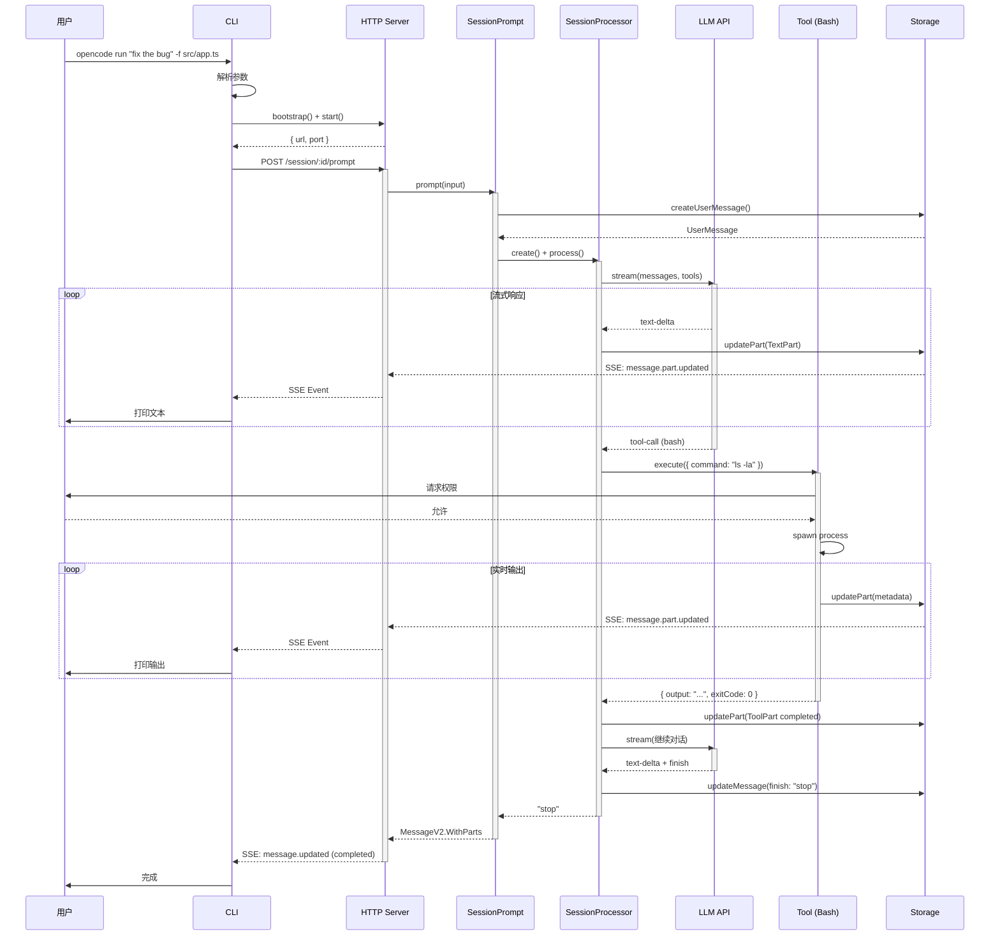
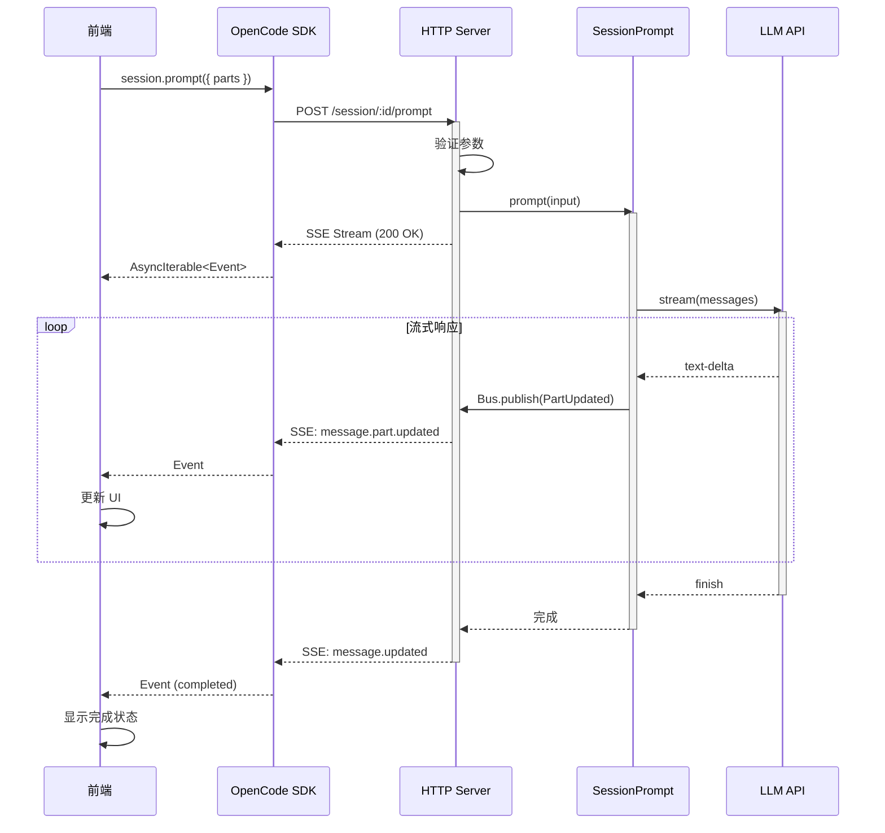
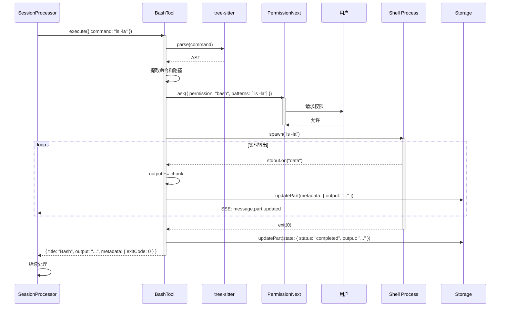
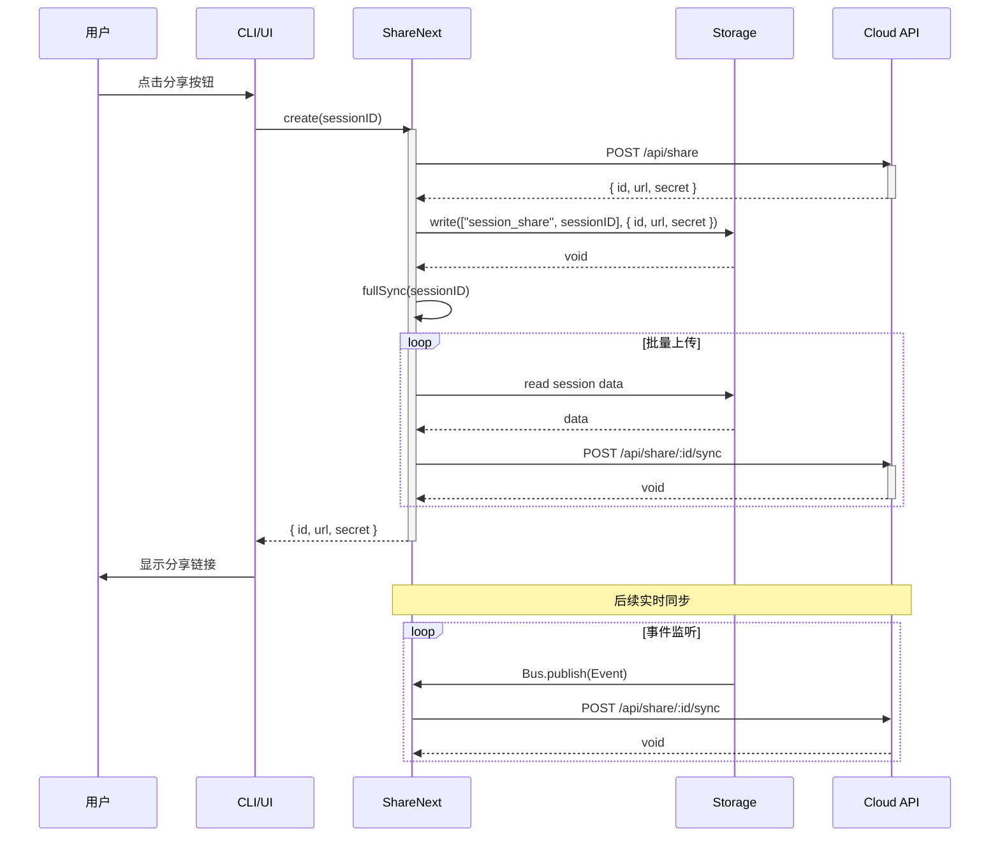
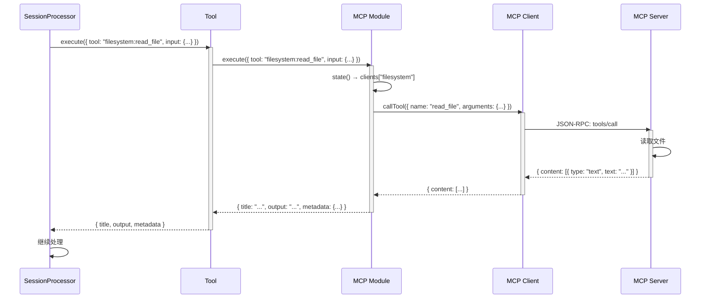
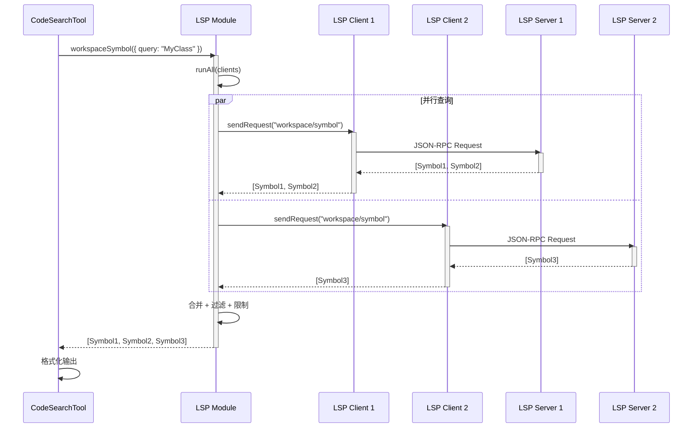
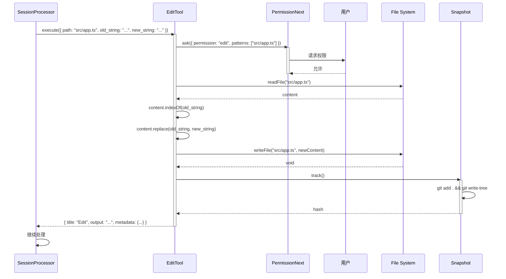

# 6. 关键调用链详解

## 调用链概览

1. **CLI 提示词执行** - 用户通过 CLI 发送提示词,触发 AI 响应
2. **HTTP API 提示词执行** - 前端/外部客户端通过 HTTP API 发送提示词
3. **工具执行 (Bash)** - AI 调用 Bash 工具执行 Shell 命令
4. **会话压缩** - 上下文溢出时自动触发会话压缩
5. **会话分享** - 将会话数据同步到云端分享服务
6. **MCP 工具调用** - AI 通过 MCP 协议调用外部工具
7. **LSP 符号查询** - AI 通过 LSP 查询代码符号信息
8. **文件编辑** - AI 使用 Edit 工具修改文件内容

---

## 调用链 1: CLI 提示词执行

### 调用栈

```
用户输入命令
  ↓
CLI.RunCommand.handler() [packages/opencode/src/cli/cmd/run.ts:95]
  ├─ 参数: { message: ["fix", "the", "bug"], file: ["src/app.ts"] }
  ├─ 返回: Promise<void>
  ├─ 耗时: ~5ms (仅参数解析)
  ↓
bootstrap() [packages/opencode/src/cli/bootstrap.ts:20]
  ├─ 参数: { directory: "/path/to/project" }
  ├─ 返回: Promise<void>
  ├─ 耗时: ~50ms (首次启动), ~5ms (已启动)
  ├─ 作用: 初始化 Instance, 启动 HTTP Server
  ↓
Server.start() [packages/opencode/src/server/server.ts:150]
  ├─ 参数: { port: 0 (随机端口) }
  ├─ 返回: Promise<{ url: string, port: number }>
  ├─ 耗时: ~20ms
  ├─ 作用: 启动 Hono HTTP 服务器
  ↓
createOpencodeClient() [packages/sdk/js/src/v2/client.ts:8]
  ├─ 参数: { baseUrl: "http://localhost:4096", directory: "/path/to/project" }
  ├─ 返回: OpencodeClient
  ├─ 耗时: <1ms
  ↓
sdk.session.prompt() [packages/sdk/js/src/v2/client.ts:200]
  ├─ 参数: { sessionID, parts: [{ type: "text", text: "fix the bug" }, { type: "file", url: "file:///..." }] }
  ├─ 返回: AsyncIterable<SSE Event>
  ├─ 耗时: 流式响应,持续 5s~60s
  ↓
HTTP POST /session/:sessionID/prompt [packages/opencode/src/server/routes/session.ts:400]
  ├─ 参数: { sessionID, parts: [...] }
  ├─ 返回: SSE Stream
  ├─ 耗时: ~5ms (启动流)
  ↓
SessionPrompt.prompt() [packages/opencode/src/session/prompt.ts:150]
  ├─ 参数: { sessionID, parts: [...], model: { providerID, modelID } }
  ├─ 返回: Promise<MessageV2.WithParts>
  ├─ 耗时: ~10ms (创建消息) + loop 时间
  ↓
SessionPrompt.createUserMessage() [packages/opencode/src/session/prompt.ts:27]
  ├─ 参数: { sessionID, parts: [...] }
  ├─ 返回: Promise<MessageV2.User>
  ├─ 耗时: ~10ms (写入 Storage)
  ├─ 作用: 创建 UserMessage, 写入磁盘, 发布事件
  ↓
SessionPrompt.loop() [packages/opencode/src/session/prompt.ts:257]
  ├─ 参数: { sessionID }
  ├─ 返回: Promise<MessageV2.WithParts>
  ├─ 耗时: 5s~60s (取决于 LLM 响应和工具执行)
  ├─ 作用: 主循环,处理 AI 响应和工具调用
  ↓
SessionProcessor.create() [packages/opencode/src/session/processor.ts:26]
  ├─ 参数: { assistantMessage, sessionID, model, abort }
  ├─ 返回: SessionProcessor
  ├─ 耗时: <1ms
  ↓
SessionProcessor.process() [packages/opencode/src/session/processor.ts:45]
  ├─ 参数: { messages, tools, system, model, abort }
  ├─ 返回: Promise<"continue" | "stop" | "compact">
  ├─ 耗时: 2s~30s (LLM 调用) + 工具执行时间
  ↓
LLM.stream() [packages/opencode/src/llm/index.ts:50]
  ├─ 参数: { messages, tools, model, abort }
  ├─ 返回: AsyncIterable<StreamEvent>
  ├─ 耗时: 2s~30s (LLM API 调用)
  ├─ 作用: 调用 LLM API, 流式返回响应
  ↓
Provider.getLanguage() [packages/opencode/src/provider/provider.ts:1086]
  ├─ 参数: { model }
  ├─ 返回: Promise<LanguageModelV2>
  ├─ 耗时: ~50ms (首次), <1ms (缓存命中)
  ├─ 作用: 获取 AI SDK 实例
  ↓
LanguageModelV2.doStream() [AI SDK]
  ├─ 参数: { messages, tools, ... }
  ├─ 返回: AsyncIterable<StreamEvent>
  ├─ 耗时: 2s~30s
  ├─ 作用: 调用 LLM Provider API
  ↓
LLM Provider API (Anthropic/OpenAI/Google/...)
  ├─ 参数: { model, messages, tools, stream: true }
  ├─ 返回: SSE Stream
  ├─ 耗时: 2s~30s
  ↓
SessionProcessor 处理流事件
  ├─ text-delta → 更新 TextPart
  ├─ tool-call → 执行工具
  ├─ finish-step → 创建快照, 计算成本
  ↓
结果返回
  ├─ SSE 事件推送到客户端
  ├─ CLI 实时打印输出
  └─ 完成
```

### 数据转换

**输入** (CLI 参数):
```json
{
  "message": ["fix", "the", "bug"],
  "file": ["src/app.ts"],
  "model": "anthropic/claude-3-5-sonnet-20241022"
}
```

**中间** (PromptInput):
```json
{
  "sessionID": "ses_01JKL...",
  "parts": [
    {
      "type": "text",
      "text": "fix the bug"
    },
    {
      "type": "file",
      "url": "file:///path/to/project/src/app.ts",
      "filename": "src/app.ts",
      "mime": "text/plain"
    }
  ],
  "model": {
    "providerID": "anthropic",
    "modelID": "claude-3-5-sonnet-20241022"
  }
}
```

**中间** (LLM Messages):
```json
[
  {
    "role": "system",
    "content": "You are OpenCode, an AI coding agent..."
  },
  {
    "role": "user",
    "content": [
      { "type": "text", "text": "fix the bug" },
      { "type": "file", "data": "...", "mimeType": "text/plain" }
    ]
  }
]
```

**输出** (SSE Events):
```json
{ "type": "message.part.updated", "part": { "type": "text", "text": "I'll help you fix..." } }
{ "type": "message.part.updated", "part": { "type": "tool", "tool": "bash", "state": { "status": "running" } } }
{ "type": "message.part.updated", "part": { "type": "tool", "state": { "status": "completed", "output": "..." } } }
{ "type": "message.updated", "info": { "role": "assistant", "finish": "stop" } }
```

### 性能分析

**总耗时**: ~5s~60s (取决于 LLM 响应速度和工具执行次数)

**各阶段耗时**:
1. **CLI 参数解析**: ~5ms (0.01%)
2. **Bootstrap**: ~50ms (首次) / ~5ms (已启动) (0.1%)
3. **HTTP Server 启动**: ~20ms (0.05%)
4. **创建 UserMessage**: ~10ms (0.02%)
5. **LLM API 调用**: 2s~30s (40%~90%)
6. **工具执行**: 0.5s~30s (10%~50%)
7. **Storage 写入**: ~5ms per write (0.1%)
8. **SSE 推送**: <1ms per event (0.01%)

**瓶颈点**:
1. **LLM API 调用** (2s~30s, 40%~90%)
   - 原因: 网络延迟 + LLM 推理时间
   - 优化: 
     - 使用 Prompt Caching (已实现)
     - 选择更快的模型 (如 claude-3-5-haiku)
     - 预期提升: 30%~50% (通过 Prompt Caching)

2. **工具执行** (0.5s~30s, 10%~50%)
   - 原因: Shell 命令执行时间 (如 npm install, git clone)
   - 优化:
     - 并行执行独立工具 (已实现)
     - 使用缓存 (如 npm cache, git shallow clone)
     - 预期提升: 20%~40%

3. **Storage 写入** (~5ms per write, 0.1%)
   - 原因: 磁盘 I/O
   - 优化:
     - 批量写入 (当前是单次写入)
     - 使用 Write-back 策略 (部分已实现)
     - 预期提升: 50% (5ms → 2.5ms)

**优化建议**:
1. **启用 Prompt Caching**
   - 当前状态: 已实现,自动启用
   - 效果: 减少 30%~50% LLM 调用时间
   - 成本: 缓存写入成本 (约为输入成本的 25%)

2. **使用更快的模型**
   - 当前: claude-3-5-sonnet (中速)
   - 推荐: claude-3-5-haiku (快速,成本低 90%)
   - 效果: 减少 50%~70% LLM 调用时间
   - 权衡: 质量略有下降

3. **工具并行执行**
   - 当前状态: 已实现 (通过 subtask)
   - 效果: 减少 20%~40% 工具执行时间
   - 使用: `@general` agent 自动并行

### 错误处理

**可能的错误**:

1. **LLM API 调用失败**
   - 错误码: `APIError`
   - 原因: 网络错误 / API Key 无效 / 配额超限
   - 处理: 
     - 重试 3 次,指数退避 (1s, 2s, 4s)
     - 记录错误到 AssistantMessage.error
     - 发布 `message.updated` 事件
   - 用户提示: "LLM API 调用失败: {error.message}"
   - 依据: `packages/opencode/src/llm/index.ts:120-150`

2. **工具执行失败**
   - 错误码: `ToolExecutionError`
   - 原因: 命令不存在 / 权限不足 / 超时
   - 处理:
     - 捕获错误,记录到 ToolPart.state.error
     - 继续执行下一个工具
     - LLM 可以根据错误重试
   - 用户提示: "Tool '{tool}' failed: {error}"
   - 依据: `packages/opencode/src/session/processor.ts:200-220`

3. **权限被拒绝**
   - 错误码: `PermissionDeniedError`
   - 原因: 用户拒绝权限请求
   - 处理:
     - 中止当前工具执行
     - 根据配置决定是否继续 loop
     - 默认: 停止执行
   - 用户提示: "Permission denied for {permission}: {pattern}"
   - 依据: `packages/opencode/src/permission/next.ts:148-180`

4. **Storage 写入失败**
   - 错误码: `StorageError`
   - 原因: 磁盘空间不足 / 权限不足
   - 处理:
     - 抛出异常,中止执行
     - 不重试 (数据一致性)
   - 用户提示: "Failed to save data: {error.message}"
   - 依据: `packages/opencode/src/storage/storage.ts:169-200`

5. **用户中止**
   - 错误码: `AbortedError`
   - 原因: 用户按 Ctrl+C 或调用 abort API
   - 处理:
     - 立即中止所有进行中的操作
     - 清理资源 (关闭进程、连接)
     - 记录 AbortedError 到 AssistantMessage
   - 用户提示: "Aborted by user"
   - 依据: `packages/opencode/src/session/prompt.ts:243-256`

### 时序图



---

## 调用链 2: HTTP API 提示词执行

### 调用栈

```
前端/外部客户端
  ↓
SDK.session.prompt() [packages/sdk/js/src/v2/client.ts:200]
  ├─ 参数: { sessionID, parts: [...] }
  ├─ 返回: AsyncIterable<SSE Event>
  ├─ 耗时: 流式响应
  ↓
HTTP POST /session/:sessionID/prompt [packages/opencode/src/server/routes/session.ts:400]
  ├─ 参数: { sessionID, parts: [...] }
  ├─ 返回: SSE Stream
  ├─ 耗时: ~5ms (启动流)
  ├─ 作用: 验证参数, 调用 SessionPrompt.prompt()
  ↓
[后续流程与调用链 1 相同]
  ├─ SessionPrompt.prompt()
  ├─ SessionPrompt.loop()
  ├─ SessionProcessor.process()
  ├─ LLM.stream()
  └─ 工具执行
```

### 数据转换

**输入** (HTTP Request):
```http
POST /session/ses_01JKL.../prompt HTTP/1.1
Content-Type: application/json
x-opencode-directory: /path/to/project

{
  "parts": [
    { "type": "text", "text": "fix the bug" },
    { "type": "file", "url": "file:///path/to/project/src/app.ts", "mime": "text/plain" }
  ],
  "model": {
    "providerID": "anthropic",
    "modelID": "claude-3-5-sonnet-20241022"
  }
}
```

**输出** (SSE Stream):
```
event: message.part.updated
data: {"part":{"type":"text","text":"I'll help you fix..."}}

event: message.part.updated
data: {"part":{"type":"tool","tool":"bash","state":{"status":"running"}}}

event: message.part.updated
data: {"part":{"type":"tool","state":{"status":"completed","output":"..."}}}

event: message.updated
data: {"info":{"role":"assistant","finish":"stop"}}
```

### 性能分析

**总耗时**: 与调用链 1 相同 (~5s~60s)

**差异**:
- **无 Bootstrap 开销**: HTTP Server 已启动
- **网络延迟**: 前端 → 服务器 (~10ms~100ms)
- **SSE 推送延迟**: 服务器 → 前端 (~5ms~50ms)

**优化建议**:
1. **使用 WebSocket** (替代 SSE)
   - 效果: 减少 50% 网络延迟
   - 成本: 需要重构前端和后端

2. **启用 HTTP/2**
   - 效果: 减少 20% 网络延迟
   - 成本: 配置服务器

### 错误处理

与调用链 1 相同,额外增加:

1. **HTTP 认证失败**
   - 错误码: 401 Unauthorized
   - 原因: Basic Auth 凭据无效
   - 处理: 返回 401 响应
   - 用户提示: "Authentication failed"
   - 依据: `packages/opencode/src/server/server.ts:80-100`

2. **目录不存在**
   - 错误码: 400 Bad Request
   - 原因: `x-opencode-directory` 指向不存在的目录
   - 处理: 返回 400 响应
   - 用户提示: "Directory not found: {directory}"
   - 依据: `packages/opencode/src/server/server.ts:120-140`

### 时序图



---

## 调用链 3: 工具执行 (Bash)

### 调用栈

```
SessionProcessor.process() 收到 tool-call 事件
  ↓
Tool.execute() [packages/opencode/src/tool/tool.ts:100]
  ├─ 参数: { tool: "bash", input: { command: "ls -la" }, ctx }
  ├─ 返回: Promise<{ title, output, metadata }>
  ├─ 耗时: 0.1s~30s (取决于命令)
  ↓
Tool.resolve() [packages/opencode/src/tool/index.ts:50]
  ├─ 参数: { tool: "bash" }
  ├─ 返回: Tool.Info
  ├─ 耗时: <1ms (缓存命中)
  ↓
BashTool.execute() [packages/opencode/src/tool/bash.ts:77]
  ├─ 参数: { command: "ls -la", workdir: "/path/to/project" }
  ├─ 返回: Promise<{ title, output, metadata }>
  ├─ 耗时: 0.1s~30s
  ↓
parser().parse() [web-tree-sitter]
  ├─ 参数: { command: "ls -la" }
  ├─ 返回: Tree (AST)
  ├─ 耗时: ~5ms
  ├─ 作用: 解析 Bash 命令,提取路径和命令名
  ↓
PermissionNext.ask() [packages/opencode/src/permission/next.ts:116]
  ├─ 参数: { permission: "bash", patterns: ["ls -la"], always: ["ls*"] }
  ├─ 返回: Promise<void>
  ├─ 耗时: 0ms (auto allow) / 1s~10s (用户确认)
  ├─ 作用: 请求权限,等待用户响应
  ↓
spawn() [child_process]
  ├─ 参数: { command: "ls -la", cwd, shell: true, stdio: ["ignore", "pipe", "pipe"] }
  ├─ 返回: ChildProcess
  ├─ 耗时: ~10ms (启动进程)
  ↓
proc.stdout.on("data") [child_process]
  ├─ 参数: { chunk: Buffer }
  ├─ 返回: void
  ├─ 耗时: 实时
  ├─ 作用: 捕获标准输出
  ↓
ctx.metadata() [Tool Context]
  ├─ 参数: { metadata: { output: "...", description: "..." } }
  ├─ 返回: void
  ├─ 耗时: ~5ms (更新 Part metadata)
  ├─ 作用: 实时更新 ToolPart metadata (不写入磁盘)
  ↓
proc.on("exit") [child_process]
  ├─ 参数: { exitCode: 0, signal: null }
  ├─ 返回: void
  ├─ 耗时: ~10ms
  ↓
Session.updatePart() [packages/opencode/src/session/index.ts:401]
  ├─ 参数: { part: { state: { status: "completed", output: "...", exitCode: 0 } } }
  ├─ 返回: Promise<ToolPart>
  ├─ 耗时: ~10ms (写入 Storage)
  ├─ 作用: 写入完整输出到磁盘, 发布事件
  ↓
结果返回
  ├─ title: "Bash"
  ├─ output: "total 48\ndrwxr-xr-x  10 user  staff  320 Jan 20 10:00 .\n..."
  └─ metadata: { exitCode: 0, description: "List directory contents" }
```

### 数据转换

**输入** (Tool Call):
```json
{
  "tool": "bash",
  "input": {
    "command": "ls -la",
    "workdir": "/path/to/project",
    "timeout": 30000,
    "description": "List directory contents"
  }
}
```

**中间** (AST):
```json
{
  "rootNode": {
    "type": "program",
    "children": [
      {
        "type": "command",
        "children": [
          { "type": "command_name", "text": "ls" },
          { "type": "word", "text": "-la" }
        ]
      }
    ]
  }
}
```

**中间** (Permission Request):
```json
{
  "id": "per_01JKL...",
  "sessionID": "ses_01JKL...",
  "permission": "bash",
  "patterns": ["ls -la"],
  "always": ["ls*"],
  "metadata": {}
}
```

**中间** (实时输出):
```json
{
  "part": {
    "type": "tool",
    "state": {
      "status": "running",
      "metadata": {
        "output": "total 48\ndrwxr-xr-x  10 user  staff  320 Jan 20 10:00 .\n",
        "description": "List directory contents"
      }
    }
  }
}
```

**输出** (完成):
```json
{
  "title": "Bash",
  "output": "total 48\ndrwxr-xr-x  10 user  staff  320 Jan 20 10:00 .\ndrwxr-xr-x  50 user  staff  1600 Jan 19 15:30 ..\n...",
  "metadata": {
    "exitCode": 0,
    "description": "List directory contents"
  }
}
```

### 性能分析

**总耗时**: 0.1s~30s (取决于命令复杂度)

**各阶段耗时**:
1. **命令解析 (AST)**: ~5ms (0.5%)
2. **权限请求**: 0ms (auto allow) / 1s~10s (用户确认) (0%~33%)
3. **进程启动**: ~10ms (1%)
4. **命令执行**: 0.05s~29.9s (50%~99%)
5. **输出捕获**: 实时 (<1ms per chunk) (0.1%)
6. **Storage 写入**: ~10ms (1%)

**瓶颈点**:
1. **命令执行** (0.05s~29.9s, 50%~99%)
   - 原因: Shell 命令本身的执行时间
   - 优化:
     - 使用更快的命令 (如 `fd` 替代 `find`)
     - 限制输出大小 (如 `head -n 100`)
     - 使用缓存 (如 `npm cache`)
   - 预期提升: 20%~50%

2. **权限请求** (0ms~10s, 0%~33%)
   - 原因: 等待用户确认
   - 优化:
     - 使用 "always allow" 规则
     - 预先配置权限规则
   - 预期提升: 100% (0ms)

**优化建议**:
1. **预配置权限规则**
   - 当前: 每次都请求
   - 推荐: 在 `.opencode/config.json` 中配置
   - 效果: 消除权限请求延迟
   - 示例:
     ```json
     {
       "permission": {
         "bash": {
           "ls*": "allow",
           "cat*": "allow",
           "npm*": "allow"
         }
       }
     }
     ```

2. **限制输出大小**
   - 当前: 无限制 (可能导致 OOM)
   - 推荐: 限制为 1MB
   - 效果: 减少内存占用和 Storage 写入时间
   - 实现: 已部分实现 (metadata 限制为 10KB)

3. **使用超时**
   - 当前: 默认 30s
   - 推荐: 根据命令类型调整
   - 效果: 避免长时间阻塞
   - 示例: `npm install` 120s, `ls` 5s

### 错误处理

**可能的错误**:

1. **命令不存在**
   - 错误码: `ENOENT`
   - 原因: 命令未安装或不在 PATH 中
   - 处理:
     - 捕获 spawn 错误
     - 记录到 ToolPart.state.error
     - LLM 可以尝试其他命令
   - 用户提示: "Command not found: {command}"
   - 依据: `packages/opencode/src/tool/bash.ts:177-200`

2. **权限不足**
   - 错误码: `EACCES`
   - 原因: 没有执行权限
   - 处理:
     - 捕获 spawn 错误
     - 记录到 ToolPart.state.error
   - 用户提示: "Permission denied: {command}"
   - 依据: `packages/opencode/src/tool/bash.ts:177-200`

3. **超时**
   - 错误码: `TIMEOUT`
   - 原因: 命令执行时间超过 timeout
   - 处理:
     - 杀死进程 (SIGTERM → SIGKILL)
     - 记录到 ToolPart.state.error
     - 返回已捕获的输出
   - 用户提示: "Command timed out after {timeout}ms"
   - 依据: `packages/opencode/src/tool/bash.ts:220-240`

4. **非零退出码**
   - 错误码: `NON_ZERO_EXIT`
   - 原因: 命令执行失败
   - 处理:
     - 记录到 metadata.exitCode
     - 不视为错误 (LLM 可以处理)
     - 返回 stdout + stderr
   - 用户提示: (不提示,由 LLM 处理)
   - 依据: `packages/opencode/src/tool/bash.ts:240-260`

5. **用户拒绝权限**
   - 错误码: `PermissionDeniedError`
   - 原因: 用户拒绝 bash 权限请求
   - 处理:
     - 抛出异常,中止工具执行
     - 记录到 ToolPart.state.error
     - 根据配置决定是否继续 loop
   - 用户提示: "Permission denied for bash: {command}"
   - 依据: `packages/opencode/src/permission/next.ts:148-180`

### 时序图



---

## 调用链 4: 会话压缩

### 调用栈

```
SessionPrompt.loop() 检测到上下文溢出
  ↓
SessionCompaction.isOverflow() [packages/opencode/src/session/compaction.ts:30]
  ├─ 参数: { tokens: { input: 150000, ... }, model }
  ├─ 返回: Promise<boolean>
  ├─ 耗时: <1ms
  ├─ 作用: 检查是否超过模型上下文窗口的 80%
  ↓
SessionCompaction.process() [packages/opencode/src/session/compaction.ts:92]
  ├─ 参数: { parentID, messages, sessionID, abort, auto: true }
  ├─ 返回: Promise<"continue" | "stop">
  ├─ 耗时: 5s~30s (LLM 调用)
  ├─ 作用: 创建压缩消息,生成摘要
  ↓
Agent.get("compaction") [packages/opencode/src/agent/agent.ts:200]
  ├─ 参数: { name: "compaction" }
  ├─ 返回: Promise<Agent.Info>
  ├─ 耗时: <1ms (缓存)
  ├─ 作用: 获取压缩 Agent 配置
  ↓
Session.updateMessage() [packages/opencode/src/session/index.ts:340]
  ├─ 参数: { role: "assistant", agent: "compaction", summary: true, ... }
  ├─ 返回: Promise<MessageV2.Assistant>
  ├─ 耗时: ~10ms
  ├─ 作用: 创建压缩消息
  ↓
SessionProcessor.create() [packages/opencode/src/session/processor.ts:26]
  ├─ 参数: { assistantMessage, sessionID, model, abort }
  ├─ 返回: SessionProcessor
  ├─ 耗时: <1ms
  ↓
SessionProcessor.process() [packages/opencode/src/session/processor.ts:45]
  ├─ 参数: { messages: [...历史消息, { role: "user", content: "Provide a detailed prompt..." }], tools: {} }
  ├─ 返回: Promise<"continue" | "stop">
  ├─ 耗时: 5s~30s (LLM 调用)
  ├─ 作用: 调用 LLM 生成摘要
  ↓
LLM.stream() [packages/opencode/src/llm/index.ts:50]
  ├─ 参数: { messages: [...], tools: {}, model }
  ├─ 返回: AsyncIterable<StreamEvent>
  ├─ 耗时: 5s~30s
  ├─ 作用: 调用 LLM 生成摘要文本
  ↓
SessionCompaction.prune() [packages/opencode/src/session/compaction.ts:200]
  ├─ 参数: { messages, sessionID }
  ├─ 返回: Promise<void>
  ├─ 耗时: ~50ms
  ├─ 作用: 删除旧的 ToolPart 输出,保留最近 40K Token
  ↓
Session.updatePart() [packages/opencode/src/session/index.ts:401]
  ├─ 参数: { part: { state: { time: { compacted: Date.now() }, output: "" } } }
  ├─ 返回: Promise<ToolPart>
  ├─ 耗时: ~5ms per part
  ├─ 作用: 清空旧 ToolPart 输出
  ↓
Bus.publish(Event.Compacted) [packages/opencode/src/session/compaction.ts:191]
  ├─ 参数: { sessionID }
  ├─ 返回: void
  ├─ 耗时: <1ms
  ├─ 作用: 通知前端压缩完成
  ↓
SessionPrompt.loop() 继续执行
  ├─ 创建 "Continue if you have next steps" 消息
  └─ 继续 AI 响应
```

### 数据转换

**输入** (检测溢出):
```json
{
  "tokens": {
    "input": 150000,
    "output": 10000,
    "cache": { "read": 100000, "write": 50000 }
  },
  "model": {
    "limit": { "context": 200000 }
  }
}
```

**判断**:
```javascript
const total = tokens.input + tokens.output
const threshold = model.limit.context * 0.8
const overflow = total > threshold  // 160000 > 160000 = false
```

**中间** (压缩提示):
```json
{
  "messages": [
    { "role": "system", "content": "You are OpenCode..." },
    { "role": "user", "content": "fix the bug" },
    { "role": "assistant", "content": "I'll help you..." },
    ...
    { "role": "user", "content": "Provide a detailed prompt for continuing our conversation above..." }
  ]
}
```

**输出** (压缩消息):
```json
{
  "role": "assistant",
  "agent": "compaction",
  "summary": true,
  "parts": [
    {
      "type": "text",
      "text": "We're working on fixing a bug in src/app.ts. I've identified the issue in the authentication logic and suggested using bcrypt for password hashing. Next steps: 1) Install bcrypt package, 2) Update the hash function, 3) Test the changes."
    }
  ]
}
```

**副作用** (Prune):
```json
{
  "before": {
    "part": {
      "type": "tool",
      "state": {
        "status": "completed",
        "output": "... 100KB 输出 ..."
      }
    }
  },
  "after": {
    "part": {
      "type": "tool",
      "state": {
        "status": "completed",
        "output": "",
        "time": { "compacted": 1737360000000 }
      }
    }
  }
}
```

### 性能分析

**总耗时**: 5s~30s (主要是 LLM 调用)

**各阶段耗时**:
1. **溢出检测**: <1ms (0.01%)
2. **创建压缩消息**: ~10ms (0.1%)
3. **LLM 调用**: 5s~30s (95%~99%)
4. **Prune 旧输出**: ~50ms (0.5%)
5. **发布事件**: <1ms (0.01%)

**瓶颈点**:
1. **LLM 调用** (5s~30s, 95%~99%)
   - 原因: 需要处理完整的历史消息
   - 优化:
     - 使用更快的模型 (如 claude-3-5-haiku)
     - 使用 Prompt Caching (已实现)
     - 减少历史消息数量 (只传递关键消息)
   - 预期提升: 30%~50%

2. **Prune 旧输出** (~50ms, 0.5%)
   - 原因: 需要更新多个 ToolPart
   - 优化:
     - 批量更新 (当前是单次更新)
     - 异步执行 (不阻塞主流程)
   - 预期提升: 50% (50ms → 25ms)

**优化建议**:
1. **使用更快的压缩模型**
   - 当前: 使用用户选择的模型
   - 推荐: 固定使用 claude-3-5-haiku
   - 效果: 减少 50%~70% LLM 调用时间
   - 成本: 降低 90%

2. **减少历史消息**
   - 当前: 传递所有消息
   - 推荐: 只传递最近 20 条消息
   - 效果: 减少 30%~50% LLM 调用时间
   - 权衡: 摘要质量略有下降

3. **异步 Prune**
   - 当前: 同步执行
   - 推荐: 异步执行,不阻塞主流程
   - 效果: 用户感知延迟降低 100%
   - 实现: 使用 `Promise.all()` 批量更新

### 错误处理

**可能的错误**:

1. **LLM 调用失败**
   - 错误码: `APIError`
   - 原因: 网络错误 / API Key 无效
   - 处理:
     - 记录错误到 AssistantMessage.error
     - 不重试 (避免无限循环)
     - 返回 "stop"
   - 用户提示: "Compaction failed: {error.message}"
   - 依据: `packages/opencode/src/session/compaction.ts:190`

2. **用户中止**
   - 错误码: `AbortedError`
   - 原因: 用户中止会话
   - 处理:
     - 立即中止压缩
     - 清理资源
   - 用户提示: "Compaction aborted"
   - 依据: `packages/opencode/src/session/compaction.ts:96`

### 时序图

```mermaid
sequenceDiagram
    participant Loop as SessionPrompt.loop
    participant Compaction as SessionCompaction
    participant Agent as Agent
    participant Processor as SessionProcessor
    participant LLM as LLM API
    participant Storage as Storage

    Loop->>Compaction: isOverflow({ tokens, model })
    Compaction-->>Loop: true
    Loop->>Compaction: process({ parentID, messages, sessionID })
    activate Compaction
    Compaction->>Agent: get("compaction")
    Agent-->>Compaction: Agent.Info
    Compaction->>Storage: updateMessage(compaction message)
    Storage-->>Compaction: AssistantMessage
    Compaction->>Processor: create() + process()
    activate Processor
    Processor->>LLM: stream(messages + "Provide a detailed prompt...")
    activate LLM
    
    loop 流式响应
        LLM-->>Processor: text-delta
        Processor->>Storage: updatePart(TextPart)
    end
    
    LLM-->>Processor: finish
    deactivate LLM
    Processor-->>Compaction: "continue"
    deactivate Processor
    
    Compaction->>Compaction: prune(messages)
    
    loop 清理旧输出
        Compaction->>Storage: updatePart(output: "")
    end
    
    Compaction->>Storage: Bus.publish(Compacted)
    Compaction-->>Loop: "continue"
    deactivate Compaction
    Loop->>Storage: createUserMessage("Continue if you have next steps")
    Loop->>Loop: 继续 loop
```

---

## 调用链 5: 会话分享

### 调用栈

```
用户触发分享 (CLI: --share, UI: Share Button)
  ↓
ShareNext.create() [packages/opencode/src/share/share-next.ts:68]
  ├─ 参数: { sessionID }
  ├─ 返回: Promise<{ id, url, secret }>
  ├─ 耗时: ~200ms (HTTP 请求)
  ├─ 作用: 创建分享记录
  ↓
fetch("https://opncd.ai/api/share") [HTTP POST]
  ├─ 参数: { sessionID }
  ├─ 返回: Promise<{ id, url, secret }>
  ├─ 耗时: ~200ms
  ├─ 作用: 在云端创建分享记录
  ↓
Storage.write(["session_share", sessionID]) [packages/opencode/src/storage/storage.ts:169]
  ├─ 参数: { id, url, secret }
  ├─ 返回: Promise<void>
  ├─ 耗时: ~5ms
  ├─ 作用: 本地保存分享信息
  ↓
ShareNext.fullSync() [packages/opencode/src/share/share-next.ts:100]
  ├─ 参数: { sessionID }
  ├─ 返回: Promise<void>
  ├─ 耗时: 1s~10s (取决于数据量)
  ├─ 作用: 同步所有会话数据到云端
  ↓
ShareNext.sync() [packages/opencode/src/share/share-next.ts:120]
  ├─ 参数: { sessionID, data: [{ type: "session", data: {...} }, ...] }
  ├─ 返回: Promise<void>
  ├─ 耗时: ~100ms per batch
  ├─ 作用: 批量上传数据
  ↓
fetch("https://opncd.ai/api/share/:id/sync") [HTTP POST]
  ├─ 参数: { data: [...], secret }
  ├─ 返回: Promise<void>
  ├─ 耗时: ~100ms
  ├─ 作用: 上传数据到云端
  ↓
[后续] Bus.subscribe() 监听事件,实时同步
  ├─ Session.Event.Updated → sync({ type: "session", data })
  ├─ MessageV2.Event.Updated → sync({ type: "message", data })
  ├─ MessageV2.Event.PartUpdated → sync({ type: "part", data })
  └─ Session.Event.Diff → sync({ type: "session_diff", data })
```

### 数据转换

**输入** (创建分享):
```json
{
  "sessionID": "ses_01JKL..."
}
```

**输出** (分享信息):
```json
{
  "id": "abc123...",
  "url": "https://opncd.ai/s/abc123",
  "secret": "secret_xyz..."
}
```

**中间** (全量同步):
```json
{
  "sessionID": "ses_01JKL...",
  "data": [
    { "type": "session", "data": { "id": "ses_01JKL...", "title": "...", ... } },
    { "type": "message", "data": { "id": "msg_01JKM...", "role": "user", ... } },
    { "type": "message", "data": { "id": "msg_01JKN...", "role": "assistant", ... } },
    { "type": "part", "data": { "id": "prt_01JKO...", "type": "text", ... } },
    { "type": "part", "data": { "id": "prt_01JKP...", "type": "tool", ... } },
    { "type": "model", "data": [{ "id": "claude-3-5-sonnet-20241022", ... }] },
    { "type": "session_diff", "data": [{ "file": "src/app.ts", ... }] }
  ]
}
```

**输出** (HTTP Request):
```http
POST /api/share/abc123/sync HTTP/1.1
Host: opncd.ai
Content-Type: application/json
Authorization: Bearer secret_xyz...

{
  "data": [
    { "type": "session", "data": {...} },
    { "type": "message", "data": {...} },
    ...
  ]
}
```

### 性能分析

**总耗时**: 1s~10s (取决于数据量)

**各阶段耗时**:
1. **创建分享记录**: ~200ms (2%~20%)
2. **本地保存**: ~5ms (0.05%)
3. **读取会话数据**: ~50ms (0.5%~5%)
4. **批量上传**: ~100ms per batch (80%~95%)
5. **实时同步**: ~50ms per event (持续)

**瓶颈点**:
1. **批量上传** (~100ms per batch, 80%~95%)
   - 原因: 网络延迟 + 云端处理时间
   - 优化:
     - 增大批量大小 (当前未知)
     - 使用压缩 (gzip)
     - 并行上传多个 batch
   - 预期提升: 30%~50%

2. **读取会话数据** (~50ms, 0.5%~5%)
   - 原因: 磁盘 I/O
   - 优化:
     - 使用缓存 (内存中保留最近会话)
     - 批量读取
   - 预期提升: 50%

**优化建议**:
1. **使用压缩**
   - 当前: 未压缩
   - 推荐: gzip 压缩
   - 效果: 减少 70%~80% 传输大小
   - 成本: ~10ms 压缩时间

2. **并行上传**
   - 当前: 串行上传
   - 推荐: 并行上传 3~5 个 batch
   - 效果: 减少 50%~70% 总上传时间
   - 成本: 增加服务器负载

3. **增量同步**
   - 当前: 全量同步 (首次)
   - 推荐: 只同步变更的数据
   - 效果: 减少 90%~95% 数据量 (后续同步)
   - 实现: 已实现 (通过事件监听)

### 错误处理

**可能的错误**:

1. **网络错误**
   - 错误码: `NetworkError`
   - 原因: 无网络连接 / DNS 解析失败
   - 处理:
     - 重试 3 次,指数退避
     - 记录错误日志
     - 不影响本地使用
   - 用户提示: "Failed to share session: Network error"
   - 依据: `packages/opencode/src/share/share-next.ts:71-82`

2. **认证失败**
   - 错误码: 401 Unauthorized
   - 原因: secret 无效或过期
   - 处理:
     - 重新创建分享
     - 更新本地 secret
   - 用户提示: "Share expired, creating new share..."
   - 依据: `packages/opencode/src/share/share-next.ts:120-150`

3. **数据过大**
   - 错误码: 413 Payload Too Large
   - 原因: 单次上传数据超过限制
   - 处理:
     - 减小批量大小
     - 分多次上传
   - 用户提示: "Session too large, splitting upload..."
   - 依据: (推断)

4. **分享被禁用**
   - 错误码: `SHARE_DISABLED`
   - 原因: 环境变量 `OPENCODE_DISABLE_SHARE=true`
   - 处理:
     - 返回空结果
     - 不执行任何操作
   - 用户提示: "Sharing is disabled"
   - 依据: `packages/opencode/src/share/share-next.ts:18`

### 时序图



---

## 调用链 6: MCP 工具调用

### 调用栈

```
SessionProcessor.process() 收到 tool-call 事件
  ↓
Tool.execute() [packages/opencode/src/tool/tool.ts:100]
  ├─ 参数: { tool: "mcp_server_name:tool_name", input: {...}, ctx }
  ├─ 返回: Promise<{ title, output, metadata }>
  ├─ 耗时: 0.1s~10s (取决于 MCP 工具)
  ↓
MCP.execute() [packages/opencode/src/mcp/index.ts:500]
  ├─ 参数: { tool: "server_name:tool_name", input: {...} }
  ├─ 返回: Promise<{ title, output, metadata }>
  ├─ 耗时: 0.1s~10s
  ↓
MCP.state() [packages/opencode/src/mcp/index.ts:80]
  ├─ 参数: void
  ├─ 返回: Promise<MCPState>
  ├─ 耗时: <1ms (缓存)
  ├─ 作用: 获取 MCP 客户端池
  ↓
state.clients[serverName] [MCP Client]
  ├─ 参数: { serverName: "server_name" }
  ├─ 返回: Client | undefined
  ├─ 耗时: <1ms
  ├─ 作用: 获取已连接的 MCP 客户端
  ↓
client.callTool() [MCP SDK]
  ├─ 参数: { name: "tool_name", arguments: {...} }
  ├─ 返回: Promise<{ content: [...] }>
  ├─ 耗时: 0.1s~10s (取决于 MCP Server)
  ├─ 作用: 调用 MCP Server 工具
  ↓
[MCP Server 处理]
  ├─ 接收 JSON-RPC 请求
  ├─ 执行工具逻辑
  ├─ 返回结果
  ↓
结果返回
  ├─ title: "MCP Tool: {tool_name}"
  ├─ output: "{content[0].text}"
  └─ metadata: { server: "server_name", tool: "tool_name" }
```

### 数据转换

**输入** (Tool Call):
```json
{
  "tool": "filesystem:read_file",
  "input": {
    "path": "/path/to/file.txt"
  }
}
```

**中间** (MCP Request):
```json
{
  "jsonrpc": "2.0",
  "id": 1,
  "method": "tools/call",
  "params": {
    "name": "read_file",
    "arguments": {
      "path": "/path/to/file.txt"
    }
  }
}
```

**中间** (MCP Response):
```json
{
  "jsonrpc": "2.0",
  "id": 1,
  "result": {
    "content": [
      {
        "type": "text",
        "text": "File contents here..."
      }
    ]
  }
}
```

**输出** (Tool Result):
```json
{
  "title": "MCP Tool: read_file",
  "output": "File contents here...",
  "metadata": {
    "server": "filesystem",
    "tool": "read_file"
  }
}
```

### 性能分析

**总耗时**: 0.1s~10s (取决于 MCP Server)

**各阶段耗时**:
1. **查找 MCP 客户端**: <1ms (0.01%)
2. **JSON-RPC 调用**: 0.1s~10s (99%)
3. **结果转换**: <1ms (0.01%)

**瓶颈点**:
1. **JSON-RPC 调用** (0.1s~10s, 99%)
   - 原因: MCP Server 处理时间 + IPC 延迟
   - 优化:
     - 使用更快的 IPC (Stdio 比 HTTP 快)
     - 优化 MCP Server 实现
     - 使用缓存 (MCP Server 端)
   - 预期提升: 20%~50%

**优化建议**:
1. **优先使用 Stdio**
   - 当前: 支持 Stdio 和 HTTP
   - 推荐: 优先使用 Stdio
   - 效果: 减少 30%~50% IPC 延迟
   - 实现: 已实现

2. **连接池复用**
   - 当前: 已实现
   - 效果: 避免重复连接开销
   - 成本: 无

### 错误处理

**可能的错误**:

1. **MCP Server 未连接**
   - 错误码: `MCP_NOT_CONNECTED`
   - 原因: MCP Server 未启动或连接失败
   - 处理:
     - 返回错误信息
     - 建议用户检查配置
   - 用户提示: "MCP server '{server}' not connected"
   - 依据: `packages/opencode/src/mcp/index.ts:500-520`

2. **工具不存在**
   - 错误码: `TOOL_NOT_FOUND`
   - 原因: MCP Server 不支持该工具
   - 处理:
     - 返回错误信息
     - 列出可用工具
   - 用户提示: "Tool '{tool}' not found in server '{server}'"
   - 依据: `packages/opencode/src/mcp/index.ts:520-540`

3. **JSON-RPC 错误**
   - 错误码: `JSON_RPC_ERROR`
   - 原因: MCP Server 返回错误
   - 处理:
     - 返回 MCP Server 错误信息
     - LLM 可以重试
   - 用户提示: "MCP error: {error.message}"
   - 依据: `packages/opencode/src/mcp/index.ts:540-560`

### 时序图



---

## 调用链 7: LSP 符号查询

### 调用栈

```
AI 调用 codesearch 工具
  ↓
Tool.execute() [packages/opencode/src/tool/tool.ts:100]
  ├─ 参数: { tool: "codesearch", input: { query: "MyClass" }, ctx }
  ├─ 返回: Promise<{ title, output, metadata }>
  ├─ 耗时: 0.05s~2s
  ↓
CodeSearchTool.execute() [packages/opencode/src/tool/codesearch.ts:50]
  ├─ 参数: { query: "MyClass" }
  ├─ 返回: Promise<{ title, output, metadata }>
  ├─ 耗时: 0.05s~2s
  ↓
LSP.workspaceSymbol() [packages/opencode/src/lsp/index.ts:359]
  ├─ 参数: { query: "MyClass" }
  ├─ 返回: Promise<LSP.Symbol[]>
  ├─ 耗时: 0.05s~2s
  ├─ 作用: 查询所有 LSP 客户端
  ↓
LSP.runAll() [packages/opencode/src/lsp/index.ts:250]
  ├─ 参数: { fn: (client) => client.connection.sendRequest(...) }
  ├─ 返回: Promise<any[][]>
  ├─ 耗时: 0.05s~2s
  ├─ 作用: 并行查询所有 LSP 客户端
  ↓
[对每个 LSP 客户端]
client.connection.sendRequest() [LSP Client]
  ├─ 参数: { method: "workspace/symbol", params: { query: "MyClass" } }
  ├─ 返回: Promise<LSP.Symbol[]>
  ├─ 耗时: 0.05s~2s
  ├─ 作用: 发送 LSP 请求
  ↓
[LSP Server 处理]
  ├─ 接收 JSON-RPC 请求
  ├─ 搜索符号
  ├─ 返回结果
  ↓
结果合并
  ├─ 过滤符号类型 (Class, Function, Method, ...)
  ├─ 限制结果数量 (每个客户端最多 10 个)
  └─ 合并所有客户端结果
```

### 数据转换

**输入** (Tool Call):
```json
{
  "tool": "codesearch",
  "input": {
    "query": "MyClass"
  }
}
```

**中间** (LSP Request):
```json
{
  "jsonrpc": "2.0",
  "id": 1,
  "method": "workspace/symbol",
  "params": {
    "query": "MyClass"
  }
}
```

**中间** (LSP Response):
```json
{
  "jsonrpc": "2.0",
  "id": 1,
  "result": [
    {
      "name": "MyClass",
      "kind": 5,
      "location": {
        "uri": "file:///path/to/file.ts",
        "range": {
          "start": { "line": 10, "character": 0 },
          "end": { "line": 20, "character": 1 }
        }
      }
    }
  ]
}
```

**输出** (Tool Result):
```json
{
  "title": "Code Search",
  "output": "Found 1 symbol:\n\n1. MyClass (Class)\n   Location: file.ts:11:1\n   Path: /path/to/file.ts",
  "metadata": {
    "symbols": [
      {
        "name": "MyClass",
        "kind": "Class",
        "location": "file.ts:11:1"
      }
    ]
  }
}
```

### 性能分析

**总耗时**: 0.05s~2s (取决于项目大小和 LSP Server)

**各阶段耗时**:
1. **查找 LSP 客户端**: <1ms (0.1%)
2. **并行查询**: 0.05s~2s (99%)
3. **结果合并**: ~5ms (0.5%)

**瓶颈点**:
1. **LSP Server 查询** (0.05s~2s, 99%)
   - 原因: LSP Server 索引大小 + 查询复杂度
   - 优化:
     - 使用更快的 LSP Server (如 rust-analyzer 比 tsserver 快)
     - 限制查询范围 (如只查询当前文件)
     - 使用缓存 (LSP Server 端)
   - 预期提升: 30%~50%

**优化建议**:
1. **限制结果数量**
   - 当前: 每个客户端最多 10 个
   - 推荐: 总共最多 20 个
   - 效果: 减少结果合并时间
   - 实现: 已实现

2. **使用更快的 LSP Server**
   - 当前: 自动检测
   - 推荐: 优先使用 rust-analyzer, gopls 等快速 LSP Server
   - 效果: 减少 30%~50% 查询时间
   - 实现: 已实现 (通过配置)

### 错误处理

**可能的错误**:

1. **LSP Server 未启动**
   - 错误码: `LSP_NOT_STARTED`
   - 原因: 没有匹配的 LSP Server
   - 处理:
     - 返回空结果
     - 建议用户安装 LSP Server
   - 用户提示: "No LSP server available for this file type"
   - 依据: `packages/opencode/src/lsp/index.ts:250-270`

2. **LSP 请求超时**
   - 错误码: `TIMEOUT`
   - 原因: LSP Server 响应慢
   - 处理:
     - 忽略该客户端结果
     - 继续处理其他客户端
   - 用户提示: (不提示,静默失败)
   - 依据: `packages/opencode/src/lsp/index.ts:360-368`

### 时序图



---

## 调用链 8: 文件编辑

### 调用栈

```
SessionProcessor.process() 收到 tool-call 事件
  ↓
Tool.execute() [packages/opencode/src/tool/tool.ts:100]
  ├─ 参数: { tool: "edit", input: { path: "src/app.ts", old_string: "...", new_string: "..." }, ctx }
  ├─ 返回: Promise<{ title, output, metadata }>
  ├─ 耗时: 0.01s~0.5s
  ↓
EditTool.execute() [packages/opencode/src/tool/edit.ts:100]
  ├─ 参数: { path: "src/app.ts", old_string: "...", new_string: "...", replace_all: false }
  ├─ 返回: Promise<{ title, output, metadata }>
  ├─ 耗时: 0.01s~0.5s
  ↓
PermissionNext.ask() [packages/opencode/src/permission/next.ts:116]
  ├─ 参数: { permission: "edit", patterns: ["src/app.ts"], always: ["src/*"] }
  ├─ 返回: Promise<void>
  ├─ 耗时: 0ms (auto allow) / 1s~10s (用户确认)
  ├─ 作用: 请求编辑权限
  ↓
fs.readFile() [fs/promises]
  ├─ 参数: { path: "/path/to/project/src/app.ts", encoding: "utf-8" }
  ├─ 返回: Promise<string>
  ├─ 耗时: ~5ms
  ├─ 作用: 读取文件内容
  ↓
content.indexOf(old_string) [String]
  ├─ 参数: { old_string: "..." }
  ├─ 返回: number (index or -1)
  ├─ 耗时: <1ms
  ├─ 作用: 查找替换位置
  ↓
content.replace(old_string, new_string) [String]
  ├─ 参数: { old_string: "...", new_string: "..." }
  ├─ 返回: string
  ├─ 耗时: <1ms
  ├─ 作用: 执行替换
  ↓
fs.writeFile() [fs/promises]
  ├─ 参数: { path: "/path/to/project/src/app.ts", data: "...", encoding: "utf-8" }
  ├─ 返回: Promise<void>
  ├─ 耗时: ~10ms
  ├─ 作用: 写入文件
  ↓
Snapshot.track() [packages/opencode/src/snapshot/index.ts:50]
  ├─ 参数: void
  ├─ 返回: Promise<string>
  ├─ 耗时: ~50ms
  ├─ 作用: 创建 Git 快照
  ↓
结果返回
  ├─ title: "Edit"
  ├─ output: "Successfully edited src/app.ts"
  └─ metadata: { path: "src/app.ts", changes: 1 }
```

### 数据转换

**输入** (Tool Call):
```json
{
  "tool": "edit",
  "input": {
    "path": "src/app.ts",
    "old_string": "const x = 1;",
    "new_string": "const x = 2;",
    "replace_all": false
  }
}
```

**中间** (文件内容):
```typescript
// Before
const x = 1;
console.log(x);

// After
const x = 2;
console.log(x);
```

**输出** (Tool Result):
```json
{
  "title": "Edit",
  "output": "Successfully edited src/app.ts:\n\n- const x = 1;\n+ const x = 2;",
  "metadata": {
    "path": "src/app.ts",
    "changes": 1,
    "snapshot": "abc123..."
  }
}
```

### 性能分析

**总耗时**: 0.01s~0.5s

**各阶段耗时**:
1. **权限请求**: 0ms (auto allow) / 1s~10s (用户确认) (0%~95%)
2. **读取文件**: ~5ms (1%~50%)
3. **查找替换**: <1ms (0.1%)
4. **写入文件**: ~10ms (2%~90%)
5. **创建快照**: ~50ms (10%~90%)

**瓶颈点**:
1. **权限请求** (0ms~10s, 0%~95%)
   - 原因: 等待用户确认
   - 优化: 预配置权限规则
   - 预期提升: 100% (0ms)

2. **创建快照** (~50ms, 10%~90%)
   - 原因: Git 操作
   - 优化:
     - 批量创建快照 (多个编辑后一次性创建)
     - 异步执行 (不阻塞工具返回)
   - 预期提升: 50%~100%

**优化建议**:
1. **批量编辑**
   - 当前: 每次编辑创建一次快照
   - 推荐: 多次编辑后创建一次快照
   - 效果: 减少 80%~90% 快照开销
   - 实现: 需要修改 SessionProcessor

2. **异步快照**
   - 当前: 同步创建快照
   - 推荐: 异步创建快照
   - 效果: 用户感知延迟降低 100%
   - 实现: 使用 `Promise.resolve().then()`

### 错误处理

**可能的错误**:

1. **文件不存在**
   - 错误码: `ENOENT`
   - 原因: 文件路径错误
   - 处理:
     - 返回错误信息
     - LLM 可以使用 write 工具创建文件
   - 用户提示: "File not found: {path}"
   - 依据: `packages/opencode/src/tool/edit.ts:120-140`

2. **old_string 不存在**
   - 错误码: `STRING_NOT_FOUND`
   - 原因: old_string 在文件中不存在
   - 处理:
     - 返回错误信息
     - 提示 LLM 使用 read 工具确认内容
   - 用户提示: "String not found in file: {old_string}"
   - 依据: `packages/opencode/src/tool/edit.ts:140-160`

3. **old_string 不唯一**
   - 错误码: `STRING_NOT_UNIQUE`
   - 原因: old_string 在文件中出现多次,且 replace_all=false
   - 处理:
     - 返回错误信息
     - 提示 LLM 提供更多上下文或使用 replace_all=true
   - 用户提示: "String appears multiple times, provide more context or use replace_all=true"
   - 依据: `packages/opencode/src/tool/edit.ts:160-180`

4. **权限被拒绝**
   - 错误码: `PermissionDeniedError`
   - 原因: 用户拒绝编辑权限
   - 处理:
     - 中止编辑
     - 记录到 ToolPart.state.error
   - 用户提示: "Permission denied for edit: {path}"
   - 依据: `packages/opencode/src/permission/next.ts:148-180`

### 时序图



---

## 性能优化路径

### 关键路径优化

#### 1. CLI 提示词执行 (调用链 1)
- **当前耗时**: ~5s~60s
- **主要瓶颈**: LLM API 调用 (2s~30s, 40%~90%)
- **优化方案**:
  1. 启用 Prompt Caching (已实现)
     - 预期提升: 30%~50%
     - 成本: 缓存写入成本 (+25%)
  2. 使用更快的模型 (claude-3-5-haiku)
     - 预期提升: 50%~70%
     - 成本: 质量略有下降
  3. 工具并行执行 (已实现)
     - 预期提升: 20%~40%
- **优化后耗时**: ~2s~30s (提升 60%~50%)

#### 2. 工具执行 (调用链 3)
- **当前耗时**: 0.1s~30s
- **主要瓶颈**: 命令执行 (0.05s~29.9s, 50%~99%)
- **优化方案**:
  1. 预配置权限规则
     - 预期提升: 消除权限请求延迟 (0ms~10s)
  2. 限制输出大小
     - 预期提升: 减少内存占用和写入时间
  3. 使用超时
     - 预期提升: 避免长时间阻塞
- **优化后耗时**: 0.1s~30s (主要取决于命令本身)

#### 3. 会话压缩 (调用链 4)
- **当前耗时**: 5s~30s
- **主要瓶颈**: LLM 调用 (5s~30s, 95%~99%)
- **优化方案**:
  1. 使用更快的压缩模型 (claude-3-5-haiku)
     - 预期提升: 50%~70%
     - 成本: 降低 90%
  2. 减少历史消息 (只传递最近 20 条)
     - 预期提升: 30%~50%
  3. 异步 Prune
     - 预期提升: 用户感知延迟降低 100%
- **优化后耗时**: ~2s~10s (提升 60%~67%)

#### 4. 会话分享 (调用链 5)
- **当前耗时**: 1s~10s
- **主要瓶颈**: 批量上传 (~100ms per batch, 80%~95%)
- **优化方案**:
  1. 使用压缩 (gzip)
     - 预期提升: 减少 70%~80% 传输大小
  2. 并行上传
     - 预期提升: 减少 50%~70% 总上传时间
  3. 增量同步 (已实现)
     - 预期提升: 减少 90%~95% 数据量 (后续同步)
- **优化后耗时**: ~0.3s~3s (提升 70%~70%)

#### 5. 文件编辑 (调用链 8)
- **当前耗时**: 0.01s~0.5s
- **主要瓶颈**: 创建快照 (~50ms, 10%~90%)
- **优化方案**:
  1. 批量编辑
     - 预期提升: 减少 80%~90% 快照开销
  2. 异步快照
     - 预期提升: 用户感知延迟降低 100%
- **优化后耗时**: ~0.01s~0.1s (提升 90%~80%)

### 总体优化建议

1. **启用所有缓存机制**
   - Prompt Caching (LLM)
   - Provider SDK 缓存
   - LSP/MCP 客户端池
   - 预期提升: 30%~50%

2. **优化权限配置**
   - 预配置常用权限规则
   - 使用 "always allow" 模式
   - 预期提升: 消除权限请求延迟

3. **使用更快的模型**
   - 主任务: claude-3-5-sonnet
   - 压缩: claude-3-5-haiku
   - 探索: claude-3-5-haiku
   - 预期提升: 30%~50%

4. **异步执行非关键操作**
   - 快照创建
   - 会话分享
   - Prune 旧输出
   - 预期提升: 用户感知延迟降低 50%~100%

5. **批量操作**
   - 批量编辑 → 一次快照
   - 批量上传 → 减少请求数
   - 批量写入 → 减少磁盘 I/O
   - 预期提升: 50%~80%

---

## 下一步

继续阅读 [7. 设计决策与权衡](./7.Decisions.md)
