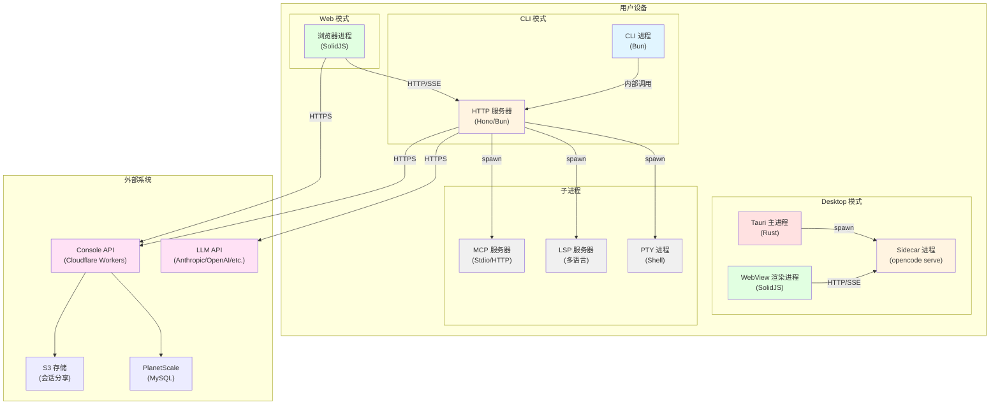

# 1. 系统容器与进程

## 容器视图 (C4 Level 2)



---

## 进程详解

### 1. CLI 进程 (opencode CLI)

- **运行环境**: Bun (JavaScript Runtime)
- **入口文件**: `packages/opencode/src/index.ts`
- **核心职责**:
  - 解析命令行参数 (yargs)
  - 启动内嵌 HTTP 服务器 (单进程模式)
  - 处理 `opencode run` 命令的非交互式执行
  - 管理 TUI (Terminal UI) 渲染
  - 订阅服务器 SSE 事件流并格式化输出
- **生命周期**: 
  - 启动: 用户执行 `opencode` 命令
  - 结束: 命令执行完毕或用户中断 (Ctrl+C)
- **资源限制**: 
  - 内存: 无硬限制 (受 Bun 运行时管理)
  - CPU: 单线程事件循环
  - 网络: 仅本地 HTTP (127.0.0.1:4096)

**代码依据**: 
- `packages/opencode/src/index.ts:1-160` - CLI 入口
- `packages/opencode/src/cli/cmd/run.ts:95-395` - run 命令实现

---

### 2. HTTP 服务器进程 (opencode serve)

- **运行环境**: Bun (内嵌 HTTP 服务器)
- **入口文件**: `packages/opencode/src/server/server.ts`
- **核心职责**:
  - 提供 RESTful API (Hono 框架)
  - 管理会话 (Session) 生命周期
  - 调度 Agent 执行和工具调用
  - 处理 SSE (Server-Sent Events) 推送
  - 管理 WebSocket 连接 (PTY, TUI)
- **生命周期**:
  - 启动: `opencode serve` 或 CLI 内部调用 `Server.listen()`
  - 结束: 进程终止或 `server.stop()`
- **资源限制**:
  - 端口: 默认 4096 (可配置)
  - 超时: 无空闲超时 (`idleTimeout: 0`)
  - 并发: Bun 自动管理

**代码依据**:
- `packages/opencode/src/server/server.ts:537-577` - 服务器启动
- `packages/opencode/src/server/server.ts:62-520` - 路由定义
- `packages/opencode/src/cli/cmd/serve.ts:6-20` - serve 命令

---

### 3. Tauri 主进程 (Desktop App)

- **运行环境**: Rust (Tauri 2.x)
- **入口文件**: `packages/desktop/src-tauri/src/lib.rs`
- **核心职责**:
  - 管理 WebView 窗口生命周期
  - 启动 Sidecar 进程 (`opencode serve`)
  - 提供系统级 API (文件选择器、通知、更新)
  - 健康检查和自动重连
  - 管理 OAuth 回调和 CLI 同步
- **生命周期**:
  - 启动: 用户打开桌面应用
  - 结束: 用户关闭窗口或应用退出
- **资源限制**:
  - 窗口: 单实例模式 (single-instance plugin)
  - Sidecar: 自动端口分配或固定端口
  - 超时: 30 秒启动超时

**代码依据**:
- `packages/desktop/src-tauri/src/lib.rs:223-369` - 主进程初始化
- `packages/desktop/src-tauri/src/lib.rs:152-198` - Sidecar 启动
- `packages/desktop/src-tauri/src/lib.rs:384-445` - 服务器连接管理

---

### 4. WebView 渲染进程 (Desktop/Web Frontend)

- **运行环境**: Browser (WKWebView/WebView2/Chromium)
- **入口文件**: 
  - Desktop: `packages/desktop/src/index.tsx`
  - Web: `packages/app/src/entry.tsx`
- **核心职责**:
  - 渲染 SolidJS UI 组件
  - 管理客户端状态 (SolidJS Stores)
  - 通过 HTTP/SSE 与服务器通信
  - 处理用户交互和路由
  - 管理 WebSocket 连接 (终端)
- **生命周期**:
  - 启动: WebView 加载完成
  - 结束: 窗口关闭或页面卸载
- **资源限制**:
  - 沙箱: WebView 安全沙箱
  - 存储: Tauri Store (Desktop) / LocalStorage (Web)
  - 网络: 仅允许与配置的服务器通信

**代码依据**:
- `packages/desktop/src/index.tsx:1-367` - Desktop 入口
- `packages/app/src/entry.tsx:1-65` - Web 入口
- `packages/app/src/context/server.tsx:29-214` - 服务器连接管理

---

### 5. PTY 子进程 (Pseudo Terminal)

- **运行环境**: Shell (bash/zsh/fish/powershell)
- **入口文件**: 由 `bun-pty` 库动态启动
- **核心职责**:
  - 执行 shell 命令
  - 提供交互式终端
  - 处理 ANSI 转义序列
  - 支持窗口大小调整
  - 缓冲输出 (2MB 限制)
- **生命周期**:
  - 启动: 用户创建终端会话或 Bash 工具调用
  - 结束: 进程退出或用户关闭终端
- **资源限制**:
  - 缓冲: 2MB 输出缓冲 (`BUFFER_LIMIT`)
  - 并发: 无限制 (每个会话独立进程)
  - 超时: 无超时

**代码依据**:
- `packages/opencode/src/pty/index.ts:96-154` - PTY 创建
- `packages/opencode/src/pty/index.ts:197-228` - WebSocket 连接
- `packages/opencode/src/server/routes/pty.ts:134-169` - WebSocket 升级

---

### 6. LSP 服务器进程 (Language Server)

- **运行环境**: 多语言 (TypeScript/Python/Rust/Go 等)
- **入口文件**: 由配置指定 (如 `typescript-language-server`)
- **核心职责**:
  - 提供代码补全和诊断
  - 支持跳转定义和引用查找
  - 提供悬停信息和符号搜索
  - 管理文档同步
  - 响应 LSP 协议请求
- **生命周期**:
  - 启动: 首次访问特定扩展名文件时延迟启动
  - 结束: 项目实例销毁或进程崩溃
- **资源限制**:
  - 并发: 每个语言/项目根目录一个实例
  - 超时: 无请求超时
  - 重试: 启动失败后标记为 broken,不再重试

**代码依据**:
- `packages/opencode/src/lsp/index.ts:177-262` - LSP 客户端管理
- `packages/opencode/src/lsp/index.ts:79-144` - 状态初始化
- `packages/opencode/src/lsp/client.ts` - LSP 客户端实现

---

### 7. MCP 服务器进程 (Model Context Protocol)

- **运行环境**: 
  - Local: Stdio 子进程 (任意语言)
  - Remote: HTTP/SSE 连接
- **入口文件**: 由 `opencode.json` 配置指定
- **核心职责**:
  - 提供自定义工具扩展
  - 提供 Prompts 和 Resources
  - 支持 OAuth 认证 (Remote)
  - 动态工具列表更新
  - 处理工具调用请求
- **生命周期**:
  - 启动: 项目实例初始化时连接
  - 结束: 项目实例销毁或连接失败
- **资源限制**:
  - 超时: 默认 30 秒 (可配置)
  - 重试: 连接失败后标记为 failed
  - 并发: 每个 MCP 服务器一个连接

**代码依据**:
- `packages/opencode/src/mcp/index.ts:291-491` - MCP 客户端创建
- `packages/opencode/src/mcp/index.ts:163-210` - 状态管理
- `packages/opencode/src/mcp/index.ts:563-600` - 工具转换

---

### 8. Console API (Cloudflare Workers)

- **运行环境**: Cloudflare Workers (V8 Isolate)
- **入口文件**: `packages/console/app/src/routes/zen/v1/chat/completions.ts`
- **核心职责**:
  - 提供 OpenCode Zen (托管 LLM 服务)
  - 管理用户账户和计费
  - 处理 OAuth 认证
  - 代理 LLM 请求并计费
  - 管理会话分享 (S3)
- **生命周期**:
  - 启动: 请求到达时自动启动 (Serverless)
  - 结束: 请求完成后自动销毁
- **资源限制**:
  - CPU: 50ms 免费层 / 30s 付费层
  - 内存: 128MB
  - 并发: 无限制 (自动扩展)

**代码依据**:
- `packages/console/app/src/routes/zen/v1/chat/completions.ts:4-11` - 聊天完成端点
- `infra/console.ts:1-195` - 基础设施配置

---

## 进程间通信

### CLI 进程 ↔ HTTP 服务器

- **通信方式**: 内部函数调用 (同进程)
- **协议**: 直接调用 `Server.App().fetch()`
- **消息格式**:

```typescript
// 内部 fetch 调用
const fetchFn = async (input: RequestInfo | URL, init?: RequestInit) => {
  const request = new Request(input, init)
  return Server.App().fetch(request)
}
```

- **依据**: `packages/opencode/src/cli/cmd/run.ts:342-346`

---

### WebView ↔ HTTP 服务器

- **通信方式**: HTTP + SSE (Server-Sent Events)
- **协议**: REST API + Event Stream
- **消息格式**:

```json
// SSE 事件示例
{
  "type": "message.part.updated",
  "properties": {
    "part": {
      "id": "01JCXXX",
      "type": "tool",
      "tool": "bash",
      "state": {
        "status": "completed",
        "title": "ls -la",
        "output": "total 48\ndrwxr-xr-x ..."
      }
    }
  }
}
```

- **序列化方式**: JSON
- **错误处理**: 
  - 超时: 3 秒健康检查
  - 重试: 自动重连 (10 秒间隔)
  - 降级: 显示连接错误提示
- **依据**: 
  - `packages/opencode/src/server/server.ts:450-504` - SSE 端点
  - `packages/app/src/context/server.tsx:94-135` - 健康检查

---

### Tauri 主进程 ↔ Sidecar 进程

- **通信方式**: HTTP (Basic Auth) + 进程管理
- **协议**: REST API
- **消息格式**:

```rust
// Tauri 命令调用
#[tauri::command]
async fn ensure_server_ready(state: State<'_, ServerState>) -> Result<ServerReadyData, String> {
  // 等待服务器就绪
}
```

- **认证**: Basic Auth (随机生成 UUID 密码)
- **错误处理**:
  - 超时: 30 秒启动超时
  - 重试: 健康检查失败时重启
  - 降级: 显示错误日志
- **依据**:
  - `packages/desktop/src-tauri/src/lib.rs:152-198` - Sidecar 启动
  - `packages/desktop/src-tauri/src/lib.rs:200-220` - 健康检查

---

### HTTP 服务器 ↔ PTY 进程

- **通信方式**: WebSocket (双向) + Stdio
- **协议**: 自定义二进制协议
- **消息格式**:

```typescript
// WebSocket 消息
ws.send(data) // 原始终端输出 (ANSI)
ws.onMessage((message) => {
  ptyProcess.write(String(message)) // 用户输入
})
```

- **序列化方式**: 原始字节流 (无序列化)
- **错误处理**:
  - 超时: 无超时
  - 重试: 连接断开后不重试
  - 降级: 缓冲输出 (2MB)
- **依据**:
  - `packages/opencode/src/pty/index.ts:131-151` - PTY 数据处理
  - `packages/opencode/src/server/routes/pty.ts:152-168` - WebSocket 升级

---

### HTTP 服务器 ↔ LSP 服务器

- **通信方式**: Stdio (JSON-RPC 2.0)
- **协议**: Language Server Protocol
- **消息格式**:

```json
// LSP 请求示例
{
  "jsonrpc": "2.0",
  "id": 1,
  "method": "textDocument/hover",
  "params": {
    "textDocument": { "uri": "file:///path/to/file.ts" },
    "position": { "line": 10, "character": 5 }
  }
}
```

- **序列化方式**: JSON-RPC
- **错误处理**:
  - 超时: 无超时
  - 重试: 启动失败后标记 broken
  - 降级: 静默失败,返回空结果
- **依据**:
  - `packages/opencode/src/lsp/index.ts:303-317` - LSP 请求
  - `packages/opencode/src/lsp/client.ts` - JSON-RPC 通信

---

### HTTP 服务器 ↔ MCP 服务器

- **通信方式**: 
  - Local: Stdio (JSON-RPC)
  - Remote: HTTP/SSE
- **协议**: Model Context Protocol
- **消息格式**:

```json
// MCP 工具调用
{
  "name": "read_file",
  "arguments": {
    "path": "/path/to/file"
  }
}
```

- **序列化方式**: JSON
- **错误处理**:
  - 超时: 默认 30 秒 (可配置)
  - 重试: OAuth 失败时提示用户认证
  - 降级: 标记为 failed,不提供工具
- **依据**:
  - `packages/opencode/src/mcp/index.ts:120-148` - 工具调用
  - `packages/opencode/src/mcp/index.ts:304-406` - Remote 连接

---

### HTTP 服务器 ↔ LLM API

- **通信方式**: HTTPS (流式)
- **协议**: OpenAI Compatible API / Anthropic API
- **消息格式**:

```json
// 流式请求
{
  "model": "claude-3-5-sonnet-20241022",
  "messages": [...],
  "tools": [...],
  "stream": true
}
```

- **序列化方式**: JSON (SSE 流式响应)
- **错误处理**:
  - 超时: 5 分钟 (可配置)
  - 重试: 支持配置重试次数
  - 降级: 返回错误消息给用户
- **依据**:
  - `packages/opencode/src/session/llm.ts` - LLM 调用
  - `packages/opencode/src/provider/provider.ts` - 提供商抽象

---

## 资源管理

### 进程启动顺序

#### CLI 模式
1. **CLI 进程启动** (`opencode run`)
2. **HTTP 服务器启动** (内部调用 `bootstrap()`)
3. **项目实例初始化** (`InstanceBootstrap`)
   - 加载配置
   - 初始化插件
   - 启动 LSP 服务器 (延迟)
   - 连接 MCP 服务器
4. **创建会话** (`Session.create()`)
5. **执行 Agent** (LLM 调用 + 工具执行)

**代码依据**: `packages/opencode/src/cli/cmd/run.ts:341-393`

#### Desktop 模式
1. **Tauri 主进程启动**
2. **WebView 创建**
3. **Sidecar 进程启动** (`opencode serve`)
   - 健康检查 (30 秒超时)
4. **WebView 连接服务器** (HTTP/SSE)
5. **项目实例初始化** (同 CLI 模式)

**代码依据**: `packages/desktop/src-tauri/src/lib.rs:264-353`

---

### 进程依赖关系

```
CLI 进程
  └─ HTTP 服务器 (内嵌)
      ├─ PTY 进程 (按需启动)
      ├─ LSP 服务器 (延迟启动)
      └─ MCP 服务器 (启动时连接)

Tauri 主进程
  ├─ WebView 渲染进程
  └─ Sidecar 进程 (opencode serve)
      ├─ PTY 进程
      ├─ LSP 服务器
      └─ MCP 服务器
```

**依赖规则**:
- WebView 依赖 Sidecar 就绪
- Agent 执行依赖 LLM API 可用
- 工具调用依赖子进程启动成功

---

### 进程崩溃处理

#### HTTP 服务器崩溃
- **CLI 模式**: 进程退出,返回错误码
- **Desktop 模式**: 
  - Tauri 检测到 Sidecar 退出
  - 显示错误日志
  - 用户可手动重启

**代码依据**: `packages/desktop/src-tauri/src/lib.rs:447-471`

#### LSP 服务器崩溃
- 标记为 `broken`,不再重试
- 静默失败,不影响其他功能
- 日志记录错误

**代码依据**: `packages/opencode/src/lsp/index.ts:182-222`

#### MCP 服务器崩溃
- 状态标记为 `failed`
- 工具不可用
- 支持手动重连 (`opencode mcp connect`)

**代码依据**: `packages/opencode/src/mcp/index.ts:512-549`

#### PTY 进程退出
- 发布 `pty.exited` 事件
- 自动清理 WebSocket 连接
- 从状态中移除

**代码依据**: `packages/opencode/src/pty/index.ts:146-151`

---

### 资源清理机制

#### 项目实例销毁
```typescript
// Instance.state() 自动清理
Instance.state(
  async () => { /* 初始化 */ },
  async (state) => { /* 清理逻辑 */ }
)
```

**清理内容**:
- 关闭所有 LSP 客户端
- 断开所有 MCP 连接
- 终止所有 PTY 进程
- 清理文件监听器

**代码依据**: 
- `packages/opencode/src/project/instance.ts` - 实例管理
- `packages/opencode/src/lsp/index.ts:141-143` - LSP 清理
- `packages/opencode/src/mcp/index.ts:198-210` - MCP 清理
- `packages/opencode/src/pty/index.ts:75-86` - PTY 清理

#### 进程退出清理
- **CLI**: 自动清理所有子进程
- **Desktop**: Tauri 调用 `kill_sidecar` 命令
- **Windows**: 使用 Job Object 确保子进程终止

**代码依据**:
- `packages/opencode/src/index.ts:154-159` - 显式退出
- `packages/desktop/src-tauri/src/lib.rs:62-81` - kill_sidecar
- `packages/desktop/src-tauri/src/job_object.rs` - Windows Job Object

---

## 下一步

继续阅读 [2. 模块分层架构](./2.Module-Layers.md)
