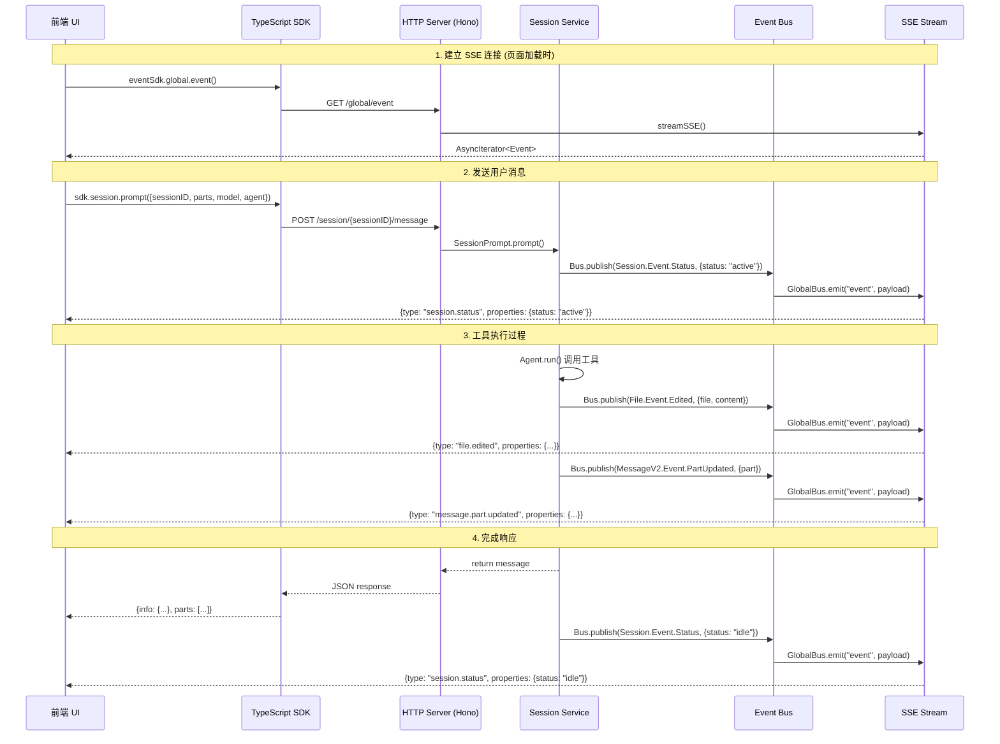
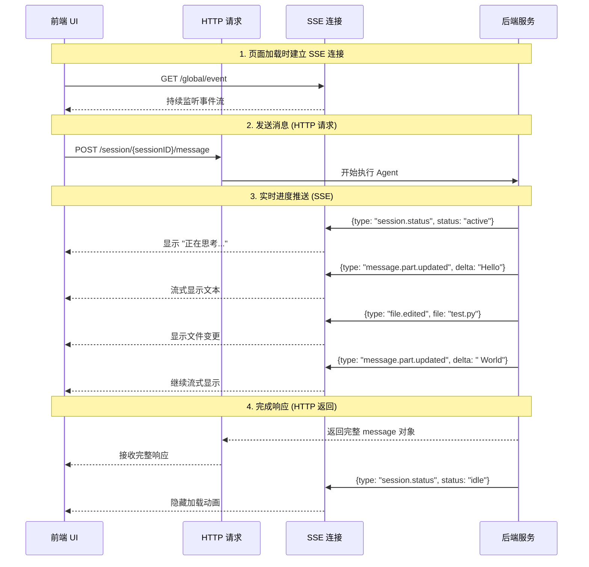

# OpenCode 前后端交互深度分析

## 1. SDK 调用架构

### 1.1 SDK 生成与使用

OpenCode 使用 `@hey-api/openapi-ts` 从 OpenAPI 规范自动生成 TypeScript SDK (`packages/sdk/js/src/v2/gen/sdk.gen.ts`)。

**SDK 客户端创建流程:**

```typescript
// packages/sdk/js/src/v2/client.ts
export function createOpencodeClient(config?: Config & { directory?: string }) {
  const customFetch: any = (req: any) => {
    req.timeout = false
    return fetch(req)
  }
  
  // 处理非 ASCII 目录路径
  if (config?.directory) {
    const isNonASCII = /[^\x00-\x7F]/.test(config.directory)
    const encodedDirectory = isNonASCII ? encodeURIComponent(config.directory) : config.directory
    config.headers = {
      ...config.headers,
      "x-opencode-directory": encodedDirectory,
    }
  }

  const client = createClient(config)
  return new OpencodeClient({ client })
}
```

### 1.2 前端 UI 调用 SDK 的方式

前端通过多个 Context 层次化管理 SDK 实例:

**全局 SDK Context (`packages/app/src/context/global-sdk.tsx`):**

```typescript
const eventSdk = createOpencodeClient({
  baseUrl: server.url,
  signal: abort.signal,
  fetch: platform.fetch,
})

const sdk = createOpencodeClient({
  baseUrl: server.url,
  fetch: platform.fetch,
  throwOnError: true,
})
```

**发送消息示例 (`packages/app/src/components/prompt-input.tsx`):**

```typescript
// 创建 session
const session = await client.session
  .create()
  .then((x) => x.data ?? undefined)

// 发送消息 (调用 POST /session/{sessionID}/message)
client.session.prompt({
  sessionID: session.id,
  agent,
  model: {
    modelID: currentModel.id,
    providerID: currentModel.provider.id,
  },
  variant,
  parts: [...] // 文本、文件等
})
```

## 2. 事件总线 (Event Bus) 架构

### 2.1 后端事件发布机制

**Bus 发布流程 (`packages/opencode/src/bus/index.ts`):**

```typescript
export async function publish<Definition extends BusEvent.Definition>(
  def: Definition,
  properties: z.output<Definition["properties"]>,
) {
  const payload = {
    type: def.type,
    properties,
  }
  
  // 1. 本地订阅分发
  for (const key of [def.type, "*"]) {
    const match = state().subscriptions.get(key)
    for (const sub of match ?? []) {
      pending.push(sub(payload))
    }
  }
  
  // 2. 全局事件总线广播 (供 SSE 使用)
  GlobalBus.emit("event", {
    directory: Instance.directory,
    payload,
  })
  
  return Promise.all(pending)
}
```

**后端工具执行时发布事件示例:**

```typescript
// packages/opencode/src/tool/write.ts
await Bus.publish(File.Event.Edited, {
  sessionID,
  file: path,
  content: input.content,
})

// packages/opencode/src/session/status.ts
Bus.publish(Event.Status, {
  sessionID,
  status: "active",
  agent: info.agent,
})
```

### 2.2 前端通过 SSE 监听事件

**SSE 连接建立 (`packages/app/src/context/global-sdk.tsx`):**

```typescript
const eventSdk = createOpencodeClient({
  baseUrl: server.url,
  signal: abort.signal,
  fetch: platform.fetch,
})

// 调用 GET /global/event 建立 SSE 连接
const events = await eventSdk.global.event()

// 异步迭代器消费事件流
for await (const event of events.stream) {
  const directory = event.directory ?? "global"
  const payload = event.payload
  
  // 事件合并优化 (防止高频更新卡顿)
  const k = key(directory, payload)
  if (k) {
    const i = coalesced.get(k)
    if (i !== undefined) {
      queue[i] = undefined
    }
    coalesced.set(k, queue.length)
  }
  queue.push({ directory, payload })
  schedule() // 16ms 批量刷新
}
```

**后端 SSE 端点实现 (`packages/opencode/src/server/server.ts`):**

```typescript
return streamSSE(c, async (stream) => {
  stream.writeSSE({
    data: JSON.stringify({
      type: "server.connected",
      properties: {},
    }),
  })
  
  // 订阅所有事件
  const unsub = Bus.subscribeAll(async (event) => {
    await stream.writeSSE({
      data: JSON.stringify(event),
    })
    if (event.type === Bus.InstanceDisposed.type) {
      stream.close()
    }
  })

  // 心跳保活 (防止 WKWebView 60s 超时)
  const heartbeat = setInterval(() => {
    stream.writeSSE({
      data: JSON.stringify({
        type: "server.heartbeat",
        properties: {},
      }),
    })
  }, 30000)

  await new Promise<void>((resolve) => {
    stream.onAbort(() => {
      clearInterval(heartbeat)
      unsub()
      resolve()
    })
  })
})
```

### 2.3 SSE 客户端实现细节

**SDK SSE 处理 (`packages/sdk/js/src/v2/gen/core/serverSentEvents.gen.ts`):**

```typescript
export const createSseClient = <TData = unknown>({
  url,
  sseDefaultRetryDelay = 3000,
  sseMaxRetryDelay = 30000,
  ...options
}: ServerSentEventsOptions): ServerSentEventsResult<TData> => {
  const createStream = async function* () {
    let retryDelay = sseDefaultRetryDelay
    let attempt = 0

    while (true) {
      if (signal.aborted) break
      attempt++

      try {
        const response = await fetch(request)
        if (!response.ok) throw new Error(`SSE failed: ${response.status}`)
        if (!response.body) throw new Error("No body in SSE response")

        const reader = response.body.pipeThrough(new TextDecoderStream()).getReader()
        let buffer = ""

        while (true) {
          const { done, value } = await reader.read()
          if (done) break
          buffer += value
          buffer = buffer.replace(/\r\n/g, "\n").replace(/\r/g, "\n")

          const chunks = buffer.split("\n\n")
          buffer = chunks.pop() ?? ""

          for (const chunk of chunks) {
            const lines = chunk.split("\n")
            const dataLines: Array<string> = []
            let eventName: string | undefined

            for (const line of lines) {
              if (line.startsWith("data:")) {
                dataLines.push(line.replace(/^data:\s*/, ""))
              } else if (line.startsWith("event:")) {
                eventName = line.replace(/^event:\s*/, "")
              } else if (line.startsWith("id:")) {
                lastEventId = line.replace(/^id:\s*/, "")
              } else if (line.startsWith("retry:")) {
                const parsed = Number.parseInt(line.replace(/^retry:\s*/, ""), 10)
                if (!Number.isNaN(parsed)) {
                  retryDelay = parsed
                }
              }
            }

            if (dataLines.length) {
              const rawData = dataLines.join("\n")
              const data = JSON.parse(rawData)
              yield data as any
            }
          }
        }
        break // 正常完成
      } catch (error) {
        onSseError?.(error)
        if (sseMaxRetryAttempts !== undefined && attempt >= sseMaxRetryAttempts) {
          break
        }
        // 指数退避重连
        const backoff = Math.min(retryDelay * 2 ** (attempt - 1), sseMaxRetryDelay)
        await sleep(backoff)
      }
    }
  }

  return { stream: createStream() }
}
```

## 3. 完整交互流程

### 3.1 发送消息并监听执行进度



### 3.2 关键点总结

1. **前端不直接调用 session/chats 返回的 SSE**
   - 前端通过 `POST /session/{sessionID}/message` 发送消息,该接口返回的是 **JSON 响应**(包含完整的 message 对象)
   - 前端通过 **全局 SSE 连接** (`GET /global/event`) 监听所有事件,包括:
     - `session.status`: 会话状态变化
     - `message.part.updated`: 消息部分更新 (流式输出)
     - `file.edited`: 文件编辑事件
     - `lsp.updated`: LSP 更新事件

2. **事件过滤与合并**
   - 前端通过 `event.directory` 字段过滤事件
   - 使用事件合并机制 (coalescing) 防止高频事件导致 UI 卡顿
   - 16ms 批量刷新策略 (60fps)

3. **单一 SSE 连接 vs 多个 HTTP 请求**
   - 只需要一个全局 SSE 连接监听所有事件
   - 所有操作 (create session, send message, abort) 都是普通 HTTP 请求
   - SSE 连接负责推送实时更新,HTTP 请求负责触发操作

## 4. Python 后端跨语言方案选型

### 方案 1: HTTP API + SSE (推荐 ⭐⭐⭐⭐⭐)

**架构:**
```
前端 (TypeScript) <--HTTP/SSE--> Python 后端 (FastAPI/Starlette)
```

**实现方式:**
```python
from fastapi import FastAPI
from sse_starlette.sse import EventSourceResponse
import asyncio

app = FastAPI()

# 事件总线
event_bus = EventBus()

@app.get("/global/event")
async def subscribe_events(request: Request):
    async def event_generator():
        queue = asyncio.Queue()
        
        def callback(event):
            queue.put_nowait(event)
        
        event_bus.subscribe_all(callback)
        
        try:
            while True:
                event = await queue.get()
                yield {
                    "event": "message",
                    "data": json.dumps(event)
                }
        except asyncio.CancelledError:
            event_bus.unsubscribe(callback)
    
    return EventSourceResponse(event_generator())

@app.post("/session/{session_id}/message")
async def send_message(session_id: str, body: PromptInput):
    # 发布状态事件
    await event_bus.publish("session.status", {
        "sessionID": session_id,
        "status": "active"
    })
    
    # 执行 Agent 逻辑
    message = await session_service.prompt(session_id, body)
    
    # 发布完成事件
    await event_bus.publish("session.status", {
        "sessionID": session_id,
        "status": "idle"
    })
    
    return message
```

**优点:**
- ✅ 与 OpenCode 原架构完全一致
- ✅ 前端无需修改,直接复用现有 SDK
- ✅ SSE 原生支持断线重连、事件 ID、重试延迟
- ✅ 轻量级,无需额外中间件

**缺点:**
- ❌ 需要维护长连接 (但 SSE 本身有重连机制)
- ❌ 单向通信 (但对于推送场景已足够)

**适用场景:**
- 需要实时推送执行进度
- 前端需要监听多种事件类型
- 希望与 OpenCode 架构保持一致

**Python 库推荐:**
- FastAPI + `sse-starlette`
- Starlette + `sse-starlette`
- aiohttp + 手动实现 SSE

---

### 方案 2: WebSocket (备选 ⭐⭐⭐⭐)

**架构:**
```
前端 (TypeScript) <--WebSocket--> Python 后端 (FastAPI/websockets)
```

**实现方式:**
```python
from fastapi import WebSocket

@app.websocket("/ws")
async def websocket_endpoint(websocket: WebSocket):
    await websocket.accept()
    
    queue = asyncio.Queue()
    
    def callback(event):
        queue.put_nowait(event)
    
    event_bus.subscribe_all(callback)
    
    try:
        while True:
            event = await queue.get()
            await websocket.send_json(event)
    except WebSocketDisconnect:
        event_bus.unsubscribe(callback)
```

**前端需要修改:**
```typescript
// 需要实现 WebSocket 客户端替代 SSE
const ws = new WebSocket('ws://localhost:8000/ws')
ws.onmessage = (event) => {
  const payload = JSON.parse(event.data)
  emitter.emit(payload.directory, payload)
}
```

**优点:**
- ✅ 双向通信能力
- ✅ 更低延迟
- ✅ 支持二进制数据

**缺点:**
- ❌ 前端需要修改 SDK 事件监听逻辑
- ❌ 需要手动实现重连、心跳
- ❌ 浏览器兼容性略差于 SSE (但现代浏览器都支持)

**适用场景:**
- 需要双向实时通信
- 需要传输二进制数据 (如文件流)
- 对延迟要求极高

---

### 方案 3: HTTP 轮询 + 长轮询 (不推荐 ⭐⭐)

**架构:**
```
前端 (TypeScript) <--HTTP Polling--> Python 后端 (FastAPI)
```

**实现方式:**
```python
@app.get("/events/poll")
async def poll_events(last_event_id: Optional[str] = None):
    # 长轮询:等待新事件或超时
    timeout = 30
    start = time.time()
    
    while time.time() - start < timeout:
        events = event_store.get_events_after(last_event_id)
        if events:
            return {"events": events}
        await asyncio.sleep(0.1)
    
    return {"events": []}
```

**前端需要修改:**
```typescript
// 轮询实现
async function pollEvents(lastEventId: string) {
  while (true) {
    const response = await fetch(`/events/poll?last_event_id=${lastEventId}`)
    const { events } = await response.json()
    
    for (const event of events) {
      emitter.emit(event.directory, event.payload)
      lastEventId = event.id
    }
    
    await sleep(1000) // 短轮询间隔
  }
}
```

**优点:**
- ✅ 实现简单
- ✅ 无需维护长连接
- ✅ 防火墙友好

**缺点:**
- ❌ 延迟高 (至少 1s)
- ❌ 服务器资源消耗大 (频繁请求)
- ❌ 前端需要大幅修改
- ❌ 无法保证事件顺序

**适用场景:**
- 对实时性要求不高 (>1s 延迟可接受)
- 网络环境限制 (如某些企业防火墙)

---

## 5. 方案对比总结

| 维度 | HTTP API + SSE | WebSocket | HTTP 轮询 |
|------|---------------|-----------|----------|
| **前端改动** | 无需改动 ✅ | 需要修改事件监听 ⚠️ | 需要大幅修改 ❌ |
| **实时性** | 优秀 (<100ms) ✅ | 极佳 (<50ms) ✅ | 差 (>1s) ❌ |
| **资源消耗** | 低 (单连接) ✅ | 低 (单连接) ✅ | 高 (频繁请求) ❌ |
| **断线重连** | 原生支持 ✅ | 需要手动实现 ⚠️ | 无需处理 ✅ |
| **双向通信** | 不支持 ❌ | 支持 ✅ | 支持 (低效) ⚠️ |
| **浏览器兼容性** | 优秀 (IE10+) ✅ | 良好 (IE10+) ✅ | 完美 ✅ |
| **实现复杂度** | 简单 ✅ | 中等 ⚠️ | 简单 ✅ |
| **与 OpenCode 一致性** | 完全一致 ✅ | 不一致 ❌ | 不一致 ❌ |

## 6. 推荐方案

**强烈推荐方案 1 (HTTP API + SSE):**

1. **前端零改动**: 直接复用现有 TypeScript SDK,无需修改前端代码
2. **架构一致**: 与 OpenCode 原架构完全一致,便于理解和维护
3. **成熟稳定**: SSE 是 W3C 标准,浏览器原生支持,有完善的重连机制
4. **实现简单**: Python 生态有成熟的 SSE 库 (`sse-starlette`)

**实施步骤:**

1. 使用 FastAPI 实现 HTTP API
2. 使用 `sse-starlette` 实现 SSE 端点
3. 实现 Python 版本的 Event Bus (参考 `packages/opencode/src/bus/index.ts`)
4. 在工具执行时发布事件到 Event Bus
5. 前端直接使用现有 SDK 连接 Python 后端

**示例代码结构:**

```python
# event_bus.py
class EventBus:
    def __init__(self):
        self._subscribers = defaultdict(list)
        self._global_queue = asyncio.Queue()
    
    async def publish(self, event_type: str, properties: dict):
        event = {"type": event_type, "properties": properties}
        
        # 本地订阅
        for callback in self._subscribers.get(event_type, []):
            await callback(event)
        for callback in self._subscribers.get("*", []):
            await callback(event)
        
        # 全局队列 (供 SSE 消费)
        await self._global_queue.put(event)
    
    def subscribe(self, event_type: str, callback):
        self._subscribers[event_type].append(callback)
        return lambda: self._subscribers[event_type].remove(callback)
    
    async def stream_events(self):
        while True:
            event = await self._global_queue.get()
            yield event

# main.py
from sse_starlette.sse import EventSourceResponse

@app.get("/global/event")
async def subscribe_events(request: Request):
    async def event_generator():
        try:
            async for event in event_bus.stream_events():
                if await request.is_disconnected():
                    break
                yield {
                    "event": "message",
                    "data": json.dumps({
                        "directory": event.get("directory", "global"),
                        "payload": event
                    })
                }
        except asyncio.CancelledError:
            pass
    
    return EventSourceResponse(event_generator())
```

这样前端可以无缝切换到 Python 后端,同时保持与 OpenCode 架构的一致性。

---

## 7. 事件接口详解: `/global/event` vs `/event`

### 7.1 两个接口的区别

OpenCode 中存在两个 SSE 事件接口,它们有不同的用途和数据格式:

#### `/global/event` (推荐使用 ⭐)

**路径:** `GET /global/event`  
**定义位置:** `packages/opencode/src/server/routes/global.ts`  
**操作ID:** `global.event`

**数据格式:**
```typescript
{
  directory: string,        // 事件来源的项目目录
  payload: {
    type: string,           // 事件类型
    properties: object      // 事件属性
  }
}
```

**实现代码:**
```typescript
// packages/opencode/src/server/routes/global.ts
.get("/event", async (c) => {
  return streamSSE(c, async (stream) => {
    // 发送连接成功事件
    stream.writeSSE({
      data: JSON.stringify({
        payload: {
          type: "server.connected",
          properties: {},
        },
      }),
    })
    
    // 监听全局事件总线
    async function handler(event: any) {
      await stream.writeSSE({
        data: JSON.stringify(event),  // event = {directory, payload}
      })
    }
    GlobalBus.on("event", handler)
    
    // 心跳保活
    const heartbeat = setInterval(() => {
      stream.writeSSE({
        data: JSON.stringify({
          payload: {
            type: "server.heartbeat",
            properties: {},
          },
        }),
      })
    }, 30000)
  })
})
```

**特点:**
- ✅ 包含 `directory` 字段,可以区分不同项目的事件
- ✅ 支持多项目实例 (multi-instance)
- ✅ 前端可以根据 `directory` 过滤事件
- ✅ 这是 **前端 UI 实际使用的接口**

---

#### `/event` (已废弃)

**路径:** `GET /event`  
**定义位置:** `packages/opencode/src/server/server.ts`  
**操作ID:** `event.subscribe`

**数据格式:**
```typescript
{
  type: string,           // 事件类型
  properties: object      // 事件属性
}
```

**实现代码:**
```typescript
// packages/opencode/src/server/server.ts
.get("/event", async (c) => {
  return streamSSE(c, async (stream) => {
    stream.writeSSE({
      data: JSON.stringify({
        type: "server.connected",
        properties: {},
      }),
    })
    
    // 订阅当前实例的事件总线
    const unsub = Bus.subscribeAll(async (event) => {
      await stream.writeSSE({
        data: JSON.stringify(event),  // event = {type, properties}
      })
    })
  })
})
```

**特点:**
- ❌ 不包含 `directory` 字段
- ❌ 只能监听当前实例的事件
- ❌ 无法区分多项目场景
- ⚠️ 已被 `/global/event` 替代

---

### 7.2 实际使用情况

**前端使用的是 `/global/event`:**

```typescript
// packages/app/src/context/global-sdk.tsx
const events = await eventSdk.global.event()  // 调用 /global/event

for await (const event of events.stream) {
  const directory = event.directory ?? "global"  // 提取 directory
  const payload = event.payload                   // 提取 payload
  
  // 根据 directory 分发事件
  emitter.emit(directory, payload)
}
```

**为什么选择 `/global/event`:**
1. 支持多项目实例管理
2. 可以通过 `directory` 字段过滤事件
3. 更清晰的事件来源追踪

---

## 8. 事件类型系统详解

### 8.1 事件定义机制

OpenCode 使用统一的 `BusEvent.define()` 方法定义所有事件类型:

```typescript
// packages/opencode/src/bus/bus-event.ts
export namespace BusEvent {
  const registry = new Map<string, Definition>()

  export function define<Type extends string, Properties extends ZodType>(
    type: Type, 
    properties: Properties
  ) {
    const result = { type, properties }
    registry.set(type, result)  // 注册到全局 registry
    return result
  }

  // 生成所有事件类型的联合类型 (用于 OpenAPI 生成)
  export function payloads() {
    return z.discriminatedUnion("type", 
      registry.entries().map(([type, def]) => {
        return z.object({
          type: z.literal(type),
          properties: def.properties,
        })
      }).toArray()
    )
  }
}
```

### 8.2 完整事件类型清单

#### 8.2.1 服务器事件 (Server Events)

```typescript
// packages/opencode/src/server/server.ts
{
  Connected: BusEvent.define("server.connected", z.object({})),
  Heartbeat: BusEvent.define("server.heartbeat", z.object({})),
  Disposed: BusEvent.define("global.disposed", z.object({})),
}
```

**用途:**
- `server.connected`: SSE 连接建立时发送
- `server.heartbeat`: 每 30 秒发送一次心跳,防止连接超时
- `global.disposed`: 全局实例销毁时发送

---

#### 8.2.2 会话事件 (Session Events)

```typescript
// packages/opencode/src/session/index.ts
{
  Created: BusEvent.define("session.created", z.object({
    info: Session.Info,
  })),
  
  Updated: BusEvent.define("session.updated", z.object({
    info: Session.Info,
  })),
  
  Deleted: BusEvent.define("session.deleted", z.object({
    info: Session.Info,
  })),
  
  Diff: BusEvent.define("session.diff", z.object({
    sessionID: z.string(),
    diff: Snapshot.FileDiff.array(),
  })),
  
  Error: BusEvent.define("session.error", z.object({
    sessionID: z.string().optional(),
    error: MessageV2.Assistant.shape.error,
  })),
}
```

**用途:**
- `session.created`: 创建新会话时触发
- `session.updated`: 会话信息更新 (如标题修改)
- `session.deleted`: 删除会话时触发
- `session.diff`: 生成文件变更摘要时触发
- `session.error`: 会话执行出错时触发

---

#### 8.2.3 会话状态事件 (Session Status Events)

```typescript
// packages/opencode/src/session/status.ts
{
  Status: BusEvent.define("session.status", z.object({
    sessionID: z.string(),
    status: z.enum(["active", "idle", "error"]),
    agent: z.string().optional(),
    model: z.object({
      providerID: z.string(),
      modelID: z.string(),
    }).optional(),
  })),
  
  Idle: BusEvent.define("session.idle", z.object({
    sessionID: z.string(),
  })),
}
```

**用途:**
- `session.status`: 会话状态变化 (active/idle/error)
- `session.idle`: 会话空闲时触发

**前端使用场景:**
- 显示 "正在思考..." 加载动画
- 禁用输入框防止重复提交
- 显示当前使用的模型和 Agent

---

#### 8.2.4 消息事件 (Message Events)

```typescript
// packages/opencode/src/session/message-v2.ts
{
  Updated: BusEvent.define("message.updated", z.object({
    info: MessageV2.Info,
  })),
  
  Removed: BusEvent.define("message.removed", z.object({
    sessionID: z.string(),
    messageID: z.string(),
  })),
  
  PartUpdated: BusEvent.define("message.part.updated", z.object({
    part: MessageV2.Part,
    delta: z.string().optional(),  // 增量文本 (流式输出)
  })),
  
  PartRemoved: BusEvent.define("message.part.removed", z.object({
    sessionID: z.string(),
    messageID: z.string(),
    partID: z.string(),
  })),
}
```

**用途:**
- `message.updated`: 消息信息更新
- `message.removed`: 消息被删除 (如 revert 操作)
- `message.part.updated`: 消息部分更新 (核心事件,用于流式输出)
- `message.part.removed`: 消息部分被删除

**前端使用场景:**
- **流式输出**: 通过 `message.part.updated` + `delta` 字段实现打字机效果
- **工具调用显示**: 显示 Agent 正在调用哪些工具
- **实时更新**: 文件编辑、代码执行结果等实时显示

---

#### 8.2.5 文件事件 (File Events)

```typescript
// packages/opencode/src/file/index.ts
{
  Edited: BusEvent.define("file.edited", z.object({
    sessionID: z.string().optional(),
    file: z.string(),
    content: z.string(),
  })),
  
  Deleted: BusEvent.define("file.deleted", z.object({
    sessionID: z.string().optional(),
    file: z.string(),
  })),
}
```

**用途:**
- `file.edited`: 文件被编辑时触发
- `file.deleted`: 文件被删除时触发

**前端使用场景:**
- 实时显示文件变更列表
- 高亮显示被修改的文件
- 触发文件树刷新

---

#### 8.2.6 权限事件 (Permission Events)

```typescript
// packages/opencode/src/permission/index.ts
{
  Updated: BusEvent.define("permission.updated", Permission.Info),
  
  Replied: BusEvent.define("permission.replied", z.object({
    sessionID: z.string(),
    permissionID: z.string(),
    response: z.string(),
  })),
}
```

**用途:**
- `permission.updated`: 需要用户授权时触发 (如文件写入、命令执行)
- `permission.replied`: 用户响应授权请求时触发

**前端使用场景:**
- 弹出权限确认对话框
- 显示权限请求详情
- 记录用户授权历史

---

#### 8.2.7 LSP 事件 (Language Server Protocol Events)

```typescript
// packages/opencode/src/lsp/index.ts
{
  Updated: BusEvent.define("lsp.updated", z.object({
    servers: z.array(LSP.ServerInfo),
  })),
}
```

**用途:**
- `lsp.updated`: LSP 服务器状态更新

**前端使用场景:**
- 显示 LSP 服务器连接状态
- 显示语言支持情况

---

#### 8.2.8 MCP 事件 (Model Context Protocol Events)

```typescript
// packages/opencode/src/mcp/index.ts
{
  Updated: BusEvent.define("mcp.updated", z.object({
    servers: z.array(MCP.ServerInfo),
  })),
}
```

**用途:**
- `mcp.updated`: MCP 服务器状态更新

---

#### 8.2.9 其他事件

```typescript
// Todo 事件
{
  Updated: BusEvent.define("todo.updated", Todo.Info),
}

// PTY (伪终端) 事件
{
  Created: BusEvent.define("pty.created", PTY.Info),
  Updated: BusEvent.define("pty.updated", PTY.Info),
  Removed: BusEvent.define("pty.removed", z.object({
    id: z.string(),
  })),
}

// 项目事件
{
  Updated: BusEvent.define("project.updated", Project.Info),
}

// 命令事件
{
  Executed: BusEvent.define("command.executed", z.object({
    sessionID: z.string(),
    command: z.string(),
  })),
}
```

---

### 8.3 事件并发处理机制

#### 8.3.1 后端事件发布是异步的

```typescript
// packages/opencode/src/bus/index.ts
export async function publish<Definition extends BusEvent.Definition>(
  def: Definition,
  properties: z.output<Definition["properties"]>,
) {
  const payload = { type: def.type, properties }
  
  // 1. 并发分发给本地订阅者
  const pending = []
  for (const key of [def.type, "*"]) {
    const match = state().subscriptions.get(key)
    for (const sub of match ?? []) {
      pending.push(sub(payload))  // 异步调用
    }
  }
  
  // 2. 发送到全局事件总线 (SSE)
  GlobalBus.emit("event", {
    directory: Instance.directory,
    payload,
  })
  
  // 3. 等待所有本地订阅者完成
  return Promise.all(pending)
}
```

**关键点:**
- 本地订阅者并发执行
- 全局事件总线立即发送 (不等待)
- 多个事件可以同时发布

---

#### 8.3.2 前端事件合并优化

前端使用事件合并 (Event Coalescing) 机制防止高频事件导致 UI 卡顿:

```typescript
// packages/app/src/context/global-sdk.tsx
const queue: Array<Queued | undefined> = []
const coalesced = new Map<string, number>()

// 生成事件唯一 key
const key = (directory: string, payload: Event) => {
  if (payload.type === "session.status") 
    return `session.status:${directory}:${payload.properties.sessionID}`
  
  if (payload.type === "lsp.updated") 
    return `lsp.updated:${directory}`
  
  if (payload.type === "message.part.updated") {
    const part = payload.properties.part
    return `message.part.updated:${directory}:${part.messageID}:${part.id}`
  }
}

// 接收事件时
for await (const event of events.stream) {
  const directory = event.directory ?? "global"
  const payload = event.payload
  
  const k = key(directory, payload)
  if (k) {
    // 如果队列中已有相同事件,标记为 undefined (丢弃旧事件)
    const i = coalesced.get(k)
    if (i !== undefined) {
      queue[i] = undefined
    }
    coalesced.set(k, queue.length)
  }
  
  queue.push({ directory, payload })
  schedule()  // 16ms 后批量刷新
}

// 批量刷新
const flush = () => {
  const events = queue
  queue = []
  coalesced.clear()
  
  batch(() => {  // SolidJS 批量更新
    for (const event of events) {
      if (!event) continue  // 跳过被合并的事件
      emitter.emit(event.directory, event.payload)
    }
  })
}
```

**优化效果:**
- 同一个 session 的 `session.status` 事件只保留最新的
- 同一个 message part 的更新只保留最新的
- 16ms 批量刷新 (60fps)
- 避免 UI 重复渲染

---

## 9. 消息发送机制详解

### 9.1 同步消息 vs 异步消息

OpenCode 提供两种消息发送接口:

#### 9.1.1 同步消息 (推荐)

**接口:** `POST /session/{sessionID}/message`  
**操作ID:** `session.prompt`  
**返回类型:** `application/json` (非 SSE)

**实现代码:**
```typescript
// packages/opencode/src/server/routes/session.ts
.post("/:sessionID/message", async (c) => {
  c.status(200)
  c.header("Content-Type", "application/json")
  
  return stream(c, async (stream) => {
    const sessionID = c.req.valid("param").sessionID
    const body = c.req.valid("json")
    
    // 等待 Agent 执行完成
    const msg = await SessionPrompt.prompt({ ...body, sessionID })
    
    // 返回完整的 message 对象 (JSON)
    stream.write(JSON.stringify(msg))
  })
})
```

**返回数据:**
```json
{
  "info": {
    "id": "msg_xxx",
    "sessionID": "session_xxx",
    "role": "assistant",
    "agent": "default",
    "model": {...},
    "time": {...}
  },
  "parts": [
    {
      "id": "part_xxx",
      "type": "text",
      "content": "完整的响应内容"
    },
    {
      "id": "part_yyy",
      "type": "tool_call",
      "name": "write_file",
      "input": {...},
      "output": {...}
    }
  ]
}
```

**特点:**
- ✅ 返回完整的 message 对象
- ✅ 包含所有 parts (文本、工具调用等)
- ✅ 前端可以直接渲染完整消息
- ⚠️ 需要等待 Agent 执行完成才返回

**前端使用:**
```typescript
// 发送消息
const response = await client.session.prompt({
  sessionID: session.id,
  agent: "default",
  model: { providerID: "anthropic", modelID: "claude-3-5-sonnet" },
  parts: [{ type: "text", content: "Hello" }],
})

// 获取完整响应
const message = response.data
console.log(message.parts)  // 所有 parts
```

---

#### 9.1.2 异步消息 (不推荐)

**接口:** `POST /session/{sessionID}/prompt_async`  
**操作ID:** `session.prompt_async`  
**返回类型:** `204 No Content`

**实现代码:**
```typescript
.post("/:sessionID/prompt_async", async (c) => {
  c.status(204)
  c.header("Content-Type", "application/json")
  
  return stream(c, async () => {
    const sessionID = c.req.valid("param").sessionID
    const body = c.req.valid("json")
    
    // 不等待执行完成,立即返回
    SessionPrompt.prompt({ ...body, sessionID })
  })
})
```

**特点:**
- ✅ 立即返回,不阻塞
- ❌ 不返回任何数据
- ❌ 前端需要完全依赖 SSE 事件获取结果

**前端使用:**
```typescript
// 发送异步消息
await client.session.promptAsync({
  sessionID: session.id,
  agent: "default",
  model: { providerID: "anthropic", modelID: "claude-3-5-sonnet" },
  parts: [{ type: "text", content: "Hello" }],
})

// 通过 SSE 监听结果
eventSdk.global.event().then(events => {
  for await (const event of events.stream) {
    if (event.payload.type === "message.part.updated") {
      console.log(event.payload.properties.part)
    }
  }
})
```

---

### 9.2 实时进度监听流程

虽然 `POST /session/{sessionID}/message` 返回的是 JSON (非 SSE),但前端仍然可以通过全局 SSE 连接监听实时进度:



**关键点:**
1. **HTTP 请求** 负责触发操作并返回最终结果
2. **SSE 连接** 负责推送实时进度更新
3. 两者并行工作,互不阻塞
4. 前端同时监听两个通道

---

### 9.3 前端实现示例

```typescript
// 发送消息并监听进度
async function sendMessage(sessionID: string, content: string) {
  // 1. 通过 SSE 监听实时进度
  const unsubscribe = eventEmitter.on(sessionID, (event) => {
    switch (event.type) {
      case "session.status":
        if (event.properties.status === "active") {
          showLoadingSpinner()
        } else {
          hideLoadingSpinner()
        }
        break
      
      case "message.part.updated":
        const part = event.properties.part
        if (part.type === "text" && event.properties.delta) {
          // 流式显示文本
          appendTextDelta(part.messageID, event.properties.delta)
        }
        break
      
      case "file.edited":
        // 显示文件变更
        showFileChange(event.properties.file)
        break
    }
  })
  
  try {
    // 2. 发送 HTTP 请求
    const response = await client.session.prompt({
      sessionID,
      parts: [{ type: "text", content }],
    })
    
    // 3. 获取完整响应
    const message = response.data
    console.log("完整消息:", message)
    
    // 4. 渲染完整消息 (确保所有内容都显示)
    renderCompleteMessage(message)
  } finally {
    // 5. 清理监听器
    unsubscribe()
  }
}
```

---

## 10. Python 后端实现建议

### 10.1 事件类型定义

```python
# events.py
from enum import Enum
from pydantic import BaseModel
from typing import Optional, Any, Dict

class EventType(str, Enum):
    # Server events
    SERVER_CONNECTED = "server.connected"
    SERVER_HEARTBEAT = "server.heartbeat"
    
    # Session events
    SESSION_CREATED = "session.created"
    SESSION_UPDATED = "session.updated"
    SESSION_STATUS = "session.status"
    SESSION_ERROR = "session.error"
    
    # Message events
    MESSAGE_UPDATED = "message.updated"
    MESSAGE_PART_UPDATED = "message.part.updated"
    
    # File events
    FILE_EDITED = "file.edited"
    FILE_DELETED = "file.deleted"
    
    # Permission events
    PERMISSION_UPDATED = "permission.updated"

class Event(BaseModel):
    type: EventType
    properties: Dict[str, Any]

class GlobalEvent(BaseModel):
    directory: str
    payload: Event
```

### 10.2 事件总线实现

```python
# event_bus.py
import asyncio
from collections import defaultdict
from typing import Callable, Dict, List
from events import Event, GlobalEvent

class EventBus:
    def __init__(self):
        self._subscribers: Dict[str, List[Callable]] = defaultdict(list)
        self._global_queue: asyncio.Queue[GlobalEvent] = asyncio.Queue()
    
    async def publish(self, event_type: str, properties: dict, directory: str = "global"):
        """发布事件到本地订阅者和全局队列"""
        event = Event(type=event_type, properties=properties)
        
        # 1. 分发给本地订阅者
        tasks = []
        for key in [event_type, "*"]:
            for callback in self._subscribers.get(key, []):
                tasks.append(asyncio.create_task(callback(event)))
        
        # 2. 发送到全局队列 (供 SSE 消费)
        global_event = GlobalEvent(directory=directory, payload=event)
        await self._global_queue.put(global_event)
        
        # 3. 等待本地订阅者完成
        if tasks:
            await asyncio.gather(*tasks, return_exceptions=True)
    
    def subscribe(self, event_type: str, callback: Callable):
        """订阅特定事件类型"""
        self._subscribers[event_type].append(callback)
        return lambda: self._subscribers[event_type].remove(callback)
    
    def subscribe_all(self, callback: Callable):
        """订阅所有事件"""
        return self.subscribe("*", callback)
    
    async def stream_events(self):
        """生成器:持续产出全局事件 (供 SSE 使用)"""
        while True:
            event = await self._global_queue.get()
            yield event

# 全局单例
event_bus = EventBus()
```

### 10.3 SSE 端点实现

```python
# main.py
from fastapi import FastAPI, Request
from sse_starlette.sse import EventSourceResponse
import json

app = FastAPI()

@app.get("/global/event")
async def subscribe_global_events(request: Request):
    """全局事件订阅端点 (SSE)"""
    async def event_generator():
        try:
            # 发送连接成功事件
            yield {
                "event": "message",
                "data": json.dumps({
                    "payload": {
                        "type": "server.connected",
                        "properties": {}
                    }
                })
            }
            
            # 持续推送事件
            async for global_event in event_bus.stream_events():
                # 检查客户端是否断开
                if await request.is_disconnected():
                    break
                
                yield {
                    "event": "message",
                    "data": json.dumps({
                        "directory": global_event.directory,
                        "payload": {
                            "type": global_event.payload.type,
                            "properties": global_event.payload.properties
                        }
                    })
                }
        except asyncio.CancelledError:
            pass
    
    return EventSourceResponse(event_generator())

@app.post("/session/{session_id}/message")
async def send_message(session_id: str, body: PromptInput):
    """发送消息 (同步接口)"""
    # 1. 发布状态事件
    await event_bus.publish(
        "session.status",
        {"sessionID": session_id, "status": "active"},
        directory=body.directory or "global"
    )
    
    # 2. 执行 Agent 逻辑
    message = await session_service.prompt(session_id, body)
    
    # 3. 发布完成事件
    await event_bus.publish(
        "session.status",
        {"sessionID": session_id, "status": "idle"},
        directory=body.directory or "global"
    )
    
    # 4. 返回完整消息
    return message
```

### 10.4 工具执行时发布事件

```python
# tools/write_file.py
async def write_file(session_id: str, file_path: str, content: str):
    """写文件工具"""
    # 1. 执行文件写入
    with open(file_path, "w") as f:
        f.write(content)
    
    # 2. 发布文件编辑事件
    await event_bus.publish(
        "file.edited",
        {
            "sessionID": session_id,
            "file": file_path,
            "content": content
        }
    )
    
    return {"success": True}
```

---

## 11. 总结

### 11.1 核心要点

1. **使用 `/global/event` 而非 `/event`**
   - 支持多项目实例
   - 包含 `directory` 字段便于过滤

2. **消息发送使用同步接口**
   - `POST /session/{sessionID}/message` 返回完整响应
   - 通过 SSE 监听实时进度
   - 两者并行工作

3. **事件类型丰富且结构化**
   - 使用 `BusEvent.define()` 统一定义
   - 支持 TypeScript 类型推导
   - 自动生成 OpenAPI 文档

4. **前端事件合并优化**
   - 防止高频事件导致 UI 卡顿
   - 16ms 批量刷新 (60fps)
   - 只保留最新的相同事件

5. **Python 后端实现建议**
   - 使用 FastAPI + `sse-starlette`
   - 实现 EventBus 类管理事件
   - 在工具执行时发布对应事件
   - 保持与 OpenCode 架构一致
